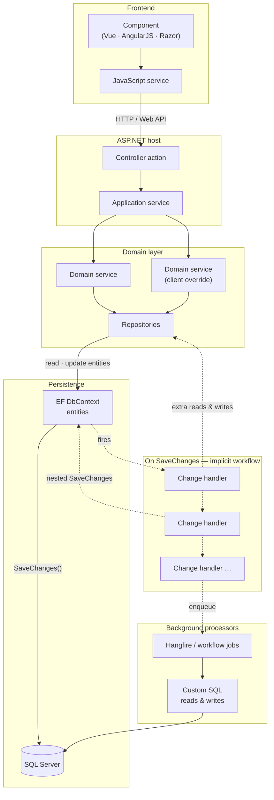

# Platform Rebuild Proposal — Executive Summary

**Purpose:** Convince management to approve an incremental platform rebuild that reduces version sprawl, speeds delivery, and makes client customization and integrations sustainable.

**Audience:** Executive leadership, product, engineering, professional services, support.

**Date:** June 2026

---

## 1. Core recommendation

Rebuild the platform **incrementally** using a **strangler-fig** approach (Section 2): a single canonical core with **versioned extension and integration packs** — not a big-bang rewrite and not continued forking per client.

**Critical constraint:** the current application embeds years of domain knowledge that is **poorly documented** except through extensive unit and integration tests. The rebuild must **preserve as much of that knowledge as possible** by targeting a **new core API** with an **adapter layer** that delegates to legacy behaviour until parity is proven — not by discarding working code and rediscovering edge cases from scratch (Section 9).

**Ask:**

- Charter a **Platform 2.0** program with dedicated capacity (not 20% time).
- Approve a **3–6 month foundation + pilot** phase with measurable exit criteria.
- Adopt policy: **no new git submodules, no new core forks, no new SaveChanges workflow handlers.**

---

## 2. The strangler pattern: how we rebuild without a big-bang

Named after the strangler fig — a vine that grows around a host tree and eventually replaces it — the **strangler pattern** means building the new platform **alongside** the legacy application and **moving traffic one slice at a time**, not replacing everything in a single rewrite.

### The idea

```
Start:     Users ──► Legacy application (everything)

Mid-way:   Users ──► Router / new API
                         ├──► New import path
                         └──► Legacy (planning, hours, UI, …)

End:       Users ──► New platform
             Legacy ──► retired
```

We never shut down the working product while the new parts grow. Each slice is migrated, tested, and only then is the old path removed.

### How it works (repeat per domain)

1. **Pick a slice** — one feature or domain (e.g. import, WBS, one screen family).
2. **Build the new version** behind a clear boundary (versioned API, adapter, or SPA route).
3. **Route only that slice** to the new implementation.
4. **Prove parity** — existing unit and integration tests, pilot users, production monitoring.
5. **Retire the legacy path** for that slice when confidence is met.
6. **Repeat** until the old stack is gone.

### Why not a big-bang rewrite?

| Big-bang rewrite | Strangler pattern |
|------------------|-------------------|
| High delivery and revenue risk | Lower risk per step |
| Long period with little shippable value | Value after each slice |
| Easy to lose tacit domain behaviour | Legacy keeps running; tests guard parity |
| Hard to roll back | Route traffic back if a slice fails |

### How we apply it in Platform 2.0

| Layer | Strangler mechanism |
|-------|---------------------|
| **API & domain logic** | New core API + adapter layer delegating to legacy (Section 9) |
| **Workflows** | Retire SaveChanges handlers and Hangfire jobs one family at a time |
| **Frontend** | New SPA + versioned API; replace Razor islands screen by screen (Section 10) |
| **Customizations** | Tenant packs on new core — not new submodules |

### What makes it succeed — and the main risk

**Requires:** a routing boundary (API, adapters, feature flags), parity tests, published sunset criteria for every temporary adapter, and discipline against adding features to the old stack.

**Main risk:** **“two systems forever”** — if we never retire legacy paths, cost doubles. Domain sunset dates and adapter exit criteria (Section 17) exist to prevent that.

**One line:** *Build the new platform around the old one, move one piece at a time, and remove each legacy piece only when the replacement is proven equivalent.*

---

## 3. The problem (in business terms)

We do not have a feature problem. We have a **variant problem**.

| Symptom | Business impact |
|---------|-----------------|
| Simple changes take weeks | Missed commitments, unhappy customers |
| Regressions in unrelated areas | Support load, emergency releases |
| Integrations behave differently per client | High PS cost, slow onboarding |
| Cloud + on-prem + customized builds | Too many versions to test and support |
| “Which version is running?” | Long incidents, risky upgrades |
| New hires slow to contribute | Delivery does not scale with headcount |
| High cognitive load per change; long code reviews | Low throughput, senior time in archaeology, team fatigue |
| UI layers accumulated without a “start over” boundary | Slow UI delivery, inconsistent UX, no reliable path to Cypress / Playwright / Selenium |

**One line:** *We are paying a growing tax on every feature because customization and integrations were implemented as compile-time forks, not runtime configuration.*

### Frontend: if we could do it over

**If we could start the UI again**, three decisions would change on day one — even though the original approach was rational at the time.

We began with a then-new Visual Studio template: Razor (`.cshtml`), npm libraries, and AngularJS in **one ASP.NET project**. That was genuinely productive — one build, shared bundling, straightforward local development. The mistake was not the template; it was **not drawing a hard line** when the product outgrew it.

Each later shortcut felt justified under delivery pressure:

- Razor pages for quick server-rendered screens
- Web API endpoints when features needed JSON
- Vue (alongside leftover AngularJS) when richer client behaviour was needed

Nobody set out to build a hybrid. We **accumulated** one — Razor pages, Web API, Vue, and legacy AngularJS in the same solution, without a versioned API contract, without one client framework, and without a surface stable enough for automated UI tests.

**What we would do differently:**

1. **Separate backend and frontend from the start** — ASP.NET as API and auth host; the UI as its own SPA with its own build and release cadence.
2. **Pick one SPA philosophy** — **Angular or Vue**, not both, and not Razor for core product screens.
3. **Define the API first** — documented, versioned OpenAPI as the only boundary between UI and platform — so Cypress, Playwright, or Selenium can test critical flows without depending on server-rendered markup.

We cannot rewind. We *can* stop extending the hybrid and migrate toward what we would have built if we had known where the product was going. That counterfactual is the frontend strand of Platform 2.0 (Section 10).

### Architecture exceeded its intended envelope

The original **layered architecture** was a reasonable choice for a smaller product with narrower client differences. It has since **expanded beyond what it was designed to carry** (see Section 4 for the typical request and save path). Client-specific behavior now lives in **git submodules**, service inheritance, and schema forks — so “the product” is effectively many variants sharing a name. Features such as **workflows** and **Hangfire** added a second, implicit orchestration layer on top of EF change handlers. We are not struggling because the domain is inherently impossible; we are carrying **two kinds of diversity at once** — a rich project-management domain *and* per-client implementation diversity — without a clear boundary between platform and customization.

Those choices were rational under past delivery pressure. The toll is visible now: every change requires reconstructing hidden context before it can be implemented or reviewed safely.

### Developer productivity and cognitive load

The highest day-to-day cost on this codebase is often not missing features — it is **cognitive load**: how much context an engineer must hold to change one thing without breaking another. A small PR may require understanding tenant-specific branches, handler chains, background jobs, and data-model variants before anyone can judge risk. That shows up as **long code reviews**, slow iteration, and reluctance to touch areas that look unrelated.

This is a **delivery and retention** issue, not a preference for greenfield work. The ask is not to throw away what we have. It is to **stop extending the submodule-and-handler model** and fund incremental simplification — one domain at a time, with parity tests and a pilot — so that most engineering energy goes into the domain problem, not archaeology.

### Embedded knowledge vs. architectural baggage

A rebuild carries a real risk: **losing knowledge** baked into the current application — edge cases, client rules, integration behaviour, and planning semantics that accumulated over years of production use. That knowledge is **rarely written down** in architecture documents; it lives in code paths, in engineers’ heads, and most reliably in our **numerous unit and integration tests**.

At the same time, the **structures that hold that knowledge** — submodules, handler chains, service inheritance, hybrid UI — are the baggage dragging delivery down. We cannot keep everything as-is, and we must not big-bang rewrite and hope we remember what mattered.

**Goal:** preserve behaviour, shed structure. Target a **new core API** and route traffic through an **adapter layer** that delegates to legacy until each domain is understood, tested, and ported (Section 9).

---

## 4. Legacy application layers: a typical save path

The current product follows a **classic layered stack** on paper — but a single user action can traverse every layer and still trigger **hidden work** after the HTTP response returns. Understanding this path explains why small changes have large blast radius and why handler chains are hard to retire.

### Request path (synchronous)

A typical use case begins in a **frontend component** (Vue, legacy AngularJS, or a Razor-hosted script). The component calls a **JavaScript service**, which issues an HTTP request to a **controller action** on the ASP.NET host. The controller delegates to an **application service** — the orchestration entry point for a use case (e.g. book hours, update WBS, run import).

The application service calls one or more **domain services**. Client-specific behaviour often appears here as **subclass overrides** (`ClientXService : BaseService`) or submodule branches. Domain services use **repositories** to read and update **entities** through Entity Framework (`DbContext`).

On **SaveChanges**, EF persists entity state to **SQL Server**. That is where the nominal request ends — but not where the work ends.

### Side effects on save (implicit orchestration)

The same `SaveChanges` call can fire one or more **EF change handlers** — hooks registered on entity changes that implement business workflows (rollup, integration side effects, validation, denormalization). Handlers are a legacy of the earlier Access / stored-procedure model: business process disguised as persistence.

Handlers frequently cause **additional reads and writes** (sometimes nested `SaveChanges`), so one user save can become a chain of database round-trips that is invisible from the controller or application service. Handlers can also **enqueue background work** — Hangfire jobs or workflow features that run after the HTTP request completes.

### Background processors

Background processors often execute **custom SQL** — hand-written queries and updates outside the normal repository/entity path — for reporting, rollups, integration sync, or batch repair. That creates a **third read/write surface** alongside repositories and handler side effects.

Together, handlers and background jobs form a **parallel workflow system** on top of the layered stack (Section 5). They are the main reason “we only changed one field” can still break planning, integrations, or hours in unrelated areas.

### Diagram: layers and side effects





**One line:** *A save in the old application is a layered call stack plus an unpredictable handler chain and optional background SQL — not a single transaction boundary.*

---

## 5. Root technical causes

The stack reflects **scope creep on the architecture**: patterns that worked at one scale now compound each other.

1. **Git submodules and client-specific code branches** — the decision to customize per client via submodules made sense early on; it now multiplies release combinations and merge cost.
2. **Class inheritance for services** (`ClientXService : BaseService`) spreads logic across opaque override trees within an already layered stack.
3. **Per-client data model forks** make migrations, APIs, and reporting unsustainable.
4. **EF `SaveChanges` change handlers** implement hidden workflows (legacy of Access DB + stored procedures).
5. **Hangfire jobs and workflow features** duplicate and defer logic — a **parallel workflow system** alongside handlers, harder to trace than either alone.
6. **Weak domain boundaries** — WBS, planning, hours, imports, and integrations are coupled while client variance cuts across every layer.
7. **Frontend accumulated without a boundary** — each layer (Razor, Web API, Vue, legacy AngularJS) solved a near-term need; we never applied the “start over” rule: one SPA, one versioned API, tested independently.

This is normal debt from years of shipping under pressure. It is not a people problem — and it is **not an argument for a big-bang rewrite**. It is an argument for a controlled boundary between core and customization going forward.

---

## 6. Strategic goal: one platform, many configurations

Design explicitly for three dimensions:

| Dimension | Target |
|-----------|--------|
| **Deployment** | Same product artifact for cloud SaaS and on-prem (profile-driven config). |
| **Integration** | Connector packs (SAP, PLM, HR, file, etc.) — not core forks. |
| **Customization** | Configuration, policy hooks, and extension actors — not submodules. |

**Success criterion:** A new client integration or customization ships as a **versioned pack** enabled per tenant, not as a separate product build.

### End state: one multi-tenant platform

The **end stage** is not “a cleaner fork of today’s product.” It is a **single multi-tenant platform** — one canonical deployment for cloud SaaS (with on-prem as a **deployment profile**, not a separate product line) where:

- Every client is a **tenant** on shared platform core and schema (`TenantId` isolation; dedicated SQL Server only where enterprise tier requires it).
- **Behaviour differences** are expressed as **enabled packs and tenant profile settings** — not git submodules, service subclasses, or custom builds.
- **Onboarding a new client** is an **operational action**, not a development project.

```
┌─────────────────────────────────────────────────────────────┐
│  Admin backoffice (platform operators)                       │
│  · Provision tenant · Enable packs · Users & roles · Billing │
└────────────────────────────┬────────────────────────────────┘
                             │
┌────────────────────────────▼────────────────────────────────┐
│  Single multi-tenant platform                                │
│  Core API · SPA · actors · SQL Server · shared observability │
└────────────────────────────┬────────────────────────────────┘
                             │ per tenant
              ┌──────────────┼──────────────┐
              ▼              ▼              ▼
         Tenant A        Tenant B        Tenant C
      (packs + profile) (packs + profile) (packs + profile)
```

### Admin backoffice: how we add a client without a fork

A dedicated **admin backoffice** (separate from the end-user product UI) is the control plane for platform operators and, where appropriate, professional services:

| Capability | Purpose |
|------------|---------|
| **Tenant provisioning** | Create a new client: name, subdomain, region, performance tier (`standard` / `large`). |
| **Pack management** | Enable integration packs (SAP, PLM, …) and customization packs per tenant. |
| **Tenant profile** | Identity (SSO / AD), deployment profile (cloud / on-prem), feature flags, rate limits. |
| **User & role bootstrap** | Initial admin user, license seats, role templates. |
| **Billing** *(target)* | Subscription tier, seat count, usage meters (e.g. active projects, imports), invoice export or payment-provider hooks. |

**Target experience:** *“Add client” in the backoffice → tenant is live on the shared platform with the right packs and profile* — minutes to hours, not weeks of branching and bespoke deployment.

Billing can start simple (tier + seats recorded in backoffice, invoiced externally) and grow into integrated subscription management; the important architectural decision is that **tenant and entitlement data live in the platform**, not in ad-hoc spreadsheets or per-client config files.

### Project portability & onboarding hub: intermediate exchange format

Adapters let the new platform **call** legacy behaviour during strangler migration. They do **not** move a customer's live projects off the old stack, and they do **not** replace integrations with SAP, Kronos, and similar systems. For **tenant cutover** and **faster onboarding**, we standardise on one **versioned intermediate exchange format** — a canonical interchange that many sources can target and one import pipeline consumes.

```
  Legacy application ──export──┐
  SAP (IDoc, API, file)  ─────┼──► Converter tools ──► Intermediate ──► Platform
  Kronos (hours, resources) ──┘      (per source)         format          import
                                                              ▲
                                         one schema, one validation, one import API
```

| Component | Responsibility |
|-----------|----------------|
| **Legacy export** | Export one or more projects from the current product — WBS, activities, relations, assignments, hours, calendars, external IDs; map tenant-specific fields where required. |
| **Integration converters** | **Tools that map external systems into the intermediate format** — e.g. SAP (projects, WBS, actuals), Kronos (time, resources). Shipped as **integration pack tooling** or standalone utilities; same output schema regardless of source. |
| **Intermediate format** | **Versioned, documented** exchange schema (e.g. JSON; chosen in discovery); validated independently of any runtime; the **single front door** for project onboarding data. |
| **Platform import** | Consumes the intermediate format via the new core **import API / actor pipeline** (POC already demonstrates canonical import with external IDs and idempotent upsert); supports **dry-run** and validation report before commit. |

**Why one format for legacy and integrations:**

- **Onboarding gets easier** — provision tenant in backoffice → run SAP or Kronos converter → import; same steps as legacy migration, not a new bespoke pipeline per system.
- **De-risks cutover** — migrate project data without indefinite dual-write or manual re-entry.
- **Supports pilots and SaaS moves** — on-prem or legacy tenant exports; greenfield client loads from ERP/time system.
- **Feeds parity testing** — golden files from legacy, SAP, or Kronos → import → assert schedules, rollups, and hours.
- **Repeatable PS playbook** — converter + dry-run + import; enable the right **integration pack** per tenant rather than fork core code.

Converter tools can start as **file-based** (export from SAP/Kronos → transform → import file) and grow into **scheduled connectors** that emit the same intermediate format — the platform import path does not change.

This capability spans **Stages 2–3** (legacy export + first SAP/Kronos converter on pilot) through **Stage 6** (catalogue of converters per enabled integration pack; standard onboarding runbook in admin backoffice).

### Journey from today's product to the end state

We do not jump from today to the end state in one step. The strangler pattern (Section 2) defines *how* each slice moves; the stages below define *what* the product looks like at each milestone.

| Stage | What it looks like | How we know we're there |
|-------|-------------------|-------------------------|
| **Today** | Many variants: submodules, handler chains, hybrid UI, per-client builds, “which version is running?” | Baseline metrics (Section 16) |
| **1 — Foundation** | Versioned core API, adapter layer, tenant profile model, freeze on new forks | One domain on new API in staging; adapters delegating to legacy |
| **2 — First tenant on new path** | Pilot client on new API + adapter; **legacy export → intermediate format → platform import** proven on real projects; one submodule or handler family retired | Pilot live in production; parity tests green; at least one project migrated via portability path |
| **3 — Domain expansion** | Import, WBS, planning, hours on new core; SPA replaces Razor islands; packs replace submodules; **bulk migration runbook**; **SAP / Kronos converters** to intermediate format | Majority of traffic off adapters; portability format v1 stable; at least one external converter in use |
| **4 — Pack-only customization** | No new submodules; all net-new client variance ships as versioned packs | % custom work as packs vs forks → target threshold |
| **5 — Operations plane** | Admin backoffice MVP: provision tenant, enable packs, bootstrap users | New internal/staging tenant created without code change |
| **6 — End state** | Single multi-tenant cloud platform; new client via backoffice; billing tied to tenant; legacy retired | Zero client-specific core branches; onboarding SLO met |

```
Today          Stage 1–2         Stage 3–4          Stage 5–6
(variants)  →  (API+adapters) →  (packs+SPA)    →   (backoffice + billing)
   │          export/import       │                    │
   │          bridge ──────────────┴────────────────────┘
   └──────── strangler per domain ──── strangler per screen
```

Stages 1–4 are **technical strangler** work (API, adapters, domains, UI, packs). Stages 5–6 are **operational maturity** — the product becomes something we **operate and sell**, not something we **build separately per client**.

Section 15 maps these stages to phased delivery and exit criteria.

---

## 7. Why the current customization model fails

| Approach | Long-term result |
|----------|------------------|
| Git submodules per client/integration | Version matrix explosion, merge hell |
| Subclassing services | Fragile base classes, hard-to-find overrides |
| Custom EF models per client | Forked migrations, APIs, reports, upgrades |
| `if (tenant == X)` in core | Accidental complexity, untestable branches |

**Replacement principle:** *Professional services may customize behavior, not the core release artifact.*

---

## 8. Target architecture: platform core + packs

```
                    API / UI
                       │
         ┌─────────────┴─────────────┐
         │     Admin backoffice       │  ← tenant provisioning, packs, billing
         └─────────────┬─────────────┘
                       │
              ┌────────┴────────┐
              │  Platform Core   │
              │  WBS · Hours ·   │
              │  Planning · Auth │
              └────────┬────────┘
                       │ messages / events
        ┌──────────────┼──────────────┐
        ▼              ▼              ▼
  Integration     Customization   Deployment
     Pack             Pack          Profile
  (SAP, PLM…)    (rules, actors)  (cloud / on-prem)
```

**Core owns:** canonical domain, invariants, APIs, persistence boundaries, external ID registry.

**Packs own:** client- or system-specific mapping, validation, enrichment, connectors, and policy steps — including **converter tools** that produce the intermediate exchange format (Section 6).

---

## 9. Preserve embedded knowledge: new core API + adapter layer

Rebuild is not permission to forget what the product already knows — but staying on the current stack is not neutral either.

### The dilemma

| Preserve (asset) | Shed (baggage) |
|------------------|----------------|
| Domain edge cases proven in production | Git submodules and per-client forks |
| Behaviour encoded in unit & integration tests | Implicit SaveChanges handler chains |
| Integration mappings that actually work | Service inheritance override trees |
| Planning and rollup semantics customers rely on | Hybrid UI with no API contract |

Much of what makes the product valuable is **tacit**: poorly documented outside code and tests. A greenfield rewrite risks rediscovering — or missing — behaviour that tests currently guard. Continued patching never extracts that knowledge from the structures that hide it.

### Strategy: new API surface, legacy behind adapters

**Do not replace the application in one step.** Introduce a **versioned core API** as the only outward-facing contract (for UI, integrators, and packs). Behind it, an **adapter layer** per domain translates API calls into existing services, handlers, and jobs until each path is ported and parity is proven.

```
  UI · integrators · packs
            │
            ▼
  ┌─────────────────────┐
  │  New core API        │  ← versioned OpenAPI; documented; testable
  │  (Platform 2.0)      │
  └──────────┬──────────┘
             │
  ┌──────────▼──────────┐
  │  Adapter layer       │  ← delegate · translate · absorb legacy variance
  │  (per domain)        │
  └──────────┬──────────┘
             │
  ┌──────────▼──────────┐
  │  Legacy stack        │  ← existing code remains source of truth
  │  services · handlers │     until parity tests pass and path is retired
  │  · jobs · tests      │
  └─────────────────────┘
```

### How adapters preserve knowledge

| Principle | Practice |
|-----------|----------|
| **Delegate first** | New API endpoints call existing implementation behind the adapter — ship the contract before rewriting internals. |
| **Tests as specification** | Existing unit and integration tests are **parity gates**; add API contract tests on top; both must pass before retiring a legacy path. |
| **Extract deliberately** | Move logic into the new core in small slices only after the adapter boundary is stable and tests prove equivalence. |
| **Document at the boundary** | OpenAPI plus adapter mapping notes capture behaviour that was previously only in code and tests. |
| **Sunset every adapter** | No permanent shim: each adapter has exit criteria (parity green, stable in production, domain owner sign-off). |

### Per-domain cutover

1. Define the new API contract for one domain (e.g. import / WBS).
2. Implement an adapter that delegates to legacy.
3. Point new UI and integrators at the new API only.
4. Run legacy tests **and** API-level parity tests (reuse integration tests where possible).
5. Port implementation behind the adapter into new core actors / services.
6. Retire the legacy path when parity and operational confidence are met.

This is strangler-fig applied explicitly to **knowledge preservation** — the same pattern as handler migration and UI replacement, with tests ensuring we keep what works while changing how it is structured.

---

## 10. Frontend: applying the “do it over” decisions

The backend rebuild only delivers half the value if we keep adding to the hybrid. This section turns the Section 3 counterfactual into concrete architecture and migration.

### What we started with (and why it worked)

| Starting point | Why it was the right call then |
|----------------|--------------------------------|
| Visual Studio ASP.NET template | Razor + npm + AngularJS in one project |
| Single solution | One build, shared bundling, fast local dev |

### What accumulated (without a plan)

| Layer added | Typical trigger | Cost in hindsight |
|-------------|-----------------|-------------------|
| Razor pages | Fast server-rendered screen | Second rendering model |
| Web API | JSON for AJAX / mobile | No published contract |
| Vue (+ legacy AngularJS) | Richer client UX | Two SPA philosophies |

The result: duplicated auth and routing, inconsistent UX, and no stable target for Cypress, Playwright, or Selenium.

### What we would build instead (target)

```
┌─────────────────────┐         ┌──────────────────────┐
│   SPA (Vue *or*       │  HTTPS  │  Platform API        │
│   Angular — one pick) │ ◄─────► │  (versioned OpenAPI) │
│   Cypress / Playwright│         │  + auth + events     │
└─────────────────────┘         └──────────────────────┘
```

| Principle | Requirement |
|-----------|-------------|
| **Separation** | Frontend and backend are separate build and deploy units; no business logic in Razor except transitional shells during migration. |
| **Single framework** | One SPA stack for new work — **Angular or Vue**, decided in Phase 0; the other is sunset on a published schedule. |
| **API as contract** | OpenAPI (or equivalent) per major version; breaking changes require version bump and migration notes. |
| **Testability** | Critical flows covered by UI automation (Cypress, Playwright, or Selenium) against the versioned API — not against server-rendered markup. |

### How we get there from here (strangler — not a UI big-bang)

1. **Freeze** new Razor features and new pages in the second SPA framework.
2. **Expose** read/write paths through the versioned API first (already required for large-project performance — Section 20).
3. **Replace** Razor islands with SPA routes behind feature flags, one domain at a time (import, WBS, planning, hours).
4. **Retire** co-located client bundles from the ASP.NET project as each island moves.

Razor may remain temporarily for auth redirects, error pages, or on-prem install wizards — not for core product screens.

---

## 11. Akka.NET: why it fits (orchestration, not fashion)

Akka.NET is proposed because our hardest problems are **workflows**, not CRUD:

- Import and export pipelines
- Integration retries and failure isolation
- Long-running recalculations (planning, rollups)
- Tenant-specific processing steps

### Actors vs. inheritance/submodules

| Legacy | Akka approach |
|--------|---------------|
| `AcmeImportService : ImportService` | `ImportPipeline → [MapActor, AcmeRulesActor, PersistActor]` |
| Client submodule | Tenant profile registers actor pack |
| Hidden handler chain | Explicit message pipeline with correlation ID |

### Actors vs. SaveChanges handlers + Hangfire

| Legacy pattern | Problem | Akka replacement |
|----------------|---------|------------------|
| EF change handlers on save | Implicit order, nested saves, hard to test | Command → orchestrator actor → persist actor |
| Hangfire jobs with business logic | Two workflow systems, duplicated rules | Supervised connector/workflow actors |
| Scheduled sync | Job-centric observability | Scheduler triggers actor message (Hangfire optional as clock during migration) |

**Rule:** `SaveChanges` is for **persistence**, not for **business process orchestration**.

**Workflow model:**

```
Command (ImportProject, BookHours, RecalculatePlan)
    → Orchestrator actor (DataManager, IntegrationRouter, PlanningCoordinator)
        → Persist actor (sole EF boundary for that workflow)
        → Integration / rollup / notification actors
        → Domain events (ImportPersisted, PlanRecalculated)
```

### What Akka is NOT for

- Simple CRUD endpoints
- Sprinkling `DbContext` in every actor
- Replacing a disciplined domain model

Use actors at **boundaries**; keep core business rules in plain, tested modules.

---

## 12. Data model strategy (avoid per-client schema forks)

Actors do not justify per-client OLTP schemas.

1. **One canonical schema** for all customers on **SQL Server** (production and on-prem standard).
2. **Governed extension data** for rare attributes (registry + validation).
3. **External ID mapping** — source systems map to internal entities without alternate keys.
4. **Read models / projections** for client-specific reporting.

Customize **behavior and mappings**, not the physics of the database except through extension points.

**Datastore:** SQL Server only — no SQLite or per-client schema forks. Shared-database tenants use `TenantId` + indexes; enterprise tenants may use dedicated SQL Server instances (same schema, different connection).

---

## 13. Cloud and on-prem: deployment profiles, not forks

| Concern | Cloud | On-prem |
|---------|-------|---------|
| Identity | Hosted SSO | AD / LDAP / SAML |
| Messaging | Managed queue | Local queue / outbox |
| Storage | Object store | Local / customer storage |
| Updates | Continuous | Customer-controlled bundles |
| Offline | N/A | File-based import/export first-class |

Same binary; differences are **configuration and enabled packs**.

---

## 14. Proof of concept (internal evidence)

An internal POC already demonstrates the direction:

- Canonical import model with **external IDs** and idempotent upsert — the **platform import** side of the legacy export → intermediate format → import bridge (Section 6)
- **Actor-orchestrated persistence** (data manager hierarchy) — not SaveChanges side effects
- **Template-first persist ordering** among siblings
- **Planning engine** with FS / SS / FF / SF dependencies and lag
- **Domain value types** (`Hours`, `DurationDays`, `PersonName`, `ScheduleDate`) protecting business semantics
- **Automated tests** on scheduling, progress, and import behavior

**Message to leadership:** We are not betting on a theory. We are asking to scale an approach that already produced working vertical slices.

---

## 15. Phased migration plan

Phases below align with the **journey stages** in Section 6 (Today → Foundation → … → End state). Each phase has a shippable outcome; the end state is Stage 6.

### Phase 0 — Discovery (4–6 weeks) · *Stage 1 prep*

- Inventory integrations, submodules, handlers, Hangfire jobs, schema forks, and **UI surface area** (Razor vs SPA routes, AngularJS vs Vue).
- Define parity checklist, tenant pack model, **SPA framework choice** (Angular vs Vue), and **adapter inventory** (which legacy paths back each new API).
- Draft **admin backoffice** scope: minimum tenant-provisioning fields, pack catalogue, billing data model (tier, seats, meters).
- Define **intermediate exchange format** v0: entities, external ID rules, version field; map legacy project model gaps; **inventory SAP / Kronos / other onboarding sources** and target converter scope.
- **Exit:** Agreed domain order, journey stage targets, portability schema outline, and success metrics.

### Phase 1 — Foundation (8–12 weeks) · *Stage 1*

- Shared contracts, actor registry, **tenant profile schema**, CI, observability, **versioned API baseline** (OpenAPI), and **adapter framework** (delegate-first, parity-test hooks).
- **Platform import** from intermediate format v1 (extend POC import pipeline); dry-run and validation report.
- Policy: no new handlers/submodules; **no new Razor product screens or second SPA framework**.
- **Exit:** One read or write path on new stack in staging; **sample legacy export file imports successfully** in dry-run.

### Phase 2 — First production domain (12–16 weeks) · *Stage 2*

- Pilot: import/WBS for one client (cloud or on-prem) via **new API + adapter** delegating to legacy.
- **Legacy export** feature: export pilot project(s) to intermediate format v1; **import into new platform** tenant; parity vs legacy.
- Retire one submodule or handler family.
- **Exit:** Pilot live; rollback documented; **at least one production project migrated** via export/import bridge.

### Phase 3 — Domain & pack expansion (ongoing) · *Stages 3–4*

- Planning, hours, additional connectors; SPA replaces Razor per domain.
- Submodule customizations reimplemented as **versioned packs**; publish **compatibility matrix**: `Core × Integration packs × Customization packs × Deployment profile`.
- **Tenant migration runbook**: export all projects from legacy → import to provisioned tenant; documented limits and rollback.
- **Integration converters** (priority: SAP, Kronos): map source exports/APIs → intermediate format v1; validate with golden files before pack GA.
- **Exit:** No new submodules for 2 consecutive releases; adapter traffic declining for migrated domains.

### Phase 4 — Admin backoffice MVP (8–12 weeks) · *Stage 5*

- Internal **admin backoffice** on the platform API: create tenant, assign packs and deployment profile, bootstrap admin user.
- Optional: **migration operations** — trigger import job, view export/import status; **run or schedule integration converters** (SAP, Kronos) into intermediate format.
- Optional: read-only billing view (tier, seats, contract dates); export for finance.
- **Exit:** A new staging tenant provisioned end-to-end through the backoffice without a code deployment.

### Phase 5 — End-state hardening (ongoing) · *Stage 6*

- Retire remaining legacy paths and adapters; single multi-tenant cloud deployment as default.
- **Billing integration** (payment provider or ERP export) as product/commercial priority allows.
- On-prem remains a **deployment profile** (same core, different connector/storage config) — not a fork.
- **Exit:** New commercial client onboarded via backoffice within agreed SLO (e.g. &lt; 1 business day); zero active client-specific core branches.

### Handler / job migration order

1. Freeze new SaveChanges handlers and logic-heavy Hangfire jobs.
2. Classify existing workflows (rollup, integration, batch, notification).
3. Migrate **import** first (POC exists).
4. Migrate planning recalc, hours rollups, ERP/export connectors.
5. Delete legacy handlers when parity tests pass.

Hangfire may remain temporarily as a **scheduler trigger** only.

---

## 16. Metrics

| Metric | Why |
|--------|-----|
| Active core branches / client forks | Version sprawl |
| Lead time (idea → production) | Speed |
| Change failure rate | Quality |
| Time to add integration | PS margin |
| Support tickets “unknown version” | Operational pain |
| On-prem upgrade completion rate | Enterprise risk |
| % custom work delivered as packs vs forks | Program adoption |
| Median PR review time / time-to-first-review | Cognitive load proxy; team throughput |
| Context switches per feature (submodules touched) | Variant tax per change |
| % core screens on versioned API + single SPA | Frontend consolidation progress |
| Critical-path UI scenarios in automated E2E suite | Regression safety for releases |
| % API traffic through adapters vs native new core | Knowledge migration progress |
| Parity test suite pass rate on legacy vs new API | Confidence before retiring paths |
| Time to provision a new tenant (backoffice) | Operational maturity; end-state proxy |
| Active client-specific core branches (target: 0) | End-state adoption |
| Projects migrated via export/import bridge | Cutover confidence; portability path adoption |
| Onboardings using intermediate format (legacy + converter sources) | Unified onboarding hub adoption |

---

## 17. Risks and mitigations

| Risk | Mitigation |
|------|------------|
| Loss of tacit domain knowledge | Adapter layer delegates to legacy; existing tests as parity gates; document at API boundary |
| Adapter layer becomes second monolith | Per-domain adapters with published sunset criteria; thin delegation only |
| Two systems forever | Domain sunset dates; strangler per module; adapter exit criteria |
| Akka learning curve | Training, narrow actor boundaries, message contract tests |
| Debugging complexity | Correlation IDs on every workflow (session / trace ID) |
| Feature starvation | 70% platform / 30% critical customer work via adapters |
| Big-bang temptation | Explicit anti-big-bang charter; pilot-first |
| UI rewrite scope creep | Strangler per screen; API-first; one framework only |

---

## 18. Options for decision-makers

| Option | Description | Verdict |
|--------|-------------|---------|
| **A. Status quo** | Keep patching handlers, jobs, submodules | Cheapest now; cost accelerates |
| **B. Incremental rebuild (recommended)** | Core + actor/integration/customization packs | Balanced risk; continuous delivery |
| **C. Big-bang rewrite** | Parallel product 2+ years | Highest revenue and execution risk |

---

## 19. Executive summary (paste-ready)

Our product’s complexity is driven less by feature count than by **years of client-specific customizations and integrations**, delivered through git submodules, service inheritance, customized data models, EF change handlers, and Hangfire jobs — patterns inherited from an earlier Access/stored-procedure architecture. The **layered design and submodule-based customization** were fit for an earlier scope; the product has outgrown that envelope. Workflows and background jobs added implicit orchestration on top of an already diverse domain and diverse clients. On the **frontend**, we would now treat UI the same way: **if we could do it over**, we would never have let Razor, Web API, Vue, and legacy AngularJS share product screens without a versioned API — the lesson we apply in Platform 2.0. Combined with cloud and on-prem delivery, this created too many de facto product versions to test, upgrade, and support — and a **high cognitive load** that slows delivery and lengthens code review even for experienced engineers.

The proposed rebuild shifts to a **platform-and-packs architecture** whose **end state** is a **single multi-tenant platform**: new clients provisioned through an **admin backoffice** (packs, tenant profile, users, and billing over time) — not through forks or bespoke builds. Critically, we **preserve embedded domain knowledge** — much of it only captured in unit and integration tests today — by introducing a **new versioned core API** with an **adapter layer** that delegates to legacy behaviour until parity is proven, following the **strangler pattern** (Section 2) through defined journey stages (Section 6). On the UI side we apply the **do-it-over** choices: a **separate SPA** (one framework: Angular or Vue), a **documented versioned API** as the only boundary, and **automated UI tests** (Cypress, Playwright, or Selenium) on critical flows. Long-running and reactive work moves from implicit SaveChanges side effects and background jobs into **explicit, supervised Akka.NET workflows** with clear message contracts.

This restores predictable delivery, reduces support matrix size, protects professional services margin, and gives customers a credible upgrade path without forking the product for each engagement — **without** a big-bang rewrite.

---

## 20. Performance and large projects (40–50,000 activities)

Customers range from small projects (~40 activities) to large programmes (~50,000 activities). Responsiveness is a **product architecture** requirement, not only a hardware decision.

### Design principle

> **Interactive paths stay small; heavy work runs asynchronously on bounded slices.**

| Path | Target | Pattern |
|------|--------|---------|
| Open project / browse WBS | < 500 ms | Paginate, lazy-load tree, summaries |
| Edit one activity | < 100 ms | Targeted read/write |
| Full plan recalculation (large project) | Seconds, background | Planning actor + progress events |
| Gantt view | Smooth scroll | Virtualized rows + visible time window |
| Bulk import | Minutes OK | Actor pipeline + batched upsert + progress |

### Database (SQL Server)

- **Never load full project tree by default** — lazy expansion, cursor pagination, search endpoints.
- **Indexes:** `(TenantId, ProjectId)`, `(ComponentId)`, `(ActivityId)`, assignment and relation FKs.
- **Component-level rollups** — cached budgeted hours, % complete, date ranges.
- **Dedicated SQL Server** for large enterprise tenants (isolation tier).

### API tiers

| Endpoint style | Purpose |
|----------------|---------|
| `/projects/{id}/summary` | Counts, dates, rollups only |
| `/components?parentId=` | One tree level at a time |
| `/activities?projectId=&cursor=` | Paginated flat list / search |
| `/projects/{id}/plan?from=&to=` | Windowed Gantt data |

Return **projections**, not full entity graphs, to the UI.

### Planning at scale

- **Store schedule snapshots** — UI reads persisted plan; does not recalculate on every page load.
- **Async recalculation** via `PlanningCoordinatorActor` for projects above threshold (e.g. 500 activities).
- **Incremental scheduling** — on single edit, recalculate affected subgraph only; full recompute on import or bulk relation change.
- **Never block HTTP** on full 50k-activity forward pass.

### UI

- Virtual scrolling for Gantt and activity lists.
- Time-windowed Gantt (load visible months, fetch more on pan).
- Component-level aggregation with expand-for-detail.
- Debounced plan triggers (one background job per burst of edits).

### Imports

- Batched upsert (e.g. 500 rows per transaction) through import actor pipeline.
- Progress events (`ImportProgressUpdated`) for UI feedback.
- Idempotent external IDs for safe retry.

### Multi-tenant isolation

- **Performance tiers** in tenant profile: `standard` vs `large`.
- Rate limits and fair queuing for heavy jobs (import, replan).
- Large tenants: dedicated DB + worker capacity.

### SLOs (proposal targets)

- Up to **500 activities:** interactive edits < 1 second.
- Up to **50,000 activities:** browse and edit remain interactive; full replan in background with progress within minutes.
- Load-test gates at **40, 500, 5,000, and 50,000** activities before major client migrations.

---

## 21. Decision requested

1. Approve **Platform 2.0** program charter and dedicated team.
2. Fund **discovery + foundation + one pilot domain**.
3. Enforce **no new submodules / handler workflows**.
4. Standardize on **SQL Server** for cloud and on-prem data stores.
5. Adopt **performance SLOs** for large projects (Section 20).
6. Standardize the **frontend** using the “do it over” model: one SPA framework and a **versioned public API** (Section 10).
7. Mandate **adapter-first migration** to the new core API so existing tests preserve domain knowledge (Section 9).
8. Approve **admin backoffice** roadmap (Phase 4) as the operational path to onboard tenants without forks.
9. Adopt **intermediate exchange format** as the mandatory contract for **all project onboarding** — legacy export, SAP, Kronos, and future integrations (Section 6).
10. Name **executive sponsor** (engineering + product + commercial).
11. Select **pilot customer** or internal flagship project for first cutover **and first export/import migration**.

---

*Document generated from engineering strategy discussions. Internal use.*
