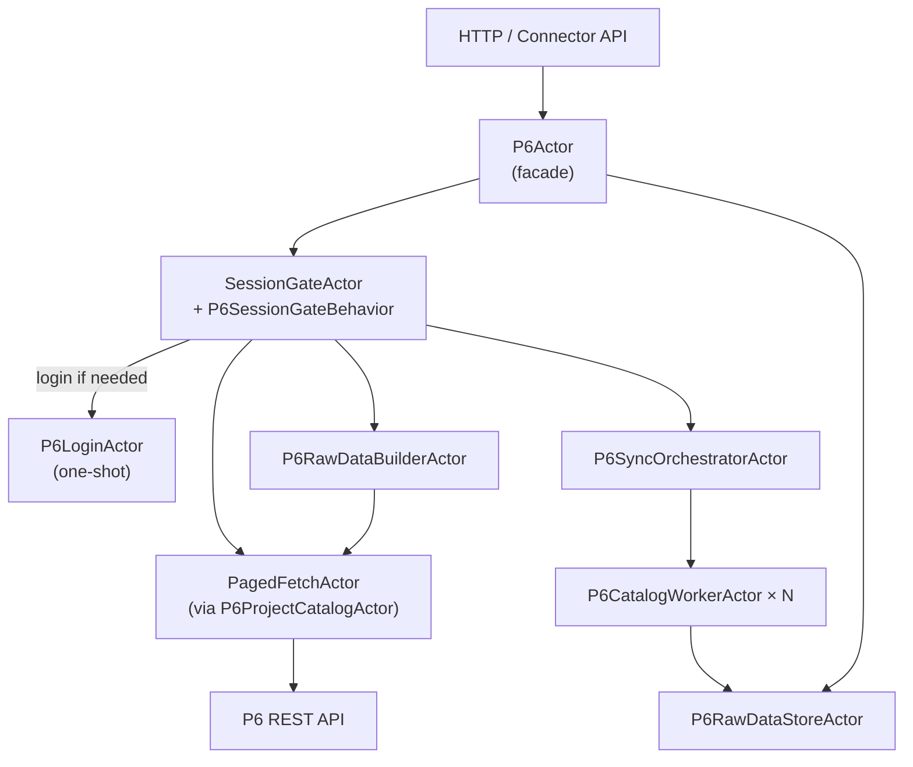
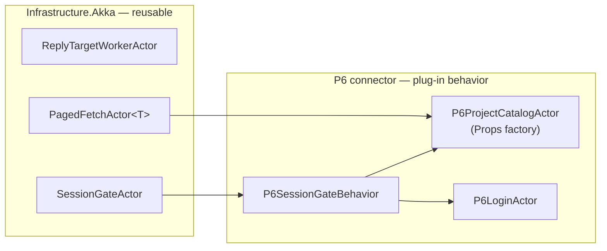
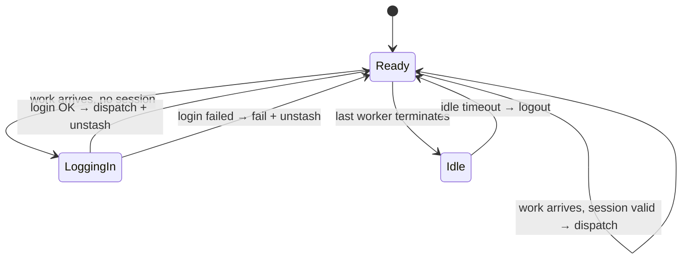

# Akka.NET actor overview — OutOfTokens

**Purpose:** Visual, shareable introduction to the P6 connector actor pipeline and the reusable actors in `Infrastructure.Akka`. Use this to advocate Akka.NET for integration workflows.

**Audience:** Engineers, architects, and stakeholders evaluating actor-based orchestration.

**Related:**

| Document | Role |
|----------|------|
| [../README.md](../README.md) | OutOfTokens solution entry point |
| [reusable-actors.md](reusable-actors.md) | Generic actor catalog and source links |
| [../../docs/monolith-modularization/platform-actor-standard.md](../../docs/monolith-modularization/platform-actor-standard.md) | Platform 2.0 actor rules and workflow model |
| [../../AkkaTeach/README.md](../../AkkaTeach/README.md) | Phased Akka.NET course (concepts) |
| [../../AkkaSignalRVuePoc/](../../AkkaSignalRVuePoc/) | SignalR + hosting POC |

---

## Why actors here?

Integration connectors (login → fetch → transform → store) are naturally **sequential pipelines with concurrency limits**, **session state**, and **failure isolation**. Akka.NET gives that structure without ad-hoc `Task` chains or scattered `lock` blocks — and the same patterns reuse across connectors.

This solution proves it with a real P6 EPPM connector: **28 unit tests, standalone build, generic building blocks extracted.**

---

## Big picture



### Generic vs domain-specific

Reusable **shape** lives in `Infrastructure.Akka`. Connector **behavior** plugs in via options and `ISessionGateBehavior`.



---

## Three reusable building blocks (P0)

| Actor | One-liner | Source |
|-------|-----------|--------|
| `ReplyTargetWorkerActor` | Store who to reply to once; internal messages stay small | [ReplyTargetWorkerActor.cs](../Infrastructure.Akka/Actors/Workers/ReplyTargetWorkerActor.cs) |
| `PagedFetchActor<T>` | Call an API page by page until done; reply once | [PagedFetchActor.cs](../Infrastructure.Akka/Actors/Workers/PagedFetchActor.cs) |
| `SessionGateActor` | Hold a session; login on demand; stash; idle logout | [SessionGateActor.cs](../Infrastructure.Akka/Actors/Session/SessionGateActor.cs) |
| `ExclusiveGateActor` | At-most-one in-flight operation | [ExclusiveGateActor.cs](../Infrastructure.Akka/Actors/Guards/ExclusiveGateActor.cs) |
| `KeyedAccumulatorActor<T>` | In-memory keyed aggregation | [KeyedAccumulatorActor.cs](../Infrastructure.Akka/Actors/State/KeyedAccumulatorActor.cs) |

Full catalog (including planned P2 actors): [reusable-actors.md](reusable-actors.md).

---

## Key point 1 — Facade routes work

`P6Actor` is a thin entry point. It does not call HTTP directly; it tells the session actor what to do.

```csharp
// Floor2Plan.Connectors.P6/Actors/P6Actor.cs
_session.Tell(new FetchProjectCatalog(Sender));
_session.Tell(new BuildRawData(Sender));
_session.Tell(new RunSync(Sender, projectIds, _store, _syncOptions));
```

---

## Key point 2 — Session gate (generic shell, P6 behavior inside)

The session actor is two lines of wiring. All P6-specific dispatch lives in `P6SessionGateBehavior`.

```csharp
// Floor2Plan.Connectors.P6/Actors/P6SessionActor.cs
SessionGateActor.Props(new P6SessionGateBehavior(api, authOptions));
```

```csharp
// Floor2Plan.Connectors.P6/Actors/P6SessionGateBehavior.cs
host.OnWork<FetchProjectCatalog>(work => host.BeginLogin(work));
host.Receive<P6LoginSucceeded>(msg => host.CompleteLogin(msg.SessionId));

SpawnWorker(P6ProjectCatalogActor.Props(_api, cookie))
    .Tell(new PagedFetchActor<P6ProjectRecord>.Start(replyTo));
```

**Session lifecycle:**



---

## Key point 3 — Paged fetch (config in, result out)

The project catalog is not a custom paging actor — it is configuration on `PagedFetchActor<T>`.

```csharp
// Floor2Plan.Connectors.P6/Actors/P6ProjectCatalogActor.cs
PagedFetchActor<P6ProjectRecord>.Props(new PagedFetchOptions<P6ProjectRecord>
{
    PageSize = IP6RestApi.ProjectSummaryPageSize,
    FetchPage = async offset => await api.GetProjectsAsync(cookie, offset: offset, ...),
    BuildSuccessReply = projects => new P6Projects(projects)
});
```

```csharp
// Any caller — same pattern for every paged worker
worker.Tell(new PagedFetchActor<P6ProjectRecord>.Start(replyTo));
// internally: page 0 → page 1 → … → reply once → stop
```

`ReplyTargetWorkerActor` is why `ReplyTo` never appears on internal `PageReceived` messages — it is stored in actor state after `Start`.

---

## Request walkthrough — get projects

```text
GetP6Projects
  → P6Actor
    → SessionGateActor       ("do I have a cookie?")
      → [login] P6LoginActor (if needed)
      → PagedFetchActor      (page through /project)
        → P6Projects         (reply to original caller)
```

---

## What stays connector-specific

| Piece | Why not generic |
|-------|-----------------|
| `P6LoginActor` | Cookie parsing, auth header format |
| `P6SyncOrchestratorActor` | Project × entity-kind workflow |
| `P6CatalogWorkerActor` | Per-entity API switches + dedupe quirk |
| `P6SessionGateBehavior` | Maps P6 commands → workers |

Generic actors handle **orchestration shape**. Connectors supply **vendor behavior** via options and `ISessionGateBehavior` — aligned with [platform-actor-standard.md](../../docs/monolith-modularization/platform-actor-standard.md) (packs, not forks).

---

## Run it

```bash
cd OutOfTokens
dotnet build OutOfTokens.sln
dotnet test OutOfTokens.sln --logger "console;verbosity=detailed"
```

Actor tests use `AkkaSerilogTestKit` — run with **detailed** console verbosity to see session login, sync progress, and errors in the test output (same logs you would get from Serilog in a host).

---

## Learn more

| Resource | Best for |
|----------|----------|
| [AkkaTeach](../../AkkaTeach/README.md) | Learning Tell, Become, PipeTo, hosting |
| [AkkaSignalRVuePoc](../../AkkaSignalRVuePoc/) | ASP.NET Core + SignalR integration |
| [ApiImportActorPoc](../../ApiImportActorPoc/) | Import pipeline orchestration |
| [platform-actor-standard.md](../../docs/monolith-modularization/platform-actor-standard.md) | Platform rules (no Ask in actors, persist boundary, correlation) |
