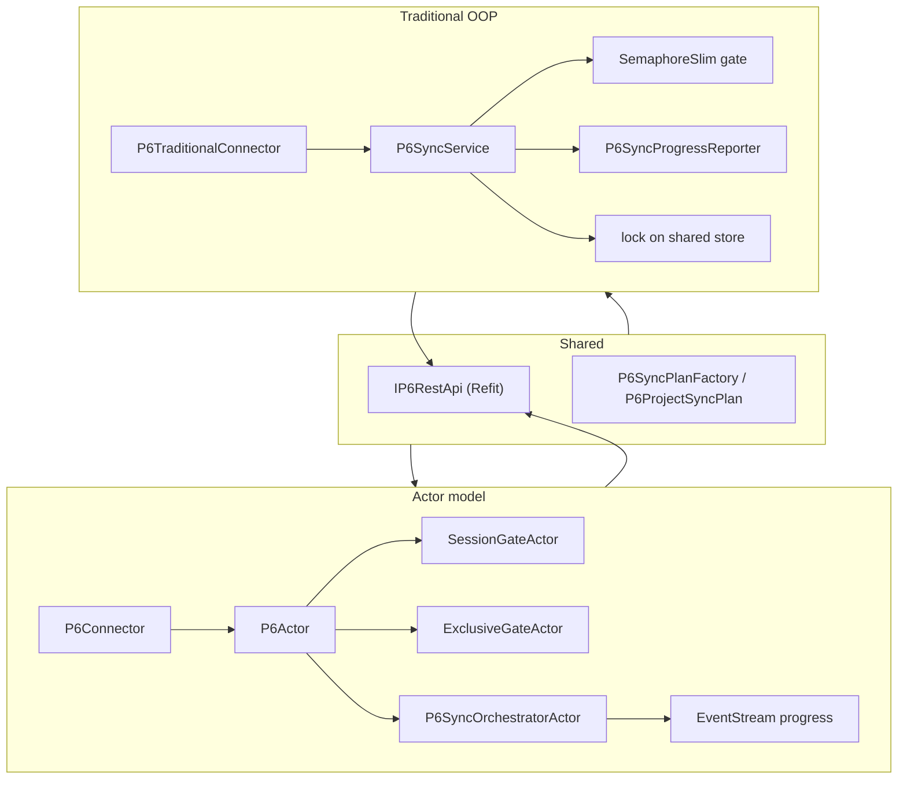

# P6 connector — actor model vs traditional OOP

Side-by-side comparison of two implementations that solve the **same** problem with the **same** Refit client (`IP6RestApi`), sync plans (`P6ProjectSyncPlan`), and Floor2Plan connector surface (`IGenericConnector`).

| Implementation | Project | Entry |
|----------------|---------|--------|
| **Actor model** | `Floor2Plan.Connectors.P6` | `P6Connector` → `P6Actor` |
| **Traditional OOP** | `Floor2Plan.Connectors.P6.Traditional` | `P6TraditionalConnector` → `P6SyncService` |

---

## Architecture at a glance



---

## What each approach looks like in code

### Session + sync entry

| Concern | Actor model | Traditional OOP |
|---------|-------------|-----------------|
| Login | `P6LoginActor` (one-shot, `PipeTo`) | `P6SessionService.OpenSessionAsync()` + `IAsyncDisposable` |
| Sync trigger | `P6Connector` → `Tell(StartP6Sync)` | `P6TraditionalConnector` → `P6SyncService.TryQueueSync()` |
| One sync at a time | `ExclusiveGateActor` | `SemaphoreSlim(1,1)` on `P6SyncService` |
| Bounded catalog parallelism | `BatchOrchestratorActor` | `SemaphoreSlim(MaxConcurrency)` + `Task.WhenAll` |
| Paging | `PagedFetchActor<T>` | `P6PagedCatalogReader.FetchAllPagesAsync()` |
| In-memory staging | `P6RawDataStoreActor` | `P6RawDataStore` with `lock` |
| Live progress | `EventStream` → `P6SyncProgressActor` | Direct call to `P6SyncProgressReporter` |

Both paths use **async I/O** under the hood. Neither blocks threads waiting on HTTP.

---

## Honest comparison

### Where the actor model is stronger

| Area | Why |
|------|-----|
| **Composable orchestration** | Generic actors (`SessionGate`, `PagedFetch`, `BatchOrchestrator`) are reused across connectors; P6 only supplies behavior/options. |
| **Loose coupling for progress** | `EventStream` lets log writers, SignalR bridges, and metrics subscribe without the orchestrator knowing about them. |
| **Failure isolation** | A crashing catalog worker stops one child actor; supervision policies can restart or escalate without taking down the whole connector. |
| **Explicit message protocol** | Commands and events are named types — good for long-running pipelines and audit trails. |
| **Session lifecycle** | `SessionGateActor` models login, stash, idle logout as explicit states — harder to get “half logged in” by accident. |

### Where traditional OOP is stronger

| Area | Why |
|------|-----|
| **Familiarity** | Most .NET developers read `async`/`await` and DI services without learning Akka messaging rules. |
| **Lower ceremony** | No `ActorSystem`, `Props`, `Tell`/`Ask`, or TestKit — fewer moving parts for a single connector. |
| **Straight-line debugging** | Stack traces and breakpoints follow call chains; no mailbox reordering to reason about. |
| **Unit-test granularity** | `P6SyncService`, `P6PagedCatalogReader`, and `P6SessionService` test in isolation with plain mocks — no actor system startup. |
| **Simpler deployment** | No actor host to wire in ASP.NET Core beyond normal DI registration. |

### Where neither wins clearly

| Area | Actor model | Traditional OOP |
|------|-------------|-----------------|
| **Lines of code** | More files (actors + generic infrastructure), but much is reusable | Fewer files for P6 alone, but paging/gating/session logic is duplicated per connector |
| **Correctness** | Actors are thread-safe per instance; you still design protocol races | You add `lock` / `SemaphoreSlim` where shared state exists — easy to miss a spot |
| **Performance** | Excellent for orchestration; HTTP is still the bottleneck | Same — HTTP is still the bottleneck |
| **Async fire-and-forget sync** | `Tell` + progress via EventStream | `Task.Run` / background task + direct logger calls |
| **Exclusive sync rule** | `ExclusiveGateActor` | `SemaphoreSlim` — same business rule, different mechanism |

### Trade-offs to be honest about

**Actor model costs**

- Team must learn Akka patterns (no `Ask` inside actors, `PipeTo`, supervision).
- Integration tests are heavier (TestKit, actor tree).
- Progress tests needed care (EventStream timing).
- `ActorSystem` is operational surface area.

**Traditional OOP costs**

- Concurrency is **your** responsibility (`lock`, `SemaphoreSlim`, shared singleton store).
- Progress is tightly coupled unless you add your own event abstraction.
- Session idle timeout / stash-while-login is not modeled yet in the traditional sample (login per operation instead).
- Copy-paste risk when adding SAP, Primavera Cloud, etc. — each connector reimplements paging and batching.

---

## Testing in this repo

| Layer | Actor model | Traditional OOP |
|-------|-------------|-----------------|
| Generic building blocks | Isolated tests per actor (`InfrastructureAkka/*Tests`) | N/A — logic lives in service classes |
| P6 sync behaviour | `P6ActorTest` — multi-actor integration | `P6SyncServiceTests` — service-level unit tests |
| Connector surface | `P6ConnectorTest` | `P6TraditionalConnectorTest` |

The actor tests prove **wiring**; the traditional tests prove **services** directly. Both are valid; they measure different things.

---

## When to choose which

**Prefer actors** when:

- Multiple connectors share orchestration (session gate, paging, batch jobs).
- You need pub/sub progress (sync log + SignalR + metrics) without N× coupling.
- Pipelines grow (retries, supervision, per-tenant routing, long-running background work).
- You are standardizing on the [platform actor model](../../docs/monolith-modularization/platform-actor-standard.md).

**Prefer traditional OOP** when:

- The integration is small, mostly CRUD + one-shot sync, and unlikely to grow.
- The team will not maintain Akka expertise.
- You want the fastest path to “works in IIS/Kestrel with DI” with minimal concepts.

**Pragmatic middle ground** (common in mature systems):

- Refit client + DTOs + sync plans in shared library (already true here).
- Actors for **orchestration**; plain services for **mapping and persistence**.
- Use actors when complexity appears — not upfront for every connector.

---

## Run both

```bash
cd OutOfTokens
dotnet test OutOfTokens.sln
```

Register in DI:

```csharp
// Actor-based (production path in OutOfTokens today)
services.AddP6Connector(configuration);

// Traditional comparison implementation
services.AddP6TraditionalConnector(configuration);
```

Only one should be registered as `IGenericConnector` for P6 in a real host. The traditional project uses `ConfigKey = "P6-Traditional"` so both can coexist in tests.

---

## Related docs

- [actor-overview.md](actor-overview.md) — actor pipeline diagrams
- [reusable-actors.md](reusable-actors.md) — generic actor catalog
- [partial-project-sync.md](partial-project-sync.md) — shared sync plan behaviour
