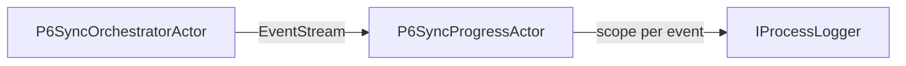
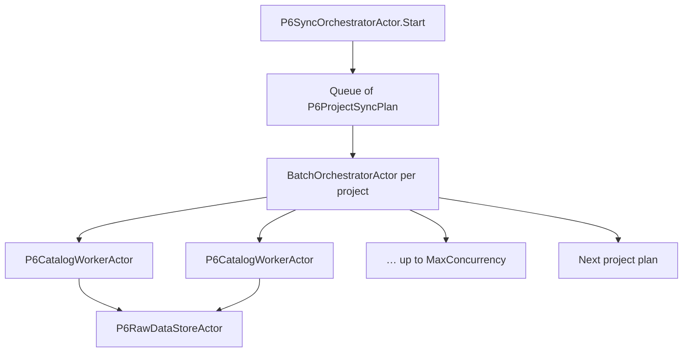

# Partial project sync (extension guide)

How `BatchOrchestratorActor` and `P6ProjectSyncPlan` support **selective** sync for chosen projects — without re-fetching every catalog every time.

**Related:** [reusable-actors.md](reusable-actors.md) · [actor-overview.md](actor-overview.md)

---

## Current behaviour (full sync)

For each selected project ObjectId, the orchestrator enqueues **all** `P6EntityKind` values and runs them in parallel (up to `MaxConcurrency`):

```text
Project A → [Projects, Wbs, Activities, Resources, ResourceAssignments, Relationships]
Project B → [ … same six catalogs … ]
```

Projects run **one after another**; catalogs within a project run **in parallel** via `BatchOrchestratorActor`.

Omit `EntityKinds` and `AdditionalFilter` to keep this default.

---

## Extension point: `P6ProjectSyncPlan`

```csharp
// Floor2Plan.Connectors.P6/Sync/P6ProjectSyncPlan.cs
public sealed record P6ProjectSyncPlan(
    string ProjectObjectId,
    IReadOnlySet<P6EntityKind> EntityKinds = null,   // null = all kinds
    string AdditionalFilter = null);                  // optional P6 REST filter fragment
```

`P6SyncOrchestratorActor.Start` accepts optional `SyncPlans`. When omitted, plans are built from project ids with `P6ProjectSyncPlan.Full(id)`.

---

## Partial update scenarios

### 1. Delta sync (typical) — changed rows since last run

The usual reason to avoid a full sync: only rows P6 updated since the previous import.

```csharp
new P6ProjectSyncPlan(
    ProjectObjectId: "10452",
    EntityKinds: new HashSet<P6EntityKind> { P6EntityKind.Activities, P6EntityKind.Relationships },
    AdditionalFilter: "LastUpdateDate>2026-03-01T00:00:00")
```

`BuildFilter` composes project scope with your clause:

```text
ProjectObjectId=10452;LastUpdateDate>2026-03-01T00:00:00
```

**Appsettings (same slice for every selected project):**

```json
"P6Sync": {
  "EntityKinds": [ "Activities", "Relationships" ],
  "AdditionalFilter": "LastUpdateDate>2026-03-01T00:00:00"
}
```

### 2. Delta on all catalogs (no entity-kind filter)

Refresh every catalog type, but only changed rows:

```csharp
new P6ProjectSyncPlan(
    ProjectObjectId: "10452",
    AdditionalFilter: "LastUpdateDate>2026-03-15T00:00:00")
```

### 3. Entity-kind subset without a date filter

Useful for targeted refresh or connector tests — not the main production pattern:

```csharp
new P6ProjectSyncPlan(
    ProjectObjectId: "10452",
    EntityKinds: new HashSet<P6EntityKind> { P6EntityKind.Wbs })
```

### 4. Mixed plans in one run

Different projects, different slices — one sync invocation:

```csharp
var plans = new[]
{
    P6ProjectSyncPlan.Full("10452"),
    new P6ProjectSyncPlan("10453", new[] { P6EntityKind.Wbs }),
    new P6ProjectSyncPlan("10454", null, "LastUpdateDate>2026-03-15T00:00:00")
};

new StartP6Sync(projectIds, syncPlans: plans)
```

The outer orchestrator still processes plans **sequentially**; each plan’s batch is independent.

### 5. Persist-layer partial apply (future)

Actor fetch is only half the story. To **apply** partial updates safely:

| Layer | Full sync today | Partial extension |
|-------|-----------------|-------------------|
| Fetch | All kinds → raw store | Plan controls what is fetched |
| Store | `ClearRawData` at start | Optional per-kind / per-project clear |
| Import | Replace project graph | Merge by `ObjectId`, tombstone missing rows |

That persist/import behaviour lives outside `BatchOrchestratorActor` — the plan type is the hook to pass “what changed” into downstream import.

---

## Wiring

| Entry point | How |
|-------------|-----|
| **Actor** | `new StartP6Sync(projectIds, syncPlans: plans)` — use `Ask` when the caller must wait for `P6SyncResult` |
| **Connector** | `SyncAllAsync` **Tell**s `StartP6Sync` and returns immediately; live progress via EventStream → `P6SyncProgressActor` |
| **Connector config** | `P6Sync:EntityKinds` / `P6Sync:AdditionalFilter` → `P6SyncPlanFactory.FromSyncOptions` |
| **Session → orchestrator** | `RunSync` → `P6SyncOrchestratorActor.Start(..., syncPlans: sync.SyncPlans)` |

---

## Live sync log (async runs)



`P6SyncProgressActor` resolves `IProcessLogger<P6Connector>` inside `IServiceScopeFactory.CreateScope()` for **each** progress event, so background sync keeps writing to the sync log after the HTTP request scope ends.

---

## Architecture


