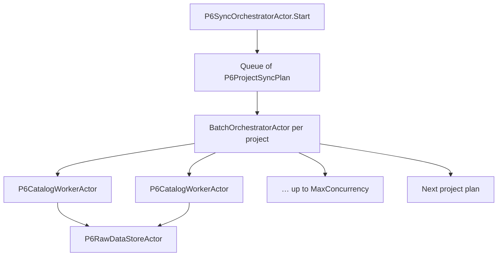

# Partial project sync (extension guide)

How `BatchOrchestratorActor` and `P6ProjectSyncPlan` support **selective** sync for chosen projects — without re-fetching every catalog every time.

**Related:** [reusable-actors.md](reusable-actors.md) · [actor-overview.md](actor-overview.md)

---

## Current behaviour (full sync)

For each selected project ObjectId, the orchestrator enqueues **all** `P6EntityKind` values and runs them in parallel (up to `MaxConcurrency`):

```text
Project A → [Projects, Wbs, Activities, Resources, ResourceAssignments, Relationships]
Project B → [ … same six catalogs … ]
```

Projects run **one after another**; catalogs within a project run **in parallel** via `BatchOrchestratorActor`.

---

## Extension point: `P6ProjectSyncPlan`

```csharp
// Floor2Plan.Connectors.P6/Sync/P6ProjectSyncPlan.cs
public sealed record P6ProjectSyncPlan(
    string ProjectObjectId,
    IReadOnlySet<P6EntityKind> EntityKinds = null,   // null = all kinds (today)
    string AdditionalFilter = null);                  // optional P6 REST filter fragment
```

`P6SyncOrchestratorActor.Start` accepts optional `SyncPlans`. When omitted, plans are built from project ids with `P6ProjectSyncPlan.Full(id)` (current behaviour).

---

## Partial update scenarios

### 1. Entity-kind subset (e.g. activities only)

Refresh scheduling data without re-pulling WBS or resources:

```csharp
new P6ProjectSyncPlan(
    ProjectObjectId: "10452",
    EntityKinds: new HashSet<P6EntityKind> { P6EntityKind.Activities, P6EntityKind.Relationships })
```

Each plan becomes a **batch work list** for `BatchOrchestratorActor` — only the listed kinds spawn `P6CatalogWorkerActor` workers.

### 2. Delta filter (e.g. changed since last sync)

Append a P6 filter clause per catalog fetch:

```csharp
new P6ProjectSyncPlan(
    ProjectObjectId: "10452",
    AdditionalFilter: "LastUpdateDate>2026-03-01T00:00:00")
```

`BuildFilter` composes the project scope with your clause:

```text
ProjectObjectId=10452;LastUpdateDate>2026-03-01T00:00:00
```

Combine with `EntityKinds` for “activities changed since X for project Y”.

### 3. Mixed plans in one run

Different projects, different slices — one sync invocation:

```csharp
var plans = new[]
{
    P6ProjectSyncPlan.Full("10452"),                                    // full
    new P6ProjectSyncPlan("10453", new[] { P6EntityKind.Wbs }),        // WBS only
    new P6ProjectSyncPlan("10454", null, "LastUpdateDate>2026-03-15") // delta, all kinds
};

new StartP6Sync(projectIds, syncPlans: plans)
```

The outer orchestrator still processes plans **sequentially**; each plan’s batch is independent.

### 4. Persist-layer partial apply (future)

Actor fetch is only half the story. To **apply** partial updates safely:

| Layer | Full sync today | Partial extension |
|-------|-----------------|-------------------|
| Fetch | All kinds → raw store | Plan controls what is fetched |
| Store | `ClearRawData` at start | Optional per-kind / per-project clear |
| Import | Replace project graph | Merge by `ObjectId`, tombstone missing rows |

That persist/import behaviour lives outside `BatchOrchestratorActor` — the plan type is the hook to pass “what changed” into downstream import.

---

## Wiring (enabled)

| Entry point | How |
|-------------|-----|
| **Actor** | `new StartP6Sync(projectIds, syncPlans: plans)` |
| **Connector config** | `P6Sync:EntityKinds` / `P6Sync:AdditionalFilter` in appsettings → `P6SyncPlanFactory.FromSyncOptions` |
| **Session → orchestrator** | `RunSync` → `P6SyncOrchestratorActor.Start(..., syncPlans: sync.SyncPlans)` |

Per-project mixed plans (full sync for project A, WBS-only for project B) pass explicit `SyncPlans` on `StartP6Sync`. UI checkboxes per entity kind can build that list later.

---

## Architecture


