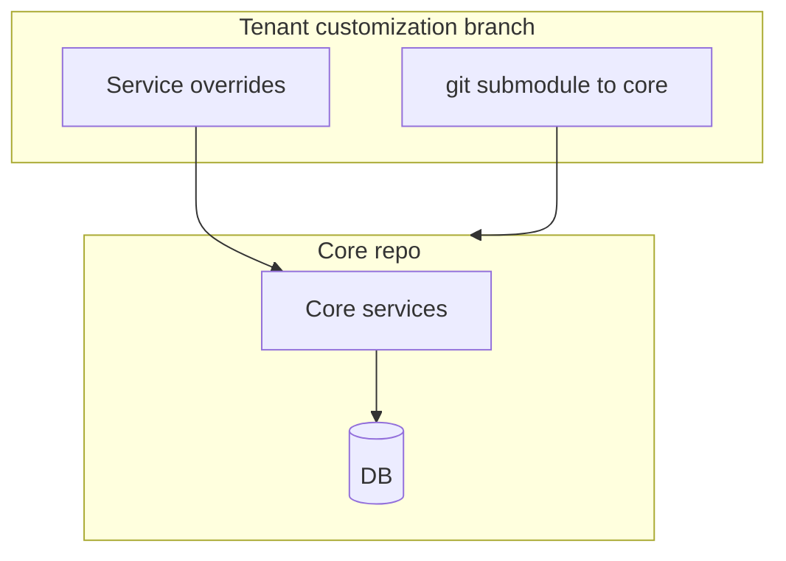
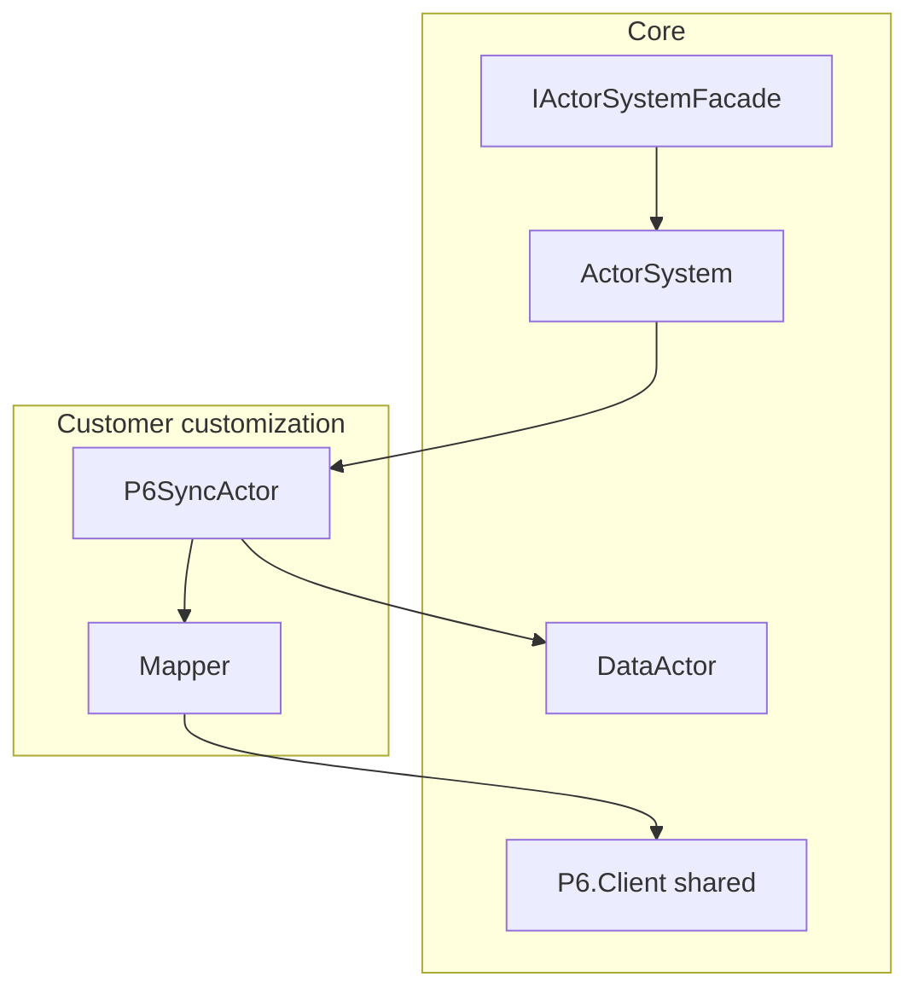
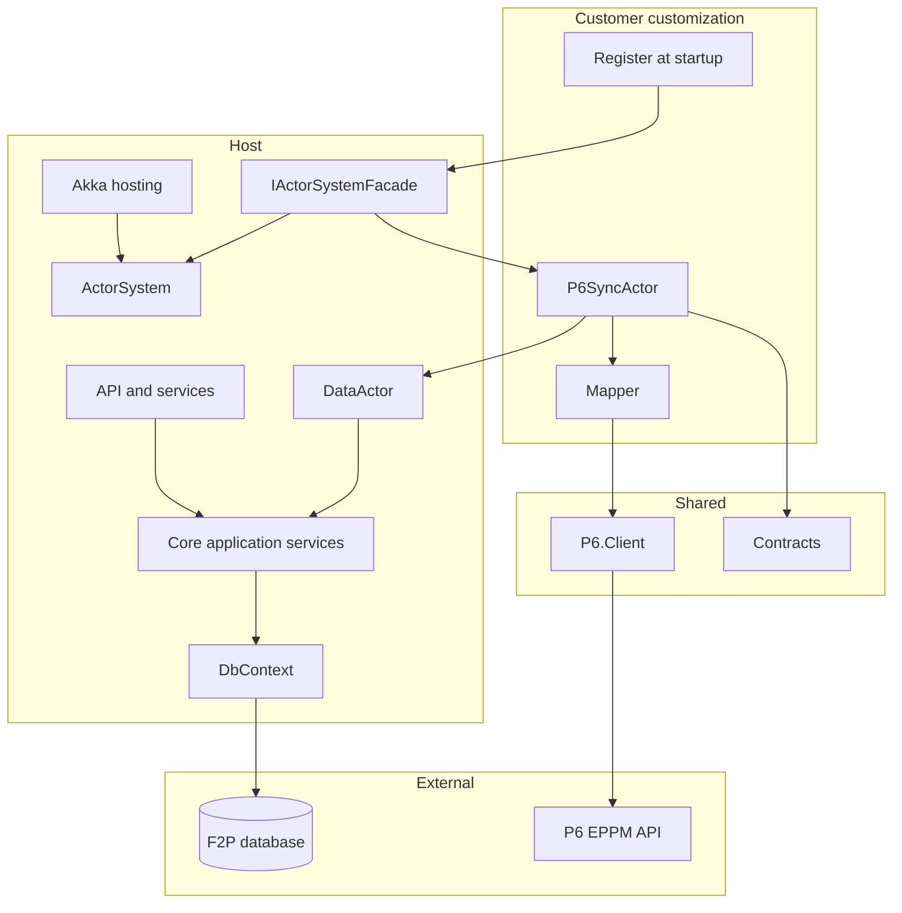
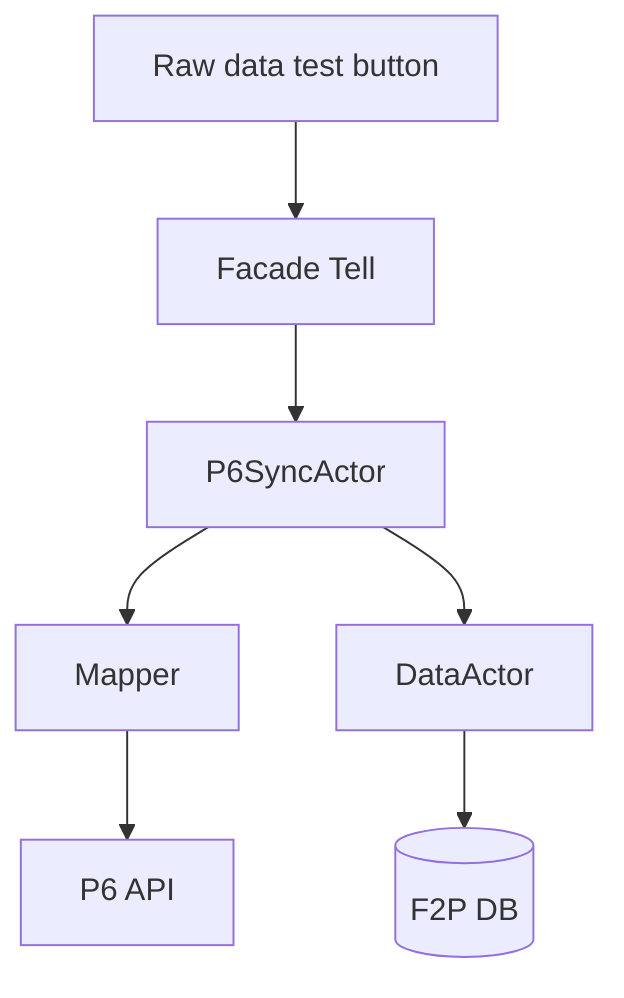
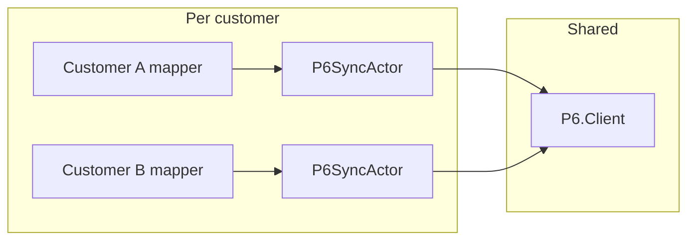

# Floor2Plan - P6 Integration via Akka Actors

**Purpose:** A reliable, flexible P6 connector — reusable across customers, adaptable to any mapping.

**Status:** Draft for discussion — September 2026

---

## Why this approach

P6 integration today lives in forked branches and service overrides. Hard to reuse, hard to maintain per customer.

This design separates concerns:

| | Core | Customer |
|---|------|----------|
| **Owns** | Data, ActorSystem, facade | P6 actor, mapping, P6 config |
| **Ships as** | Shared platform | Small customization project |

One shared **P6.Client**, one **mapper per customer**. Customers with an existing P6 integration plug in their mapping — same actor shape, different mapper.

Akka.NET runs P6 calls asynchronously with retries and supervision, without blocking the web app.

---

## Context

### Today



### Target



Core stays stable. Customer brings actor + mapper. Any mapping fits.

---

## View 1 — .NET components



| Component | Role |
|-----------|------|
| **IActorSystemFacade** | Register customer actors; `Tell` commands (`StartP6Sync`, `RawDataTest`) |
| **P6.Client** | Shared HTTP client — auth, retries, optional request/response logging |
| **Mapper** | Customer-specific — F2P shapes to EPPM |
| **P6SyncActor** | Sync commands, P6 HTTP via PipeTo, forwards updates to DataActor |
| **DataActor** | Persists inbound P6 data via application services |
| **Contracts** | Typed commands and events with correlation fields |

### Commands vs events

| Path | Mechanism | When |
|------|-----------|------|
| **Commands** | `facade.Tell(...)` | Sync start, raw data test, updates to DataActor |
| **Domain events** | EventStream after commit | P6 actor subscribes to changes it cares about |

---

## View 2 — Actor flows



### Raw data test

Connector bypass — no import, no DB write. Calls P6.Client read and displays the result. Verifies connectivity and mapping.

### Sync start

`StartP6Sync` → P6 actor → P6 API → DataActor when data lands in F2P.

### Reactive sync

After commit, publish to EventStream → P6 actor handles relevant events.

---

## Flexible mapping



| Customer situation | What they bring |
|------------------|-----------------|
| **New P6 integration** | Mapper + actor + config |
| **Existing P6 integration** | Mapping rules in the mapper; same actor shape |
| **Different EPPM fields** | Mapper only — P6.Client unchanged |

New customer: reference **P6.Client**, implement **mapper**, register **actor**.

---

## Suggested interfaces

```csharp
public interface IActorSystemFacade
{
    void Tell<TCommand>(TCommand command) where TCommand : IActorCommand;
    IActorRef RegisterActor(string name, Props props);
}

public interface IP6Client
{
    Task<P6Response> SendAsync(EppmMessage message, P6CallContext context, CancellationToken ct);
}

public interface IEventToEppmMapper
{
    bool CanHandle(IActorMessage message);
    EppmMessage Map(IActorMessage message);
}
```

`Props` wraps the factory that creates the actor — customer builds it with their mapper and client at registration.

---

## Observability

- `SyncId` per sync run, `CorrelationId` from HTTP, `TenantId` on log scope
- Optional P6 request/response logging when debugging mapping
- Filter logs by `SyncId` to trace a sync end-to-end

---

## Phased rollout

| Phase | Goal |
|-------|------|
| **1** | ActorSystem + facade in core. Dummy actor receives a message. |
| **2** | Raw data button → P6 actor → mock client → display result. |
| **3** | Real mapper for first customer. Mock or real P6.Client. |
| **4** | DataActor persists inbound data. Full sync round-trip. |
| **5** | After-commit EventStream for reactive sync. |

---

## Implementation notes

- Publish after commit, not inside `SaveChanges`
- P6SyncActor: state machine, PipeTo for HTTP, no blocking in Receive
- DataActor calls application services, not DbContext directly
- Typed messages in Contracts; correlation on every sync run
- Idempotent P6 calls for reactive sync

---

*September 2026*
