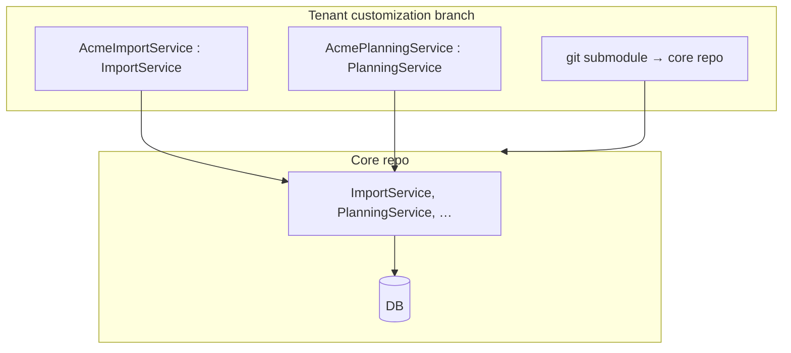
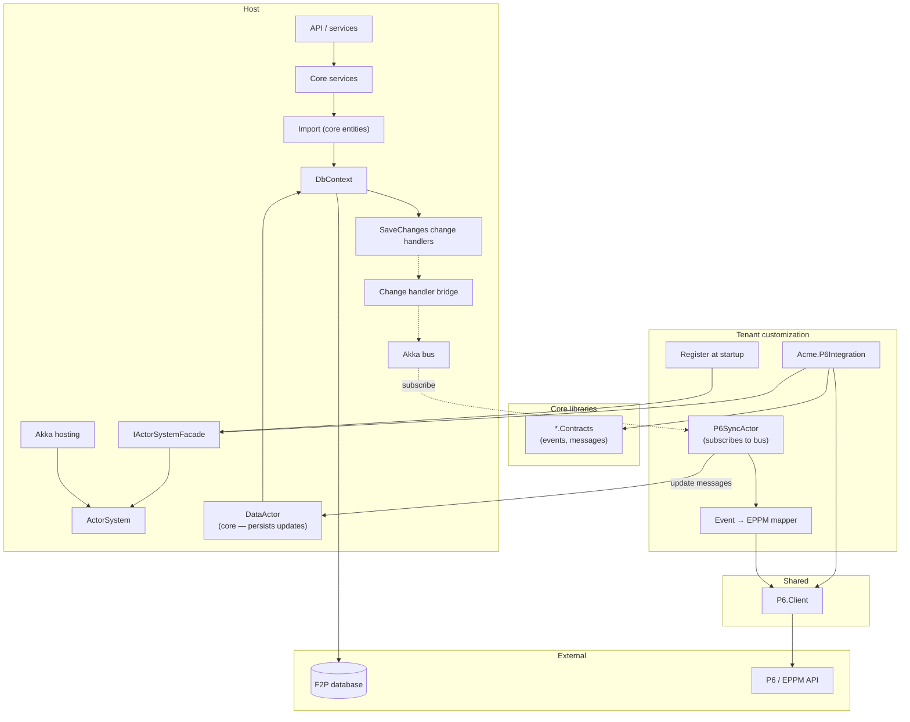
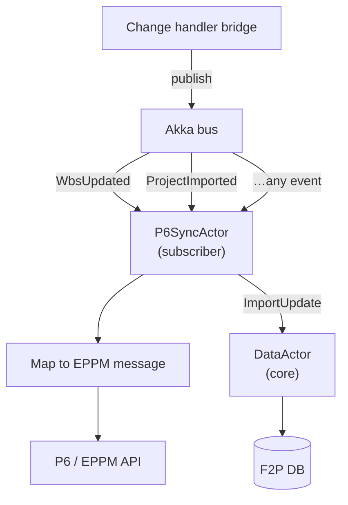
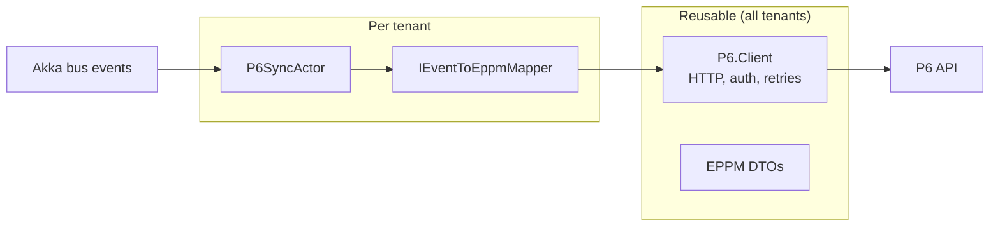

# Floor2Plan — Akka Actor Integration Design

**Purpose:** Design for moving tenant customization (e.g. P6 / EPPM integration) from service inheritance on forked branches to custom actors registered against a core ActorSystem.

**Status:** Draft for discussion

---

## Context

### Today

Each Floor2Plan tenant gets a customized branch with a submodule pointing at core. Core services are inherited and overridden in the customization branch.



**Pain:** merge drift, hidden coupling, hard to see what a tenant changed.

### Target

Core stays one codebase. Tenant customization adds actors and mapping — not service subclasses. Side effects that today live in EF `SaveChanges` change handlers move onto an Akka bus; tenant actors subscribe and react.

---

## Design principles

| Principle | Detail |
|-----------|--------|
| **Thin facade** | `IActorSystemFacade` — register actors, Tell/Ask. No heavy platform abstraction. |
| **Core owns data** | Import, entities, `DataActor` — canonical persistence into F2P database. |
| **Tenant owns integration** | P6 actor, EPPM mapping, P6 client configuration. |
| **Reusable P6 client** | Shared `P6.Client` NuGet; per-tenant mapping only. |
| **Events = state changed** | User interaction → save → bridge publishes onto Akka bus. |
| **Bridge, not subsystem** | Change handler bridge is a thin hook onto the bus — same trigger point as today. |

---

## View 1 — .NET components

How the solution is built and wired.



### Component roles

| Component | Owner | Role |
|-----------|-------|------|
| **Core services + import** | Core | User actions, import into core entities |
| **DbContext + change handlers** | Core | Persist; detect what changed |
| **Change handler bridge** | Core | Thin hook — publishes state-change events onto Akka bus |
| **ActorSystem + facade** | Core | Runs actors; tenant registers via facade |
| **DataActor** | Core | Handles update messages; imports/writes into F2P DB correctly |
| **\*.Contracts** | Core | Shared events and messages |
| **P6.Client** | Shared | Reusable P6 / EPPM HTTP client (auth, retries, wire format) |
| **Event → EPPM mapper** | Tenant | Maps bus events to EPPM messages |
| **P6SyncActor** | Tenant | Subscribes to bus; calls P6; sends update messages to DataActor |
| **Registration** | Tenant | `facade.RegisterActor(...)` at startup |

---

## View 2 — Actor organization

How work flows inside the ActorSystem.



### Flows

**F2P → P6 (outbound)**  
User saves → change handler → bridge publishes event → P6 actor subscribes → maps to EPPM → P6 API.

**P6 → F2P (inbound)**  
P6 actor receives data / response → sends update message → DataActor → F2P database.

Tenant actor never touches `DbContext` directly.

---

## Reusable P6 client vs tenant mapping



| Layer | Reusable? | Responsibility |
|-------|-----------|----------------|
| **P6.Client** | Yes | Auth, endpoints, send/receive, errors, retries |
| **EPPM DTOs** | Yes | P6 wire format |
| **IEventToEppmMapper** | No — per tenant | Bus event → EPPM message |
| **P6SyncActor** | No — per tenant | Subscribe, map, call client, forward updates to DataActor |

### Migrating to another tenant

1. Reference shared **P6.Client** NuGet.
2. Implement their **IEventToEppmMapper**.
3. Register their **P6SyncActor** via facade.
4. Configure P6 URL/credentials in appsettings.

No fork of core. No fork of the client.

---

## Suggested interfaces

```csharp
// Core — facade
public interface IActorSystemFacade
{
    void Tell(object message);
    Task<TReply> AskAsync<TReply>(object message, CancellationToken ct = default);
    void RegisterActor(string name, Props props);
}

// Shared — reusable
public interface IP6Client
{
    Task SendAsync(EppmMessage message, CancellationToken ct);
}

// Tenant — per client
public interface IEventToEppmMapper
{
    bool CanHandle(object busEvent);
    EppmMessage Map(object busEvent);
}
```

---

## Phased rollout

### Phase 1 — Core plumbing

- Add Akka hosting (`IHostedService`) to core.
- Implement `IActorSystemFacade`.
- Smoke test: dummy actor receives a message.

### Phase 2 — Raw data button (first trigger)

- Wire existing raw data connector button to core import.
- Core imports into core entities and saves.
- Optionally `facade.Tell(DataImported)` after save.

### Phase 3 — P6 actor + mock

- Implement `P6SyncActor` in tenant customization.
- Mock `IP6Client` (log / fake 200).
- Register actor at startup.

### Phase 4 — Change handler bridge

- Bridge publishes events onto Akka bus on `SaveChanges`.
- P6 actor subscribes to relevant events.
- Tenant mapper converts events → EPPM messages.

### Phase 5 — DataActor + real P6

- Core `DataActor` handles update messages from P6 actor.
- Swap mock for real `P6.Client`.

---

## Today vs tomorrow

| | Today | Tomorrow |
|---|-------|----------|
| **Tenant variance** | Inherit & override core services on forked branch | Register actors + mapper |
| **P6 integration** | Buried in handlers / subclasses | `P6SyncActor` + shared `P6.Client` |
| **Trigger** | SaveChanges change handlers | Same — bridge publishes to bus |
| **DB writes from P6** | Ad-hoc in customization | `DataActor` in core |
| **New tenant** | New branch, merge pain | New mapper + actor registration |

---

## One-liner

> Core runs the ActorSystem and owns data import via DataActor. A thin bridge publishes EF state changes onto the Akka bus. Tenant customization registers a P6 actor that subscribes, maps events to EPPM messages, and calls a shared P6 client — instead of overriding core services on a forked branch.

---

## Open questions

- [ ] Which bus events does the P6 actor subscribe to initially?
- [ ] Raw data button only, or bridge from day one?
- [ ] `DataActor` message contract for inbound P6 updates
- [ ] Fire-and-forget vs Ask for P6 calls (retries / supervision)

---

*Document generated from design discussion — September 2026*
