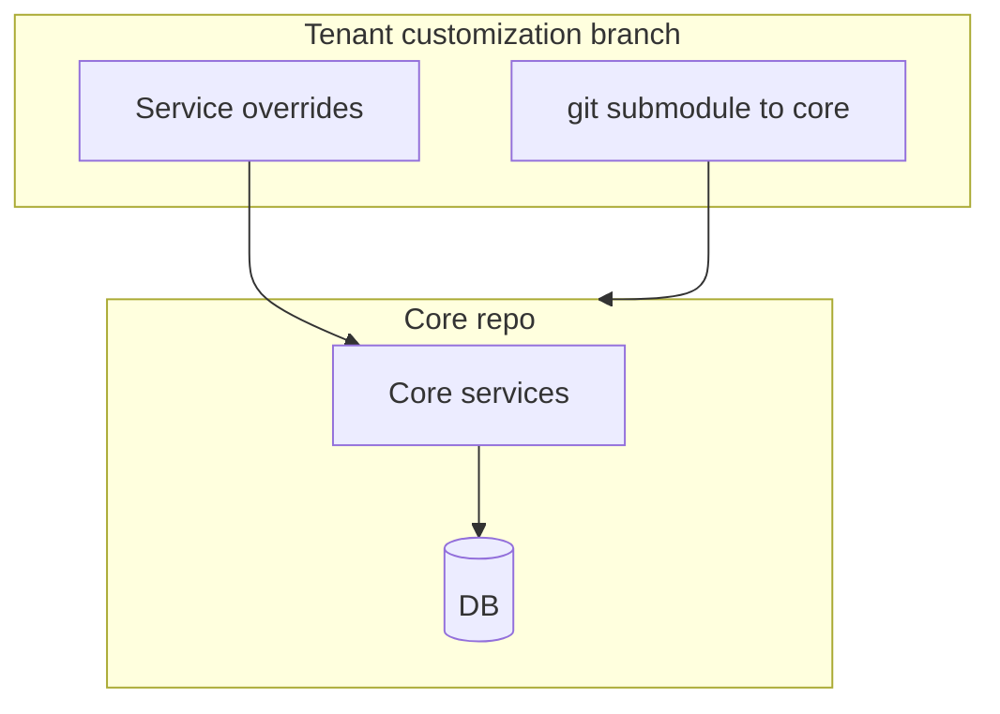
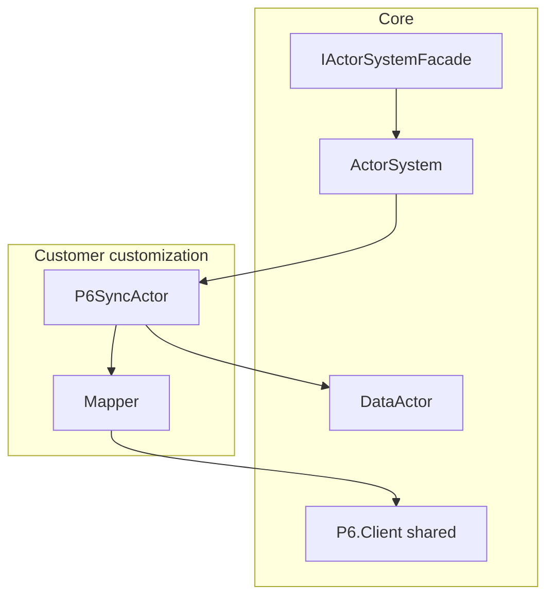
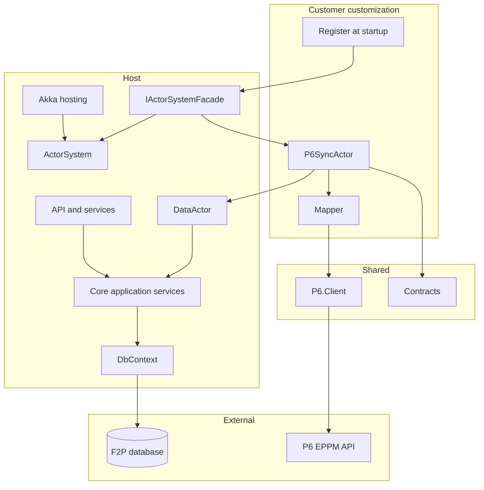
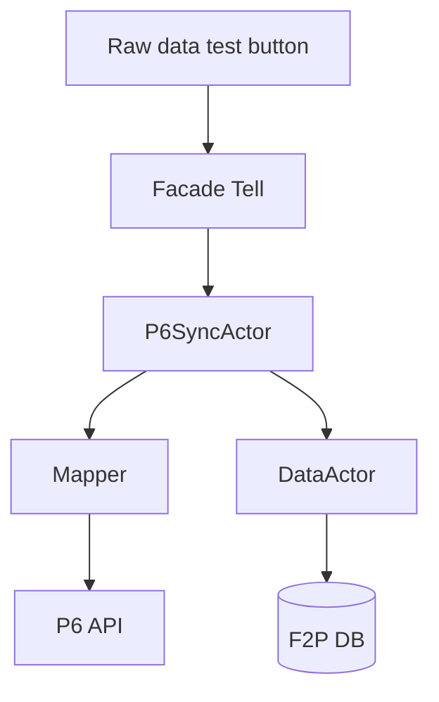
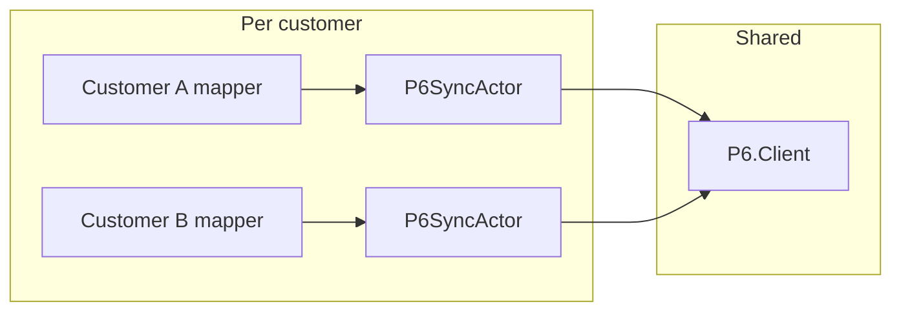

# Floor2Plan - P6 Integration via Akka Actors

**Purpose:** A flexible way to integrate Floor2Plan with Primavera P6 — reusable across customers, adaptable to any mapping.

**Scope:** P6 first. Not a platform rewrite. If this works well, it becomes a natural foundation for other work — but that is a follow-on conversation, not what we are building now.

**Status:** Draft for discussion — September 2026

---

## Why this approach

Floor2Plan tenants today customize via forked branches and service inheritance. That works, but P6 integration gets buried in overrides and is hard to reuse.

This design separates concerns:

| | Core | Customer / tenant |
|---|------|-------------------|
| **Owns** | Data, ActorSystem, facade | P6 actor, mapping, P6 config |
| **Ships as** | Shared platform | Small customization project |

**The pitch:** one shared **P6.Client**, one **mapper per customer**. Customers that already have their own P6 integration can plug in their mapping — the shape is the same, only the mapper changes. No fork of core services.

Akka.NET gives us a clean place to run P6 calls (async, retries, supervision) without blocking the web app. Once we have experience with it on P6, broader use of actors in Floor2Plan becomes easier to explain and sell.

---

## Context

### Today



P6 logic mixed into inherited services. Each customer is a variation on the same problem.

### Target (P6 slice)



Core stays stable. Customer brings actor + mapper. **Any mapping fits** — greenfield P6 or replacing an existing integration.

---

## View 1 — .NET components



| Component | Role |
|-----------|------|
| **IActorSystemFacade** | Register customer actors; `Tell` commands (`StartP6Sync`, `RawDataTest`) |
| **P6.Client** | Shared HTTP client — auth, retries, optional request/response logging |
| **Mapper** | Customer-specific — F2P shapes ↔ EPPM. This is where every customer differs. |
| **P6SyncActor** | Customer actor — sync commands, P6 HTTP via PipeTo, forwards updates to DataActor |
| **DataActor** | Core — persists inbound P6 data via application services |
| **Contracts** | Typed commands and events with correlation fields |

### Commands vs events

| Path | Mechanism | When |
|------|-----------|------|
| **Commands** | `facade.Tell(...)` | Sync start, raw data test, updates to DataActor |
| **Domain events** | EventStream after commit | Later phase — P6 actor subscribes to changes it cares about |

EventStream is local for now. It is a natural hook if we add more connectors later — same publish, new subscriber. Not in scope for the first P6 slice unless we need it.

---

## View 2 — Actor flows



### Raw data test (first milestone)

Connector bypass — **no import, no DB write**. Quick check that P6.Client can read and the mapper produces sensible output. Good for onboarding a customer with an existing P6 setup: prove the mapping before turning on sync.

### Sync start

User or system triggers `StartP6Sync` → P6 actor → P6 API → DataActor when data should land in F2P.

### Reactive sync (later)

After commit, publish to EventStream → P6 actor picks up relevant events. Only when the basic sync path works.

---

## Flexible mapping — any customer



| Customer situation | What they bring |
|------------------|-----------------|
| **New P6 integration** | Mapper + actor + config |
| **Already has P6 integration** | Their mapping rules in the mapper; same actor shape |
| **Different EPPM fields** | Mapper only — P6.Client unchanged |

New customer = reference **P6.Client**, implement **mapper**, register **actor**. No core fork.

---

## Suggested interfaces

```csharp
public interface IActorSystemFacade
{
    void Tell<TCommand>(TCommand command) where TCommand : IActorCommand;
    IActorRef RegisterActor(string name, Props props);
}

public interface IP6Client
{
    Task<P6Response> SendAsync(EppmMessage message, P6CallContext context, CancellationToken ct);
}

public interface IEventToEppmMapper
{
    bool CanHandle(IActorMessage message);
    EppmMessage Map(IActorMessage message);
}
```

`Props` wraps the factory that creates the actor — customer builds it with their mapper and client at registration.

---

## Observability

Keep it practical from day one:

- `SyncId` per sync run, `CorrelationId` from HTTP, `TenantId` on log scope
- Optional P6 request/response logging when debugging mapping issues
- Filter logs by `SyncId` to trace a single sync end-to-end

---

## Phased rollout

Focus on proving P6. Each phase should be demoable.

| Phase | Goal |
|-------|------|
| **1** | ActorSystem + facade in core. Dummy actor receives a message. |
| **2** | Raw data button → P6 actor → mock client → display result. No DB. |
| **3** | Real mapper for first customer. Mock or real P6.Client. |
| **4** | DataActor persists inbound data. Full sync round-trip. |
| **5** | After-commit EventStream for reactive sync. Retire old path when ready. |

We do not need to solve the existing connector stack on day one. Run alongside it until the new path is proven, then cut over per customer.

---

## What this could lead to (not in scope now)

If P6 integration via actors works well:

- Reuse the pattern for other connectors (subscribe to the same EventStream)
- Reduce forked-branch customization over time
- Address technical debt in change handlers incrementally

That is the longer story. **Right now we are proving P6 is the most flexible integration path** — reusable, mappable, and customer-agnostic at the core.

---

## Technical notes (from review)

Kept for implementers — not part of the sales pitch:

- Publish after commit, not inside `SaveChanges`
- P6SyncActor: state machine, PipeTo for HTTP, no blocking in Receive
- DataActor calls application services, not DbContext directly
- Typed messages in Contracts; correlation on every sync run
- Idempotent P6 calls when reactive sync is added

---

*September 2026*
