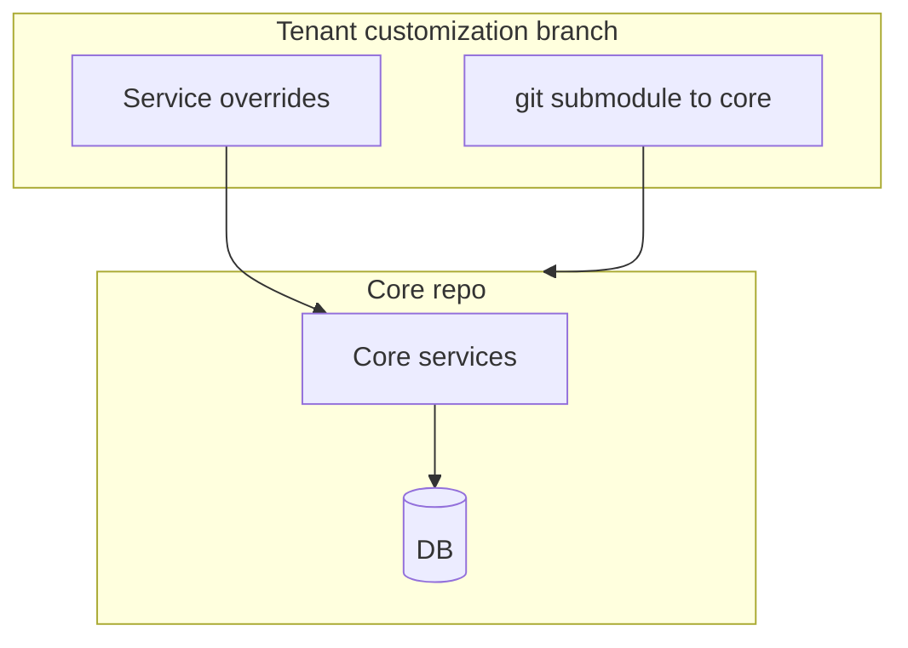
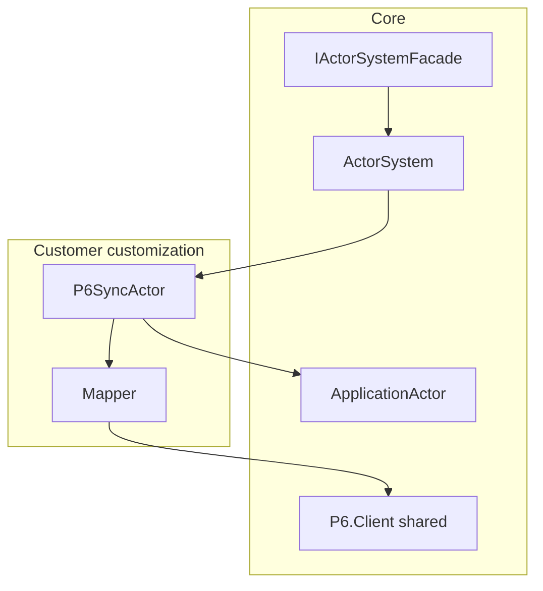
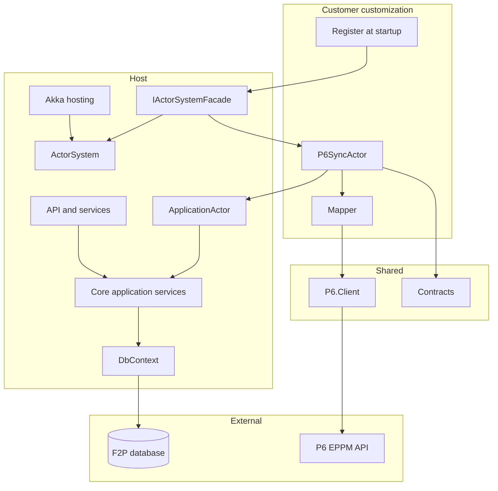
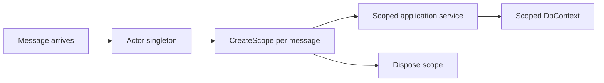
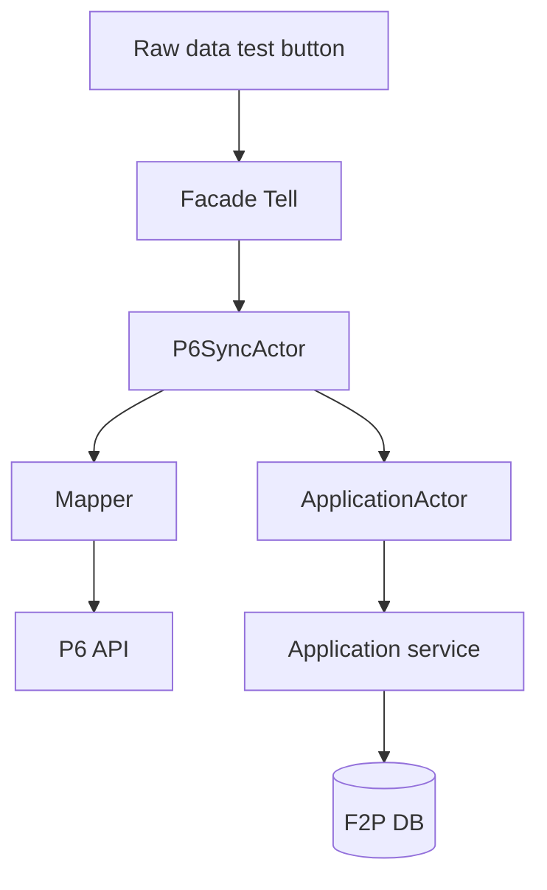
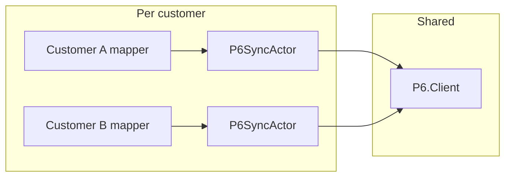

# Floor2Plan - P6 Integration via Akka Actors

**Purpose:** A reliable, flexible P6 connector — reusable across customers, adaptable to any mapping.

**Status:** Draft for discussion — September 2026

---

## Why this approach

P6 integration today lives in forked branches and service overrides. Hard to reuse, hard to maintain per customer.

This design separates concerns:

| | Core | Customer |
|---|------|----------|
| **Owns** | Data, ActorSystem, facade | P6 actor, mapping, P6 config |
| **Ships as** | Shared platform | Small customization project |

One shared **P6.Client**, one **mapper per customer**. Customers with an existing P6 integration plug in their mapping — same actor shape, different mapper.

Akka.NET runs P6 calls asynchronously with retries and supervision, without blocking the web app.

---

## Context

### Today



### Target



Core stays stable. Customer brings actor + mapper. Any mapping fits.

---

## View 1 — .NET components



| Component | Layer | Role |
|-----------|-------|------|
| **IActorSystemFacade** | Core / hosting | Register customer actors; `Tell` commands |
| **P6.Client** | Shared | HTTP client — auth, retries, optional request/response logging |
| **Mapper** | Customer | F2P shapes to EPPM |
| **P6SyncActor** | Customer | Sync commands, P6 HTTP via PipeTo |
| **ApplicationActor** | **Application** | Receives persist commands; calls application services — **not** a data-layer actor |
| **Contracts** | Shared | Typed commands and events with correlation fields |

### ApplicationActor (not a data-layer actor)

The name matters. **ApplicationActor** lives in the application layer. It receives commands like `ImportP6Data` and delegates to existing application services (`IPlanningImportService`, etc.). Those services own the business rules and call repositories/DbContext.

| | ApplicationActor | Repository / DbContext |
|---|------------------|------------------------|
| **Layer** | Application | Infrastructure |
| **Knows** | Use cases, commands | SQL, EF, tables |
| **Called by** | P6SyncActor via message | Application services |

P6SyncActor talks to P6. ApplicationActor talks to application services. Neither opens `DbContext` directly.

### Commands vs events

| Path | Mechanism | When |
|------|-----------|------|
| **Commands** | `facade.Tell(...)` | Sync start, raw data test, persist commands to ApplicationActor |
| **Domain events** | EventStream after commit | P6 actor subscribes to changes it cares about |

---

## Actor system and IoC

Actors integrate with `Microsoft.Extensions.DependencyInjection` via **Akka.Hosting**. The host registers the ActorSystem as a singleton; actors are created through `Props` or `AddActor<T>()`.

### Lifetimes — there is no request scope

HTTP requests get a scoped `DbContext` automatically. **Actors do not.** An actor instance is typically long-lived (singleton per actor ref). Messages arrive one at a time on the mailbox, but there is no implicit scope per message.



| Registration | Lifetime | Inject into actor ctor? |
|--------------|----------|-------------------------|
| `IServiceScopeFactory` | Singleton | Yes |
| `ILogger<T>`, `IConfiguration` | Singleton | Yes |
| `IP6Client` (stateless HttpClient) | Singleton | Yes |
| `DbContext`, application services | Scoped | **No** — resolve inside a scope per message |
| Mapper, tenant config | Scoped or transient | Resolve inside scope, or inject singleton if stateless |

### Pattern: scope per message

```csharp
public sealed class ApplicationActor : ReceiveActor
{
    private readonly IServiceScopeFactory _scopeFactory;

    public ApplicationActor(IServiceScopeFactory scopeFactory)
    {
        _scopeFactory = scopeFactory;

        ReceiveAsync<ImportP6Data>(async command =>
        {
            using IServiceScope scope = _scopeFactory.CreateScope();
            var importService = scope.ServiceProvider
                .GetRequiredService<IPlanningImportService>();

            await importService.ImportAsync(command.Payload);
        });
    }
}
```

**Rules:**

- Inject **`IServiceScopeFactory`** into actors that need scoped services.
- Create **`using var scope = _scopeFactory.CreateScope()`** at the start of each message handler.
- Resolve application services from `scope.ServiceProvider` inside the handler.
- Dispose the scope when the handler completes — same as a unit of work for that message.
- Do **not** cache scoped services on actor fields between messages.

### Customer actor registration with DI

```csharp
// Akka.Hosting resolves ctor deps from DI when using AddActor<T>
services.AddAkka<MyHostedService>("f2p", (builder, sp) =>
{
    builder.WithActors((system, registry) =>
    {
        registry.Register<P6SyncActor>(system.ActorOf(
            DependencyResolver.For(system).Props<P6SyncActor>(), "p6-sync"));
    });
});

// Customer customization — manual Props with injected deps
facade.RegisterActor("p6-sync",
    Props.Create(() => new P6SyncActor(mapper, p6Client, scopeFactory)));
```

`Props` is the factory recipe. Akka calls it to create the actor instance. Constructor dependencies that are singleton-safe can be captured in the lambda; scoped deps use `IServiceScopeFactory` inside handlers.

---

## View 2 — Actor flows



### Raw data test

Connector bypass — no import, no DB write. Calls P6.Client read and displays the result. Verifies connectivity and mapping.

### Sync start

`StartP6Sync` → P6 actor → P6 API → ApplicationActor → application service when data lands in F2P.

### Reactive sync

After commit, publish to EventStream → P6 actor handles relevant events.

---

## Flexible mapping



| Customer situation | What they bring |
|------------------|-----------------|
| **New P6 integration** | Mapper + actor + config |
| **Existing P6 integration** | Mapping rules in the mapper; same actor shape |
| **Different EPPM fields** | Mapper only — P6.Client unchanged |

New customer: reference **P6.Client**, implement **mapper**, register **actor**.

---

## Suggested interfaces

```csharp
public interface IActorSystemFacade
{
    void Tell<TCommand>(TCommand command) where TCommand : IActorCommand;
    IActorRef RegisterActor(string name, Props props);
}

public interface IP6Client
{
    Task<P6Response> SendAsync(EppmMessage message, P6CallContext context, CancellationToken ct);
}

public interface IEventToEppmMapper
{
    bool CanHandle(IActorMessage message);
    EppmMessage Map(IActorMessage message);
}
```

---

## Observability

- `SyncId` per sync run, `CorrelationId` from HTTP, `TenantId` on log scope
- Optional P6 request/response logging when debugging mapping
- Filter logs by `SyncId` to trace a sync end-to-end

---

## Phased rollout

| Phase | Goal |
|-------|------|
| **1** | ActorSystem + facade in core. Dummy actor receives a message. |
| **2** | Raw data button → P6 actor → mock client → display result. |
| **3** | Real mapper for first customer. Mock or real P6.Client. |
| **4** | ApplicationActor + scope-per-message. Full sync round-trip. |
| **5** | After-commit EventStream for reactive sync. |

---

## Implementation notes

- Publish after commit, not inside `SaveChanges`
- P6SyncActor: state machine, PipeTo for HTTP, no blocking in Receive
- ApplicationActor: scope per message via `IServiceScopeFactory`
- Typed messages in Contracts; correlation on every sync run
- Idempotent P6 calls for reactive sync

---

*September 2026*
