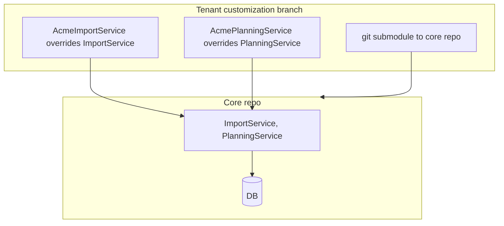
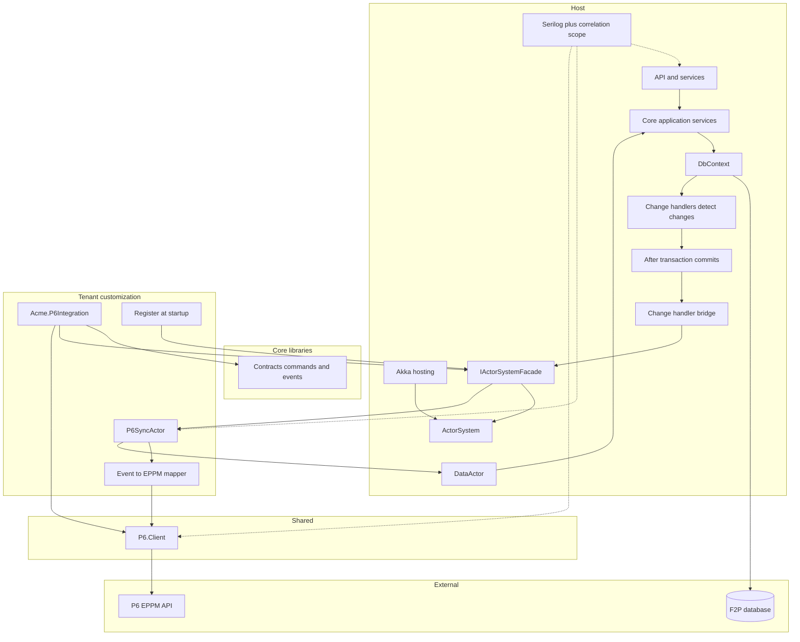
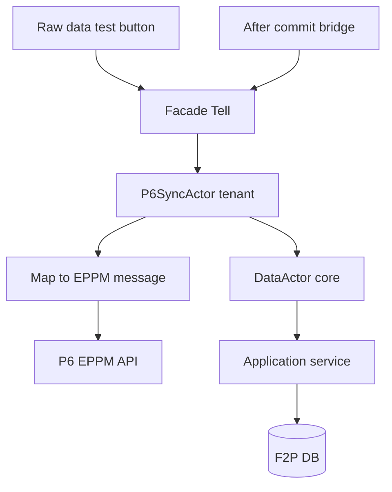
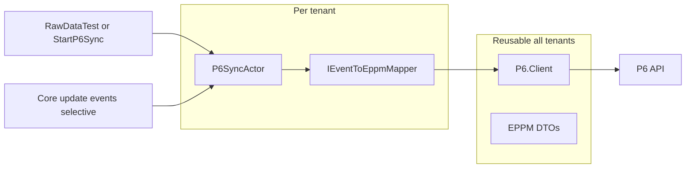

# Floor2Plan - Akka Actor Integration Design

**Purpose:** Design for moving tenant customization (e.g. P6 / EPPM integration) from service inheritance on forked branches to custom actors registered against a core ActorSystem.

**Status:** Draft for discussion (incorporates design review, September 2026)

---

## Context

### Today

Each Floor2Plan tenant gets a customized branch with a submodule pointing at core. Core services are inherited and overridden in the customization branch.



**Pain:** merge drift, hidden coupling, hard to see what a tenant changed.

### Target

Core stays one codebase. Tenant customization adds actors and mapping — not service subclasses. Side effects that today live in EF change handlers move to the ActorSystem **after the database transaction commits**.

---

## Design principles

| Principle | Detail |
|-----------|--------|
| **Thin facade** | `IActorSystemFacade` — register actors, typed `Tell` only. No `Ask` inside the actor system (Ask only at HTTP/controller if needed). |
| **Core owns data** | Import, entities, `DataActor` — canonical persistence into F2P database via application services/commands. |
| **Tenant owns integration** | P6 actor, EPPM mapping, P6 client configuration. |
| **Reusable P6 client** | Shared `P6.Client` NuGet; per-tenant mapper only. |
| **After-commit only** | Bridge publishes **after** transaction commits — never from inside `SaveChanges`. |
| **Typed messages** | Commands and events in a Contracts project — no `Tell(object)`. |
| **Observable** | `CorrelationId` + `SyncId` + `TenantId` on every sync run and log line; optional P6 request/response logging. |
| **One P6 path** | Replace existing connector/Hangfire path — do not run two parallel integrations. |

---

## View 1 — .NET components

How the solution is built and wired.



### Component roles

| Component | Owner | Role |
|-----------|-------|------|
| **Core application services** | Core | User actions, import, business rules |
| **Change handlers** | Core | Detect what changed during save |
| **After-commit bridge** | Core | Publish typed events to ActorSystem only after DB commit |
| **ActorSystem + facade** | Core | Runs actors; holds registered actor refs; typed `Tell` |
| **DataActor** | Core | Receives inbound update commands; calls application services — not `DbContext` directly |
| **Contracts** | Core | Typed commands and events with correlation fields |
| **P6.Client** | Shared | Reusable P6 HTTP client; optional request/response logging |
| **Event to EPPM mapper** | Tenant | Maps commands/events to EPPM messages |
| **P6SyncActor** | Tenant | Sync-start + selective core events; PipeTo for HTTP; state machine |
| **Registration** | Tenant | `facade.RegisterActor(...)` at startup |

### Message routing (pick one, document it)

| Option | When to use |
|--------|-------------|
| **Tell to registered actor ref** | **Default for Phase 1–4.** Simplest. Facade holds `IActorRef` for P6SyncActor. |
| **EventStream** | Single-server fan-out to multiple subscribers. Does **not** work across cluster nodes. |
| **DistributedPubSub** | Multi-server / cluster later. |

Start with **direct Tell to P6SyncActor ref**. Add EventStream or pub-sub only when you need fan-out.

---

## View 2 — Actor organization

How work flows inside the ActorSystem.



### Flows

**Raw data test (connector bypass)**  
Raw data button bypasses connector import — no DB write. Quick test: `facade.Tell(new RawDataTest(...))` → P6 actor → P6 client read → display response. Assign a `SyncId` and `CorrelationId` for logging.

**Sync start (user or system initiated)**  
`facade.Tell(new StartP6Sync(...))` → P6 actor (Idle → Syncing → Done) → P6 API via PipeTo → update commands to DataActor when persisting.

**F2P to P6 (reactive, Phase 4+)**  
User saves → after commit → bridge → `facade.Tell(new CoreEntityUpdated(...))` → P6 actor handles only events it deems relevant → EPPM → P6 API. If P6 export fails, F2P data is already saved — plan retry and idempotent P6 calls.

**P6 to F2P (inbound)**  
P6 actor receives response → `Tell` typed update command → DataActor → application service → F2P database.

Tenant actor never touches `DbContext` directly.

### P6SyncActor behaviour

| Requirement | Detail |
|-------------|--------|
| **State machine** | `Become`: Idle → Syncing → Done (or Failed) |
| **Async HTTP** | `PipeTo` for all P6 calls — never block in `Receive` |
| **Cancellation** | `CancellationToken` when sync cancelled or actor stops |
| **Errors** | try/catch for HTTP timeouts; supervision for unexpected failures |
| **Idempotency** | Dedup repeated activity saves; safe to retry after commit |

### DataActor behaviour

- Call **application services / commands** — avoid `DbContext` in the actor if possible.
- One actor may bottleneck at scale — consider per-aggregate actors or a worker pool later.
- Not on the raw data test path (read-only, no persist).

---

## Observability and correlation

Every sync run gets a **`SyncId`** (new GUID per run). Propagate **`CorrelationId`** from HTTP (or generate at facade). Include **`TenantId`** on all actor and P6 client log lines.

| Field | Set by | Example |
|-------|--------|---------|
| `CorrelationId` | HTTP middleware or facade | `a1b2c3...` |
| `SyncId` | Facade on `StartP6Sync` / `RawDataTest` | `sync-2026-09-02-001` |
| `TenantId` | Host context | `acme` |
| `UseCase` | Facade / message | `P6.RawDataTest`, `P6.SyncStart` |

### Logging

- Actors: `Context.GetLogger()` with `SyncId`, `CorrelationId`, `TenantId` in scope (Serilog `LogContext`).
- Facade: push correlation scope before `Tell`.
- **P6.Client (optional):** log request/response metadata when enabled in config — URL, status code, duration, `SyncId`. Redact credentials and optionally body in production.

```csharp
// Typed messages carry correlation
public sealed record StartP6Sync(
    Guid SyncId,
    string CorrelationId,
    string TenantId,
    /* payload */);

public sealed record RawDataTest(
    Guid SyncId,
    string CorrelationId,
    string TenantId);
```

### Tracing a sync in Seq / logs

Filter: `SyncId = '...'` or `CorrelationId = '...'` — should show HTTP trigger → facade → P6 actor states → P6 HTTP calls → DataActor → application service.

---

## Reusable P6 client vs tenant mapping



| Layer | Reusable? | Responsibility |
|-------|-----------|----------------|
| **P6.Client** | Yes | Auth, endpoints, send/receive, retries, optional request/response logging |
| **EPPM DTOs** | Yes | P6 wire format |
| **IEventToEppmMapper** | No — per tenant | Commands + selected events → EPPM message |
| **P6SyncActor** | No — per tenant | State machine, PipeTo, correlation scope, forward updates to DataActor |

### Migrating to another tenant

1. Reference shared **P6.Client** NuGet.
2. Implement their **IEventToEppmMapper**.
3. Register their **P6SyncActor** via facade.
4. Configure P6 URL/credentials — Key Vault in production, not plain appsettings.

---

## Suggested interfaces

```csharp
// Core — facade (typed Tell only)
public interface IActorSystemFacade
{
    void Tell<TMessage>(TMessage message) where TMessage : IActorMessage;
    IActorRef RegisterActor(string name, Props props);
}

// Marker for typed commands/events in Contracts
public interface IActorMessage
{
    string CorrelationId { get; }
    string TenantId { get; }
}

public interface ISyncMessage : IActorMessage
{
    Guid SyncId { get; }
}

// Shared — reusable
public interface IP6Client
{
    Task<P6Response> SendAsync(EppmMessage message, P6CallContext context, CancellationToken ct);
}

// Optional observability on P6 calls
public sealed record P6CallContext(
    Guid SyncId,
    string CorrelationId,
    string TenantId,
    bool LogRequestResponse = false);

// Tenant — per client
public interface IEventToEppmMapper
{
    bool CanHandle(IActorMessage message);
    EppmMessage Map(IActorMessage message);
}
```

`Props` is the actor factory recipe — tenant builds it with mapper and client, facade calls `ActorOf(props, name)`.

---

## Coexistence with existing connector stack

Before Phase 4, document what replaces each existing piece. Do **not** build a second P6 path alongside the old one.

| Existing | Migration |
|----------|-----------|
| `SyncPlanningProcessor` | Replaced by P6SyncActor + DataActor |
| `ActivityConnectorChangeHandler` | Replaced by after-commit bridge → P6 actor |
| Hangfire / Elsa `RunConnectorActivity` | Replaced by `StartP6Sync` via facade (or retire job) |
| `ConnectorConfigurationController` | Stays for config; raw data button becomes bypass test |

Strangler approach: wire new path behind feature flag, cut over per tenant, remove old handler/processor when verified.

---

## Deployment model

**Decide early:**

| Model | Implication |
|-------|-------------|
| **One tenant per server** (current forked-branch model) | Direct Tell to actor ref is sufficient. EventStream OK. |
| **Many tenants in one app** | Need tenant-scoped actor refs or routing; consider DistributedPubSub later. |

---

## Phased rollout

### Phase 1 — Core plumbing

- Add Akka hosting (`IHostedService`) to core.
- Implement `IActorSystemFacade` with typed `Tell` and correlation scope.
- Contracts project with `IActorMessage` / `ISyncMessage`.
- Smoke test: dummy actor receives a typed message with `SyncId` in logs.

### Phase 2 — Raw data button (connector bypass, quick test)

- Wire raw data button as connector bypass — skips import, no DB write.
- `facade.Tell(new RawDataTest(syncId, correlationId, tenantId))`.
- Display P6 read response. Verify logging shows full correlation chain.

### Phase 3 — P6SyncActor + mock client

- Implement `P6SyncActor` with Idle/Syncing/Done `Become`, PipeTo, cancellation.
- Mock `IP6Client` returns sample EPPM data.
- Register actor at startup via `Props`.
- Tests: Akka.Hosting.TestKit, mock client, prove PipeTo does not block mailbox.

### Phase 4 — After-commit bridge

- Bridge publishes typed events **after transaction commits** (not in `SaveChanges`).
- Consider outbox table for reliable delivery and retry.
- `facade.Tell` to P6SyncActor for events it deems relevant.
- Idempotent P6 calls; dedup repeated saves.

### Phase 5 — DataActor + real P6.Client

- DataActor calls application services for inbound P6 updates.
- Swap mock for real `P6.Client` with optional request/response logging.
- Retire old connector processor / change handler path per strangler plan.

---

## Design review feedback (incorporated)

**What the design gets right**

- Tenant owns integration; core owns data.
- Tell only via facade.
- Shared P6.Client; per-tenant mapper.
- Phased rollout; fixes forked-branch merge pain.

**Fixes applied from review**

| # | Topic | Resolution |
|---|-------|------------|
| 1 | Bridge timing | After-commit only; outbox considered for Phase 4 |
| 2 | Name the bus | Direct Tell to actor ref (default); EventStream/cluster noted |
| 3 | P6SyncActor | State machine, PipeTo, cancellation, supervision |
| 4 | DataActor | Application services, not DbContext; pool later if needed |
| 5 | Existing stack | Strangler table above — no parallel P6 path |
| 6 | Deployment | One tenant per server vs multi-tenant — decide early |
| 7 | Typed messages | Contracts with `IActorMessage` — no `Tell(object)` |
| 8 | Correlation | `SyncId` + `CorrelationId` + `TenantId` on every run |
| 9 | Idempotency | Dedup P6 calls; safe retry after commit |
| 10 | Tests | TestKit + mock client + mailbox non-blocking |
| 11 | Logging | `Context.GetLogger()` with correlation scope |
| 12 | Secrets | Key Vault for production P6 credentials |
| 13 | Observability | Optional P6 request/response logging via `P6CallContext` |

---

## Today vs tomorrow

| | Today | Tomorrow |
|---|-------|----------|
| **Tenant variance** | Inherit and override core services on forked branch | Register actors + mapper |
| **P6 integration** | Buried in handlers / subclasses / Hangfire | `P6SyncActor` + shared `P6.Client` |
| **Trigger** | Change handlers inline | After-commit bridge → facade Tell |
| **DB writes from P6** | Ad-hoc in customization | DataActor → application services |
| **Observability** | Ad-hoc logging | SyncId + CorrelationId end-to-end |
| **New tenant** | New branch, merge pain | New mapper + actor registration |

---

## One-liner

> Core runs the ActorSystem and owns data via DataActor and application services. After commit, a thin bridge tells the P6 actor. Tenant customization registers P6SyncActor with typed messages, correlation, and a shared P6 client — replacing forked service overrides and the old connector path.

---

*Design discussion + review — September 2026*
