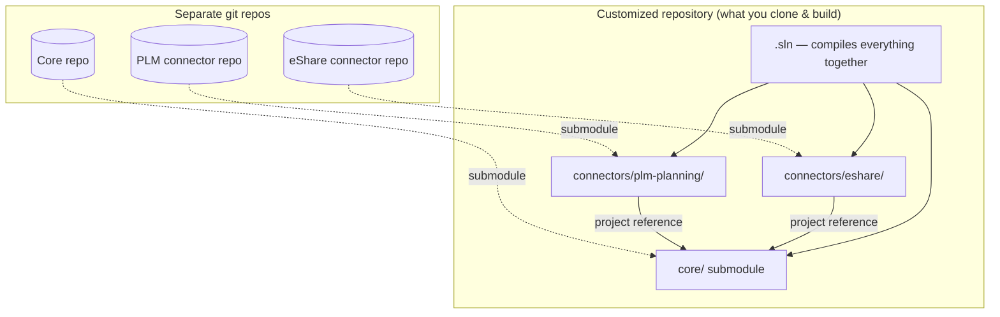

# Why legacy Floor2Plan connectors should not reference core via git submodules

**Audience:** Developers, integrators, and tech leads working on SAP, Kronos, PLM, HR, file, and client-specific **connectors** in the legacy Floor2Plan application.

**Purpose:** Explain — in plain terms — why the current pattern (connector folder as git submodule that **references the core application**) creates mixed dependencies, and what Platform 2.0 replaces it with.

**This is not** a blame document. Submodule-based connectors solved real problems years ago. The product outgrew that model.

---

## 1. Vocabulary

| Term (legacy) | Meaning |
|---------------|---------|
| **Connector** | Code that talks to an external system (SAP, Kronos, PLM, eShare, HR, files) — own **git repository** |
| **Core** | Main Floor2Plan application — domain, services, EF, UI — also its **own git repository** |
| **Customized repository** | A **composite clone** used to compile a specific delivery: `core/` submodule + sibling connector folders, built as one solution |
| **Connector repo (standalone)** | Often **cannot compile** in isolation — it needs core types at build time |

In Platform 2.0, connectors become **versioned integration packs** referenced only through contracts — not folders in a customized mega-repo.

---

## 2. The legacy pattern (how it actually works)

Each connector lives in **its own repo**, but connectors typically **do not compile alone**. Teams assemble a **customized repository** for a client or integration profile:

```text
customized-repo/                    ← clone this to build (client / PS delivery)
├── core/                           ← git submodule → Floor2Plan main application
├── connectors/
│   ├── plm-planning/               ← git submodule → PLM connector repo
│   ├── sap-wbs/
│   ├── eshare/
│   └── …                           ← one folder per enabled connector
├── client-overrides/               ← optional: more submodules / forks
└── Floor2Plan.Customized.sln       ← single solution compiling core + all connectors
```



**What happens at build time:**

1. Clone the **customized repo** (not “the product” — a **composition** of repos).
2. `git submodule update --init --recursive` — pin `core` + each connector to specific commits.
3. Open the customized solution — connectors **project-reference** into `core/`.
4. Compile one binary/deployment artefact for that combination.

So integration code is in separate git repos for **history isolation**, but **not** separate at compile or runtime. The customized repo is a **temporary monolith assembler**.

### Why connectors cannot compile standalone

A typical connector project references:

- Core **entity types** and **DbContext**
- **Application/domain services** (`ImportService`, `WbsService`, …)
- Types from **client-specific** sibling folders in the same customized repo
- Shared **handler** and **job** registration that lives under `core/`

Opening only the PLM connector repo in Visual Studio → **missing references, build fails**. That is by design of the current model, not an accident.

### What this is not

| Misconception | Reality |
|---------------|---------|
| “Connector is a plug-in DLL” | It is source compiled **into** the same solution as core |
| “Separate repo = separate deployment unit” | Deployment is the **customized build**, not the connector repo alone |
| “Core is the product, connectors are optional extras” | **Core commit + connector commits** define what runs |

---

## 3. Why it seemed reasonable at the time

| Original benefit | What we wanted |
|------------------|----------------|
| **Isolate client/vendor code** | Acme SAP mapping should not pollute default core |
| **Per-customer delivery** | Ship connector only when customer pays for integration |
| **Parallel teams** | Integrator works in submodule without merging to main daily |
| **Reuse core logic** | Why rewrite import if `ImportService` already exists? |

Those goals are still valid. **Git submodules pointing at core are the wrong mechanism** once you have many connectors, clients, and release trains.

---

## 4. What actually goes wrong

### 4.1 Dependencies point the wrong way

A connector should depend on a **small, stable contract** (ports, messages, file schema). Instead it depends on the **entire core**:

```text
  Desired (plug-in):     Connector ──► Integration contract (API / format)
                              Core implements contract

  Legacy (submodule):    Connector ──► Core entities, services, DbContext, handlers
                              Core knows nothing stable about connector
```

**Effect:** Every core refactor breaks connectors. Every connector needs a core version it was built against. Nobody can answer “which core SHA works with SAP connector 3.2?” without archaeology.

This violates **Dependency Inversion**: high-level core should not be the concrete dependency of low-level integration code.

---

### 4.2 Version matrix explosion

With customized repos you do not ship **one product** — you ship **compositions**:

```text
customized-repo-A  =  core@v2025.14  +  plm-planning@abc  +  eshare@def
customized-repo-B  =  core@v2025.14  +  sap@ghi           +  client-x@jkl
```

| Combination | Risk |
|-------------|------|
| Core submodule bumped, connector submodules not | Customized clone build breaks |
| Two connectors need incompatible core APIs | Cannot assemble one customized repo |
| PS maintains customized-repo fork for one client | Product repo diverges from delivery repo |
| Developer clones connector repo only | **Does not compile** — must know parent customized repo |
| QA asks “which Floor2Plan?” | Answer is **SHA tuple** across submodules, not a version number |

**Testing:** You cannot test “Floor2Plan” — you test one cell in the matrix. QA and support ask *which git SHAs* are running; business thinks they bought one product.

---

### 4.3 Mixed concerns in one connector

Because the connector compiles against core, integrators naturally:

- Call **domain services** directly instead of sending commands
- Touch **EF entities** and **SaveChanges** side effects
- Register logic in **handler chains** shared with unrelated features
- Duplicate the same SAP field mapping in a **job**, a **handler**, and the **submodule**

There is no clear line between:

- “Map SAP IDoc → our model” (connector job)
- “Enforce WBS invariants” (core domain)
- “Trigger replan after import” (orchestration)

**Effect:** Integration bugs look like core bugs. Code review requires reading three repos and handler order docs.

---

### 4.4 Hidden orchestration

Legacy core often chains work through:

- **SaveChanges interceptors** / workflow handlers
- **Hangfire** jobs fired from services
- **Implicit** ordering (handler A before handler B)

Connectors that call `SaveChanges` or domain services **inherit that chain** without declaring it.

**Effect:**

- Import works in unit test, fails in production (different handler registration)
- “Small” connector change triggers unrelated billing side effect
- Cannot test connector in isolation — must boot half the monolith

Platform 2.0 rule: **`SaveChanges` is for persistence, not business process.** Orchestration belongs in explicit workflows (see `ApiImportActorPoc` actor pipelines).

---

### 4.5 Blocks modularization and Platform 2.0

The modularization program assumes:

- **One bounded context** owns WBS, Import, Hours, …
- **One DbContext per context** in target state
- **No cross-context writes** during import
- **Integration packs** at the edge, not inside domain entities

Submodule connectors **pin integration to core internals**:

| Goal | Submodule blocker |
|------|-------------------|
| Extract Import module | Connector still references monolith entities |
| Split DbContext | Connector uses old shared `DbContext` |
| Versioned public API | Connector bypasses API; calls services |
| Tenant packs on single core | Each tenant still implies submodule set |

You cannot strangler-migrate a domain while connectors surgically attach to the old guts.

---

### 4.6 Onboarding and operability

| Task | Customized-repo world |
|------|------------------------|
| New developer clones connector repo | Build fails — must clone **parent customized repo** and init submodules |
| New developer clones customized repo | `git submodule update --init --recursive`; easy to get wrong SHAs |
| CI build | Must reproduce exact submodule manifest per client profile |
| Security patch core | Retest **every customized composition** that pins that core commit |
| “Which SAP fields map to Activity?” | Search core + connector submodule + client folder in **that** clone |
| Enable integration for tenant | New customized repo variant or submodule pin — not a runtime flag |
| Open PLM connector in IDE alone | **Cannot compile** — architectural constraint of current model |

Platform 2.0 target: **enable integration pack in admin backoffice** — not add a git submodule.

---

### 4.7 Vendor and client types leak into core

When connectors reference core entities, pressure grows to:

- Add `SapSpecificField` to shared tables
- Branch `if (client == Acme)` in core services
- Fork core “slightly” for one connector

**Effect:** Core stops being canonical. “The domain model” is different per deployment — exactly what multi-tenant Platform 2.0 must avoid.

Target: **external ID registry** + mapping in the pack; core keeps stable invariants (`ApiImportActorPoc` external id rules are the reference).

---

## 5. Symptoms your team already recognizes

If you have said any of these, you are paying the customized-repo tax:

- “Clone the **customized** repo, not the connector repo alone.”
- “It works on my machine but not on the patch environment.”
- “We need to merge core before we can merge the connector.”
- “Which **submodule SHAs** is the client running?”
- “Our customized repo pins core to a branch the connector team doesn’t use.”
- “The connector repo doesn’t build — you need the parent repo with `core/` checked out.”

These are **structural** problems, not lack of discipline.

---

## 6. What good looks like (Platform 2.0)

```text
 External system (SAP, Kronos, PLM, …)
        │
        ▼
┌───────────────────┐
│ Integration pack  │  ← versioned NuGet/deployable; maps vendor ↔ contract
│ (connector)       │     NO reference to core EF entities
└─────────┬─────────┘
          │ intermediate format OR versioned core API / commands
          ▼
┌───────────────────┐
│ F2P Core modules  │  ← Import, WBS, Planning, Hours, …
│ · domain rules    │     owns invariants + persistence boundaries
│ · import API      │
│ · external ID map │
└───────────────────┘
```

| Principle | Implementation |
|-----------|----------------|
| **Stable boundary** | Intermediate exchange format (inbound) + OpenAPI ports (outbound) |
| **Pack owns vendor** | SAP IDoc / Kronos API / PLM XML → canonical format |
| **Core owns domain** | One import pipeline; idempotent upsert; external IDs |
| **Tenant enables pack** | Configuration, not submodule checkout |
| **Testability** | Golden files: vendor sample → intermediate JSON → import result |
| **Lead vs follow explicit** | Per entity type — documented, not assumed (see integrations deep-dive) |

Reference POC: `ApiImportActorPoc/` — import actors, external IDs, single EF boundary per workflow.

Policy (approved direction): **no new git submodules for connectors or client core forks.**

---

## 7. “But we need access to core types” — alternatives

| Legacy habit | Replace with |
|--------------|--------------|
| Connector calls `WbsService` | `ImportProject` command / REST API / actor message |
| Connector builds `Activity` entities | Map to **DTO / intermediate format**; core materializes entities |
| Connector shares `DbContext` | Core persistence only; connector never opens SQL |
| Client-specific rules in submodule | **Customization pack** or tenant profile hook |
| Reuse mapping in job + UI | One pack module; one mapping library inside pack |

**Rule of thumb:** If the connector **cannot be compiled** without the core solution, the boundary is wrong.

---

## 8. FAQ

### “Submodules keep client code out of main — isn’t that separation?”

It separates **git history**, not **runtime or compile dependencies**. The connector still **couples** to core internals. Real separation is a **published contract** (format or API) that core and pack evolve independently.

### “Integration packs sound like submodules with another name.”

Packs depend on **contracts**, not on `YourApp.Domain.Entities.Project`. You can version `sap-projects-v1` against `core-api-v2` with a compatibility matrix. Submodules version against **whatever class names exist in core today**.

### “We’ll fix discipline — stricter reviews.”

Discipline helps at the margins. The architecture **rewards** shortcuts (subclass core service, call `DbContext`). Platform 2.0 makes the right path the easy path.

### “What about on-prem clients with odd SAP configs?”

**Pack configuration** and mapping tables — not a core submodule. Same pack binary, different tenant settings.

### “Can we migrate one connector at a time?”

Yes — **strangler**: adapter calls legacy until pack produces intermediate format; core import path unchanged. See `platform-rebuild-proposal-summary.md` Section 6 (portability / intermediate format).

---

## 9. Team rules (legacy → transition)

**Stop doing**

- New git submodules that reference core for connectors or client logic
- New `SaveChanges` handlers for integration side effects
- New direct entity manipulation from connector code

**Start doing**

- Classify integration: **lead vs follow** per entity (integrations deep-dive)
- Map vendor data to **intermediate format** or **versioned API DTO**
- Characterization tests on existing connector behaviour before moving code
- Document which **bounded context** owns each integration point

**When touching legacy connector code**

- Do not widen coupling (no new core type references)
- Prefer thin adapter toward new import API
- Tag temporary bridges `[StranglerAdapter]` + ticket to remove

---

## 10. Further reading (this repo)

| Document | Topic |
|----------|--------|
| `docs/monolith-modularization/claude-external-integrations-deepdive-instructions.md` | Lead/follow, integration catalog, packs |
| `ApiImportActorPoc/docs/platform-rebuild-proposal-summary.md` | Submodule policy, portability hub, journey stages |
| `ApiImportActorPoc/README.md` | External IDs, import actor boundary |
| `docs/floor2plan-v2-read-model-playbook.md` | V2 read paths (orthogonal but same boundary thinking) |

---

## 11. One-slide summary

> **Legacy:** Each connector has its own git repo but **cannot compile** without `core/` as a submodule inside a **customized repository** that assembles core + connectors into one solution. That gives git separation without architectural separation — and a combinatorial release matrix. **V2:** Connectors are packs that depend on **contracts**, compiled against core only at the **host**, enabled per tenant without a new customized clone.
