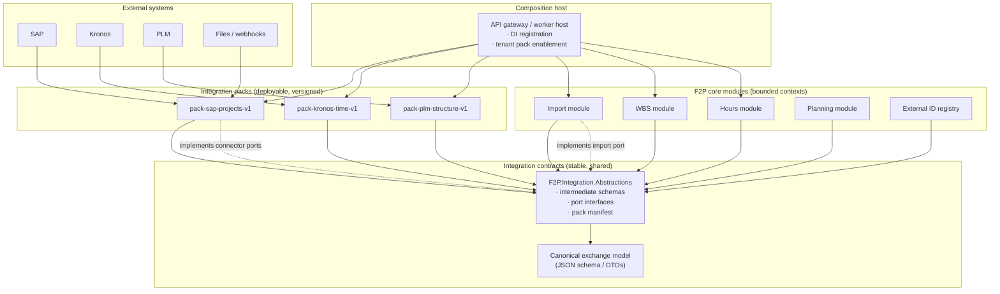
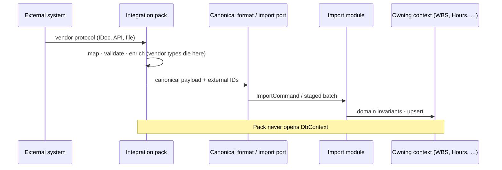
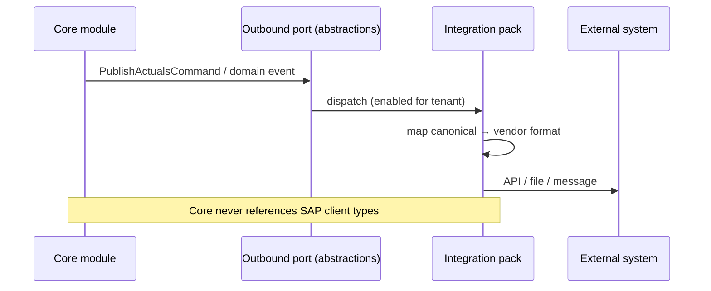
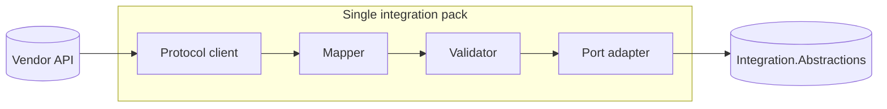

# Floor2Plan V2 — connector architecture (abstract)

Abstract dependency model for **integration packs** (V2 connectors). Complements `floor2plan-legacy-connector-submodule-antipattern.md`.

---

## 1. Dependency diagram (the rule that matters)

Dependencies point **inward toward contracts**, never from pack to core domain or EF.



**Read the arrows as compile-time references:**

| Project | May reference | Must NOT reference |
|---------|---------------|------------------|
| **Integration pack** | `Integration.Abstractions`, vendor SDKs | `*.Domain`, `DbContext`, UI, other packs |
| **Core module** | Its own domain + `Integration.Abstractions` | Vendor SDKs, pack implementations |
| **Host / gateway** | Core modules + packs (composition root) | — |

---

## 2. Inbound flow (F2P follows — external is system of record)



---

## 3. Outbound flow (F2P leads — Floor2Plan is system of record)



---

## 4. Pack internal structure (one connector)

```text
F2P.Integration.Packs.Sap.Projects/
├── PackManifest.json              # id, version, contract version, capabilities
├── Sap.Projects.Connector/        # protocol: RFC, OData, file drop
├── Sap.Projects.Mapping/          # vendor DTO → canonical (only place SAP types live)
├── Sap.Projects.Validation/       # pack-level checks before handoff
└── Sap.Projects.Tests/
    ├── Golden/                    # vendor sample → canonical JSON
    └── Contract/                  # compatibility with abstractions version
```



---

## 5. Ground rules for building a connector V2

### Dependency rules (non-negotiable)

1. **Pack references contracts only** — `F2P.Integration.Abstractions` (and vendor libraries). No project reference to core domain, application services, or EF.
2. **Core references contracts only** — for integration boundaries. No reference to any pack project.
3. **Composition at the host** — gateway/worker registers `IPack` implementations from enabled tenant profile. Only the host references both sides.
4. **Vendor types are private** — SAP/Kronos/PLM types never appear outside the pack’s `Mapping` / `Connector` folders.
5. **One import front door** — canonical inbound data enters only through the **Import module** API (command, actor message, or staged file). Other contexts do not accept raw vendor payloads.

### Boundary rules

6. **Lead vs follow per entity** — document for each entity type whether F2P or external owns writes; packs implement the direction, they don’t decide it.
7. **External IDs in canonical payload** — every imported entity carries `system:value` keys; core registry enforces uniqueness (`ApiImportActorPoc` pattern).
8. **Idempotent upsert** — replays and retries must not duplicate; pack supplies stable external keys, core owns merge logic.
9. **No SaveChanges orchestration** — long-running fetch/map/push runs in explicit workflows (actors/jobs calling ports), not EF change handlers.

### Versioning and operations

10. **Pack is versioned independently** — `sap-projects-v1.3.0` declares compatible `integration-contract-v2.x`.
11. **Tenant enables packs** — configuration flags, not git submodule checkout or custom core build.
12. **Compatibility matrix** — publish `pack × contract × core` support; breaking contract = new major pack or adapter shim.
13. **Golden-file tests** — vendor sample → canonical JSON is the pack’s primary test; import module tests canonical → DB separately.

### What a pack may and may not do

| Allowed | Forbidden |
|---------|-----------|
| Call external APIs, read files, poll queues | Call `WbsService`, `ImportService`, or any core application service |
| Map to canonical DTO / intermediate JSON | Construct or mutate EF entities |
| Validate vendor-specific rules | Enforce cross-context domain invariants |
| Implement outbound port for push | Register SaveChanges handlers in core |
| Emit telemetry with correlation ID | Branch on `if (tenant == Acme)` in core |

---

## 6. Comparison to legacy (one picture)

```text
LEGACY customized-repo              V2 platform
──────────────────────              ────────────
core/ submodule                     one core deployable
client/ derived service overrides   customization pack (tenant rules)
connectors/* submodules             integration packs (vendor)
sync jobs + handler chains          explicit workflow actors
DI: ClientXService : BaseService    DI: packs enabled per tenant
```

---

## 7. Checklist before merging a new pack

- [ ] Zero references to `*.Domain`, `*.Infrastructure`, `DbContext`
- [ ] All vendor SDK usings confined to pack connector/mapping projects
- [ ] Inbound path ends at canonical format or `IInboundImportPort`
- [ ] Outbound path implements `IOutbound*Port` from abstractions
- [ ] `PackManifest` with contract version and capability flags
- [ ] Golden tests for at least one real vendor sample
- [ ] Lead/follow documented per entity in pack README
- [ ] Host registers pack only via DI extension — no static singletons in core

---

## 8. Related docs

| Doc | Use |
|-----|-----|
| `floor2plan-legacy-connector-submodule-antipattern.md` | Why V1 failed |
| `monolith-modularization/claude-external-integrations-deepdive-instructions.md` | Lead/follow, catalog |
| `ApiImportActorPoc/` | Import boundary, external IDs, actors |
| `ApiImportActorPoc/docs/platform-rebuild-proposal-summary.md` | Intermediate format, journey |
