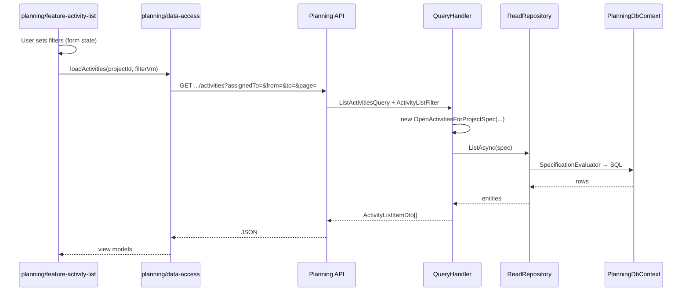

# Floor2Plan V2 — read/filter playbook (Specifications + Nx modules)

Combined conventions for **backend query encapsulation** and the **Nx Angular frontend module plan**, aligned with Platform 2.0 modularization targets in this repo.

**Sources:** `docs/monolith-modularization/agent-instructions-snippet.md`, `docs/monolith-modularization/platform-frontend-standard.md`, `ApiImportActorPoc/docs/platform-rebuild-proposal-summary.md` (Section 10), `specification-pattern` skill.

**Audience:** Engineers building V2 list screens, filters, and context libraries during strangler migration.

---

## 1. Target topology

```text
┌─────────────────────────────────────────────────────────────────────────┐
│  Nx workspace (Angular SPA)                                              │
│  apps/f2p-shell  +  libs/<context>/feature-*  +  libs/shared/*          │
│  lazy routes per bounded context                                         │
└───────────────────────────────┬─────────────────────────────────────────┘
                                │ HTTPS · versioned OpenAPI
                                ▼
┌─────────────────────────────────────────────────────────────────────────┐
│  Composed ASP.NET gateway host                                           │
│  · routes to context modules (IModule)                                   │
│  · BFF endpoints ONLY for justified cross-screen reads                     │
└───────────────────────────────┬─────────────────────────────────────────┘
                                │
        ┌───────────────────────┼───────────────────────┐
        ▼                       ▼                       ▼
   Import module            Planning module          Hours module
   (own DbContext)          (own DbContext)          (own DbContext)
        │                       │                       │
        └─ IReadRepository + ISpecification<T> ───────┘
              (IQueryable never leaves Infrastructure)
```

| Layer | Rule |
|-------|------|
| **Frontend** | One Angular SPA; lazy-loaded **Nx lib per bounded context** |
| **API** | Versioned OpenAPI; projections/DTOs — not full entity graphs |
| **Application** | Orchestration; builds or selects specifications |
| **Domain** | Ubiquitous Language in spec names; optional `ISpecification<T>` for in-memory rules |
| **Infrastructure** | `SpecificationEvaluator` + `DbContext`; specs execute here |

---

## 2. Bounded contexts (backend ↔ frontend alignment)

Map **one Nx domain library group** per bounded context. Names must match backend modules and OpenAPI tags.

| Context | Typical read-heavy surfaces | Nx lib prefix (example) |
|---------|----------------------------|-------------------------|
| **Import** | Import job lists, file status, validation issues | `@f2p/import` |
| **WBS** | Structure trees, node search, hierarchy filters | `@f2p/wbs` |
| **Planning** | Activity lists, Gantt windows, schedule snapshots | `@f2p/planning` |
| **Hours** | Timesheet grids, approval queues, period filters | `@f2p/hours` |
| **Resources** | Resource catalog, assignments, availability | `@f2p/resources` |
| **Reporting** | Dashboards, exports (often read models) | `@f2p/reporting` |
| **Identity** | Users, roles, tenant profile (admin) | `@f2p/identity` |
| **Billing** | If in scope — invoices, usage | `@f2p/billing` |

**Rule:** A feature screen in `planning` must not import `@f2p/hours/data-access` directly. Cross-context UI uses **gateway BFF** or **composed read API** — not cross-lib Db assumptions.

---

## 3. Nx workspace layout

```text
floor2plan-web/                          # Nx monorepo (separate repo or folder)
├── apps/
│   └── f2p-shell/                       # Host: router, auth, shell chrome, module dropdown
├── libs/
│   ├── shared/
│   │   ├── ui/                          # workspace alias → @floorganise/ui (shell, tiles, buttons)
│   │   ├── styles/                      # global @import '@floorganise/css'
│   │   ├── api-core/                    # HTTP interceptors, base URL, auth headers
│   │   ├── api-generated/               # OpenAPI-generated clients (per version)
│   │   └── util/                        # date ranges, paging helpers (no domain rules)
│   ├── planning/
│   │   ├── data-access/                 # PlanningApiService — thin wrapper over generated client
│   │   ├── feature-activity-list/         # smart container + routes
│   │   ├── feature-gantt/               # virtual scroll / time-window loading
│   │   └── ui/                          # presentational components
│   ├── hours/
│   │   ├── data-access/
│   │   ├── feature-timesheet/
│   │   └── ui/
│   └── wbs/
│       └── ...
└── openapi/                             # Pulled from gateway OpenAPI build
```

### Shell routing (lazy load)

```typescript
// apps/f2p-shell/src/app/app.routes.ts
{
  path: 'planning',
  loadChildren: () => import('@f2p/planning/feature-shell').then(m => m.planningRoutes),
},
{
  path: 'hours',
  loadChildren: () => import('@f2p/hours/feature-shell').then(m => m.hoursRoutes),
},
```

### Library types (Nx tags)

| Tag | Contains | Must not contain |
|-----|----------|------------------|
| `type:feature` | Routes, smart components, filter state | Direct `HttpClient` (use data-access) |
| `type:data-access` | API services, mappers DTO → view model | UI components |
| `type:ui` | Presentational components | API calls |
| `scope:planning` | Planning-only code | Imports from `scope:hours` |

Enforce with `@nx/enforce-module-boundaries` in `eslint.config`.

---

## 4. Specification pattern (backend)

F2P V2 will have **many list and filter endpoints**. Encapsulate each query as a **named specification** — see `specification-pattern` skill and [Ardalis article](https://ardalis.com/avoid-dbcontext-iqueryable-proliferation/).

### Per-context backend layout

```text
F2P.Planning/
├── Planning.Domain/
│   └── Specifications/          # optional: domain-only predicates
├── Planning.Application/
│   ├── Queries/                   # handlers that pick/build specs
│   └── Specifications/            # query specs (common placement)
└── Planning.Infrastructure/
    ├── Persistence/
    │   ├── PlanningDbContext.cs
    │   └── Repositories/
    └── Specifications/            # only if evaluator wiring is custom
```

### Naming

| Artifact | Pattern | Example |
|----------|---------|---------|
| Specification class | `{DomainIntent}Spec` | `OpenActivitiesForProjectSpec` |
| List query handler | `{Intent}Query` / `{Intent}QueryHandler` | `ListOpenActivitiesQuery` |
| API operation | verb + resource + filter summary | `GET /api/v1/planning/projects/{projectId}/activities` |
| OpenAPI schema | `{Resource}ListFilter` | `ActivityListFilter` |

### Example (Planning)

```csharp
// Planning.Application/Specifications/OpenActivitiesForProjectSpec.cs
public sealed class OpenActivitiesForProjectSpec : Specification<Activity>
{
    public OpenActivitiesForProjectSpec(Guid projectId, ActivityListFilter filter)
    {
        Query.Where(a => a.ProjectId == projectId && !a.IsClosed);

        if (filter.AssignedToUserId is { } userId)
            Query.Where(a => a.AssignedToUserId == userId);

        if (filter.WindowStart is { } start && filter.WindowEnd is { } end)
            Query.Where(a => a.StartDate <= end && a.EndDate >= start);

        Query.OrderBy(a => a.SortOrder);
        Query.AsNoTracking();

        if (filter.Page is { } page && filter.PageSize is { } size)
            Query.Skip((page - 1) * size).Take(size);
    }
}
```

```csharp
// Planning.Application/Queries/ListActivitiesQueryHandler.cs
public async Task<PagedResult<ActivityListItemDto>> Handle(
    ListActivitiesQuery request,
    CancellationToken ct)
{
    var spec = new OpenActivitiesForProjectSpec(request.ProjectId, request.Filter);
  var items = await _readRepository.ListAsync(spec, ct);
    var total = await _readRepository.CountAsync(spec, ct);
    return new PagedResult<ActivityListItemDto>(items.Select(ActivityListItemDto.From), total);
}
```

**Non-negotiable:** `IQueryable<T>`, `DbContext`, and `DbSet<T>` do not appear on public interfaces above Infrastructure.

### Packages

```xml
<PackageReference Include="Ardalis.Specification" Version="9.*" />
<PackageReference Include="Ardalis.Specification.EntityFrameworkCore" Version="9.*" />
```

---

## 5. End-to-end read/filter flow

Align **UI filter state**, **API contract**, and **specification** so each layer has one job.



| Layer | Responsibility | Avoid |
|-------|----------------|-------|
| **UI (feature)** | Filter form, validation UX, debounce, empty states | LINQ, SQL, business rules |
| **data-access** | Map view model ↔ API DTO; HTTP only | Building query strings ad hoc per screen — reuse param builders |
| **API** | AuthZ, bind `ActivityListFilter`, return DTO | EF types in responses |
| **Application** | Choose spec, map to DTO | Returning `IQueryable` |
| **Infrastructure** | Evaluate spec | Domain logic in repository |

### Filter DTO rules (API)

- **Do** expose stable, documented filter fields (`status`, `dateFrom`, `dateTo`, `page`, `pageSize`).
- **Do** validate and bound filters (max page size, max date range) in API — prevents abuse.
- **Do not** accept arbitrary expression trees or SQL fragments from the client.
- **Do not** mirror every spec constructor parameter 1:1 if the UI never needs it — YAGNI on query params.

When filter logic is **reused** across endpoints (e.g. “active project activities”), **reuse the same spec class** with different DTO slices.

---

## 6. Frontend data-access conventions

### One service per context

```typescript
// libs/planning/data-access/src/lib/planning-activities.api.ts
@Injectable({ providedIn: 'root' })
export class PlanningActivitiesApi {
  constructor(private readonly http: HttpClient) {}

  list(projectId: string, filter: ActivityListFilter): Observable<PagedActivities> {
    const params = buildActivityListParams(filter); // shared mapper
    return this.http.get<PagedActivities>(
      `/api/v1/planning/projects/${projectId}/activities`,
      { params },
    );
  }
}
```

### Filter view model

Keep **UI state** separate from API DTO when formatting differs (date pickers vs ISO strings):

```typescript
export interface ActivityListFilterVm {
  assignedToUserId: string | null;
  window: { start: Date; end: Date } | null;
  page: number;
  pageSize: number;
}

export function toActivityListFilter(vm: ActivityListFilterVm): ActivityListFilter {
  return {
    assignedToUserId: vm.assignedToUserId ?? undefined,
    windowStart: vm.window?.start.toISOString(),
    windowEnd: vm.window?.end.toISOString(),
    page: vm.page,
    pageSize: vm.pageSize,
  };
}
```

### Large lists (Planning / Hours)

Per Platform 2.0 performance notes:

- **Virtual scrolling** in feature libs; fetch pages via spec-backed API (`page` / `pageSize`).
- **Time-windowed** Gantt: spec includes `WindowStart` / `WindowEnd`; pan triggers new API call — do not load 50k rows client-side.
- **Debounced** filter changes → one API call per burst (not per keystroke).

### Styling — `@floorganise/css` + `@floorganise/ui` (required)

All V2 Nx modules follow `docs/monolith-modularization/platform-frontend-standard.md`.

| Concern | Package / lib | Rule |
|---------|---------------|------|
| Tokens, `f2ps-*` aliases, shell themes | `@floorganise/css` | Global `@import` in shell; no local brand colour variables |
| Home tiles, buttons, forms, nav, toasts | `@floorganise/ui` | Import shared components — do not duplicate markup |
| Context-specific widgets (e.g. Gantt row) | `libs/<context>/ui` | Presentational only; styled via `@floorganise/css` classes |

```typescript
// libs/planning/feature-activity-list/.../activity-list.component.ts
import { F2pButton, F2pPanel } from '@floorganise/ui';

@Component({
  template: `
    <f2p-panel>
      <button f2pButton variant="primary">Apply filters</button>
    </f2p-panel>
  `,
})
export class ActivityListComponent { /* ... */ }
```

Reference implementation: `FloorganiseCss/showcase-angular/` (home tiles, login, buttons).

---

## 7. Cross-context reads (gateway BFF)

When a **single screen** needs data from multiple contexts (e.g. planning Gantt + hours actuals overlay):

| Approach | When |
|----------|------|
| **Primary context API** | One context owns the screen; others are secondary widgets with own lazy calls |
| **Gateway BFF endpoint** | Tight UX needs one round-trip; compose in gateway only |
| **Read model / projection** | Reporting-style denormalized store |

```text
❌  @f2p/planning/feature-gantt imports @f2p/hours/data-access for core load
✅  Gateway: GET /api/v1/bff/planning/{projectId}/gantt-with-actuals
         → calls Planning + Hours modules internally
         → returns single DTO
```

Each backend module still uses **its own specs** inside the BFF handler — the BFF does not get a free pass to leak `IQueryable` across DbContexts.

---

## 8. OpenAPI ↔ Nx codegen

1. Gateway publishes `openapi/v1.yaml` per major version.
2. Nx `api-generated` lib regenerated in CI when contract changes.
3. `data-access` wraps generated clients — feature components never import generated stubs directly.

Tag operations by **bounded context** (`Planning`, `Hours`, …) to match Nx lib ownership.

---

## 9. Strangler alignment (per domain)

Replace legacy islands **one context at a time** (import → WBS → planning → hours):

| Step | Backend | Frontend |
|------|---------|----------|
| 1 | Versioned list API + spec for P0 screen | Lazy route behind feature flag |
| 2 | Characterization tests green vs legacy | Cypress/Playwright on new route |
| 3 | Retire legacy Razor/AngularJS island | Remove old bundle from ASP.NET host |

Each slice delivers **both** API specs and matching Nx feature lib — avoid “API only” or “UI only” slices that widen the hybrid.

---

## 10. Checklist (new list screen)

**Backend**

- [ ] Named `*Spec` class; no `IQueryable` on public API
- [ ] `ActivityListFilter` (or equivalent) documented in OpenAPI
- [ ] Pagination and max bounds enforced
- [ ] `AsNoTracking` for read; projection to list DTO
- [ ] Integration test: filter combination → expected SQL shape / row count

**Frontend**

- [ ] Feature lib under correct `scope:<context>`
- [ ] `data-access` service; no `HttpClient` in feature component
- [ ] Filter VM → DTO mapper unit-tested
- [ ] Lazy route registered in `f2p-shell`
- [ ] Module boundary ESLint passes
- [ ] `@floorganise/css` imported globally; shared widgets from `@floorganise/ui`
- [ ] Context-specific markup only in `libs/<context>/ui`

**Cross-cutting**

- [ ] UC- ID traced in test plan (`docs/modularization/`)
- [ ] Domain terms match Ubiquitous Language (`domain-driven-design` skill)

---

## 11. Anti-patterns

| Anti-pattern | Why it fails in F2P V2 |
|--------------|------------------------|
| `IQueryable` returned from API service | Query logic spreads; EF errors at runtime |
| Giant `PlanningService.GetData(filter)` with switch | Unmaintainable; use specs |
| Client sends raw SQL / OData with no bounds | Security and performance risk |
| Feature lib imports another context's data-access | Couples modules; blocks team parallelism |
| One mega Nx lib `libs/f2p/features` | Defeats lazy load and ownership |
| Load-all then filter in browser | Breaks at 500+ / 50k activities |
| BFF that joins two DbContexts with EF `Include` across DBs | Wrong tool — compose HTTP/module calls or use read model |

---

## 12. Related artifacts in this repo

| Doc / skill | Use for |
|-------------|---------|
| `specification-pattern` skill | Spec + repository rules |
| `domain-driven-design` skill | Naming, bounded contexts |
| `dotnet-ef-core` skill | DbContext per context, lifetimes |
| `docs/monolith-modularization/agent-instructions-snippet.md` | Target topology summary |
| `docs/monolith-modularization/tenant-workflow-fields-deepdive-instructions.md` | Legacy Text*/Bool* → V2 customization pack analysis |
| `docs/monolith-modularization/platform-ui-customization-standard.md` | V2 view schema + extensions target |
| `ApiImportActorPoc/docs/platform-rebuild-proposal-summary.md` | SPA strangler, performance SLOs |
| `FloorganiseCss/showcase-angular/` | Shell/tile DOM contract for smoke tests |
| `Floor2PlanSmokeTests/` | Cypress smoke harness |

---

## 13. AI prompt template

When implementing a new filtered list:

```text
Use specification-pattern + docs/floor2plan-v2-read-model-playbook.md.

Context: Planning
Screen: activity list for project with assignee + date window filters
Deliver:
- OpenActivitiesForProjectSpec (Ardalis)
- ListActivitiesQueryHandler + ActivityListFilter DTO
- OpenAPI operation
- @f2p/planning/data-access service + feature-activity-list component
- No IQueryable above Infrastructure; no cross-context imports
```
