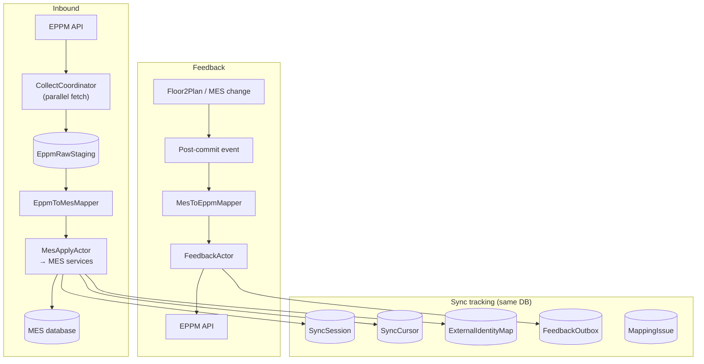
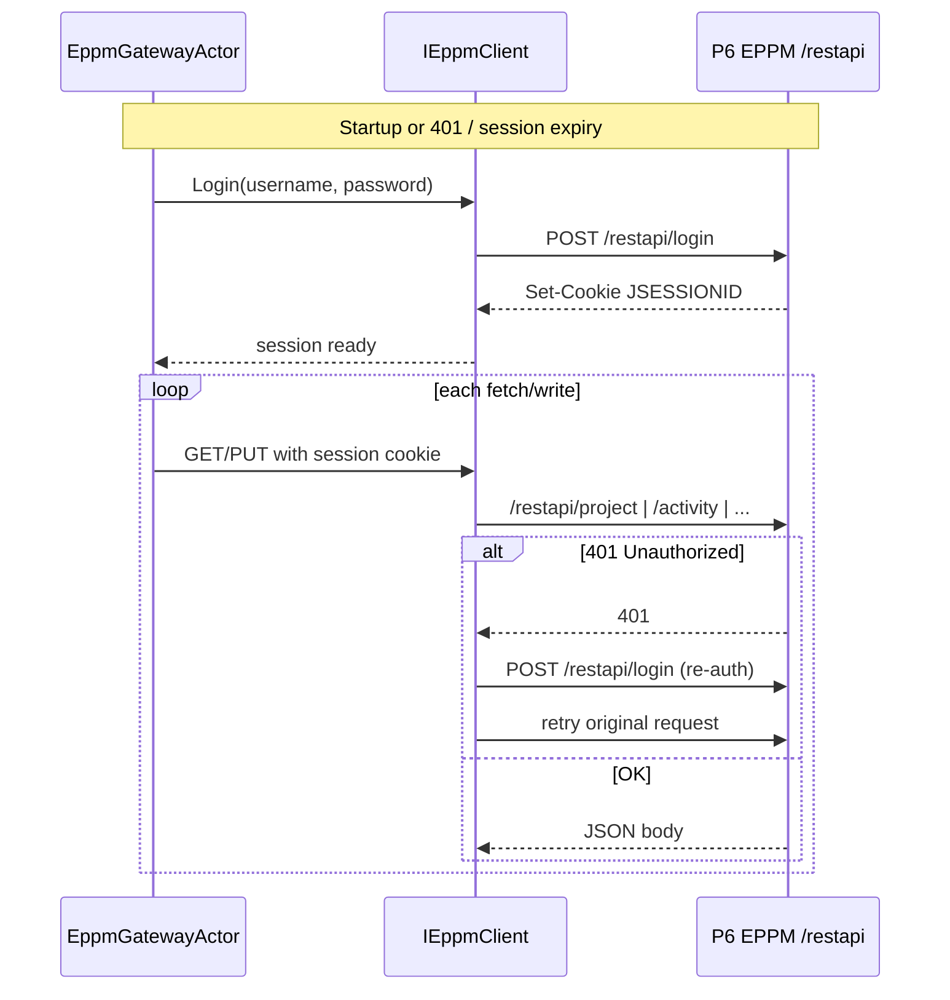
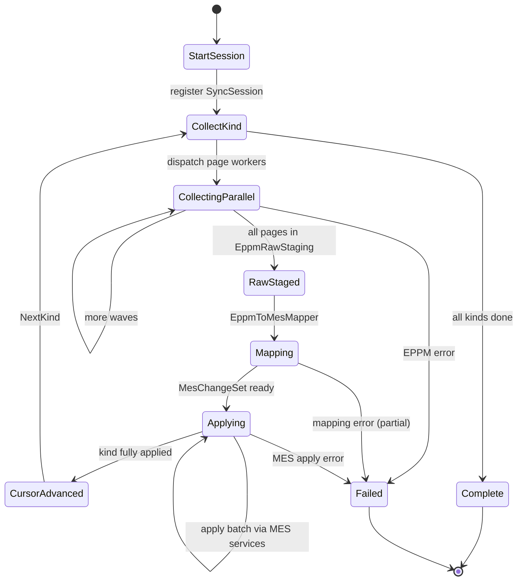
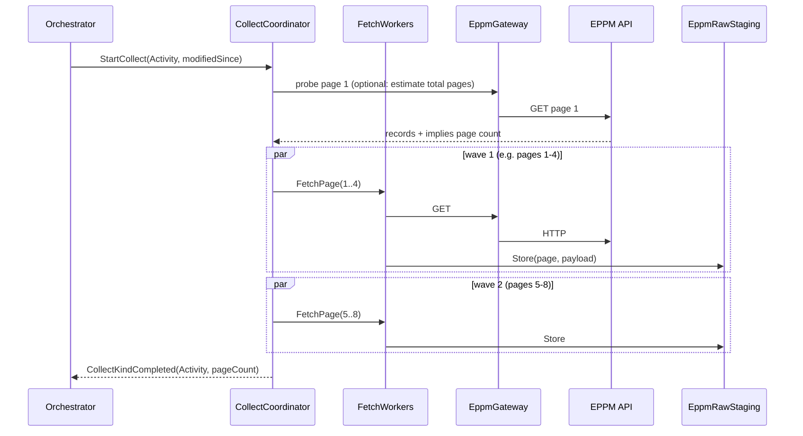
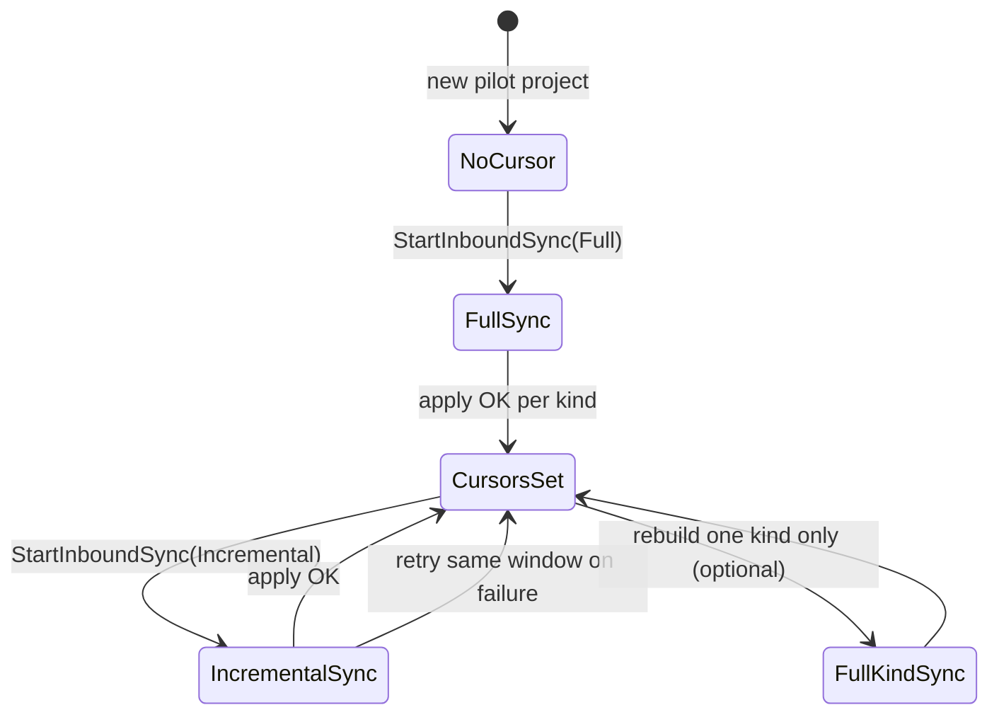
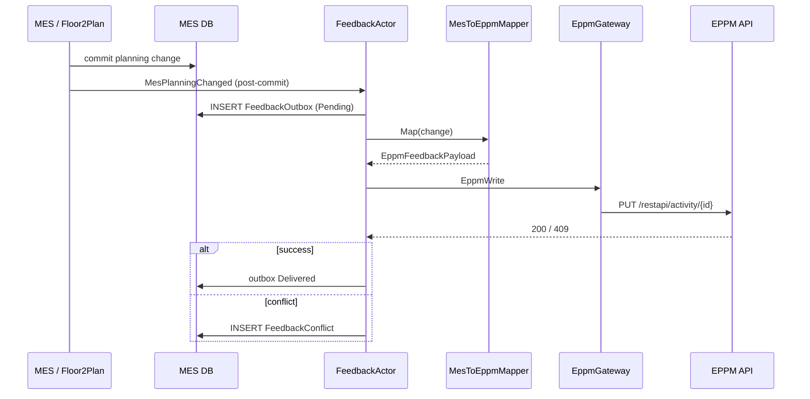
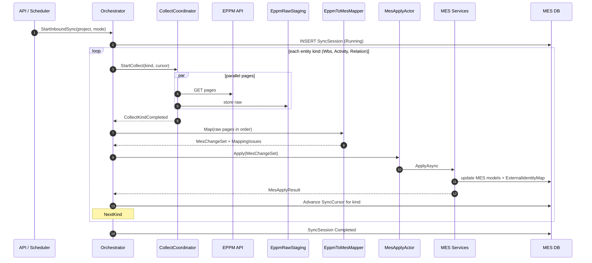
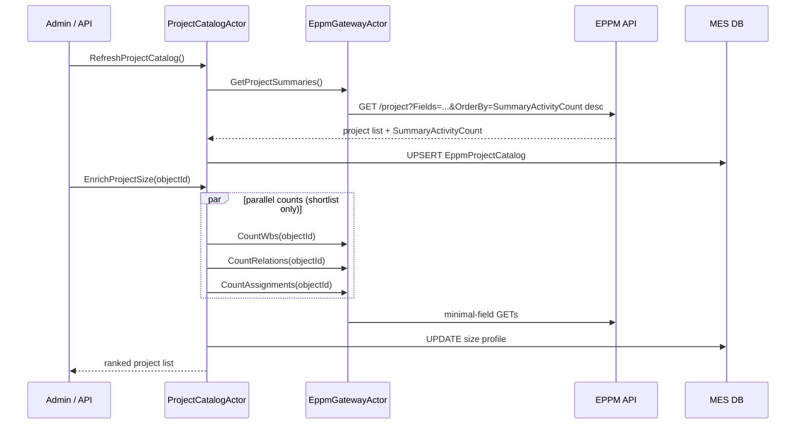

# MES ↔ Primavera EPPM sync architecture

**Status:** Draft for review  
**Date:** September 2026  
**Audience:** Engineering team implementing shipyard MES integration with Primavera EPPM and Floor2Plan feedback  
**EPPM deployment:** Oracle Primavera P6 EPPM **on-premises**

---

## 1. Purpose

This document describes how to integrate **Primavera EPPM** with a **shipyard MES application** that has its own domain models (Project, Component, Activity). The integration is **mapping-first**: EPPM data is collected, transformed into MES semantics, applied through existing MES services, and selected changes are fed back to EPPM when **Floor2Plan** (or MES execution state) changes.

**Akka.NET** orchestrates long-running workflows. **Persistence of MES domain data** stays in existing application services — not in a dedicated “sync persist layer.”

### Goals

| Goal | Detail |
|------|--------|
| Pilot scope | Start with **1–2 Primavera projects** |
| Inbound | EPPM structure/schedule → map → MES models |
| Outbound | Floor2Plan / MES changes → map → EPPM feedback updates |
| Scale | Support large activity volumes via **parallel EPPM fetch** and staging |
| Safety | Cursors, external ID map, mapping issues, feedback conflicts |

### Non-goals (v1)

- Mirroring every EPPM field into MES
- Full bidirectional sync on structure (WBS hierarchy)
- Per-tenant columns in sync tables (each tenant has **its own database**)

---

## 2. Context

```text
┌─────────────────┐         ┌─────────────────┐         ┌─────────────────┐
│ Primavera EPPM  │         │  MES (shipyard) │         │   Floor2Plan    │
│ schedule/source │ ──────► │ own Project /   │ ◄────── │ planning layer  │
│ of structure    │  inbound│ Component /     │  events │                 │
│                 │         │ Activity models │         │                 │
└─────────────────┘         └─────────────────┘         └─────────────────┘
        ▲                            │                            │
        │         feedback           │                            │
        └────────────────────────────┴────────────────────────────┘
```

| System | Role |
|--------|------|
| **Primavera EPPM** | System of record for schedule structure, WBS, activities, relationships (inbound) |
| **MES** | System of record for shipyard execution models, shop-floor semantics, enriched structure |
| **Floor2Plan** | Source of planning changes that may need feedback to EPPM |

### 2.1 EPPM deployment

P6 EPPM runs **on-premises** in the shipyard (or corporate) network: an application server (WebLogic, Tomcat, or equivalent) exposing the **P6 REST API** at `/restapi/...`.

```text
┌──────────────────────────────────────────────────────────────┐
│  Shipyard / corporate network (on-prem)                       │
│                                                              │
│  ┌─────────────┐    HTTPS/LAN    ┌─────────────────────────┐ │
│  │ MES + Akka  │ ◄──────────────►│ P6 EPPM application     │ │
│  │ sync host   │   /restapi/...  │ server (on-prem)        │ │
│  └──────┬──────┘                 └───────────┬─────────────┘ │
│         │                                    │               │
│         ▼                                    ▼               │
│  ┌─────────────┐                 ┌─────────────────────────┐ │
│  │ SQL Server  │                 │ P6 database (Oracle /   │ │
│  │ (MES DB)    │                 │ SQL Server)             │ │
│  └─────────────┘                 └─────────────────────────┘ │
└──────────────────────────────────────────────────────────────┘
```

#### EPPM integration facts

| Topic | Detail |
|-------|--------|
| **Base URL** | Internal hostname, e.g. `https://p6.yard.local/p6ws/services/restapi` |
| **Authentication** | `POST /restapi/login` → session cookie (`JSESSIONID`) |
| **Count queries** | Page with `Fields=ObjectId` and sum pages |
| **Pagination** | `Limit` + `Offset` on each GET |
| **Concurrency** | Tune `MaxParallelRequests` to your app server (start **4**) |
| **TLS** | Internal CA or self-signed — configure `HttpClient` trust on the sync host |
| **Network** | LAN / VPN; firewall rules between MES sync host and EPPM server |
| **Version** | Fixed P6 release per install (e.g. 20.x, 21.x) — pin and test field names |
| **Summary fields** | `SummaryActivityCount` depends on P6 schedule/summary jobs |

#### Configuration (record in deployment runbook)

```yaml
eppm:
  deployment: on-premises
  baseUrl: "https://p6.yard.local/p6ws/services/restapi"   # confirm with PS team
  auth:
    mode: session-cookie                                  # POST /restapi/login
    username: "<integration service account>"
    password: "<from secret store>"
    sessionRenewalMinutes: 25                             # re-login before server timeout
  http:
    maxParallelRequests: 4                                # raise only after load test
    pageSize: 500
    timeoutSeconds: 120
    trustInternalCa: true                                 # or install CA cert properly
  version:
    p6Release: "21.12"                                    # document for mapper compatibility
```

#### Integration service account

- Dedicated **non-human** P6 user for REST integration
- Permissions: read projects/WBS/activities for pilot EPS; write only fields needed for feedback
- Password rotation via secret store; `EppmGatewayActor` handles re-login on `401`
- Do not share credentials across yards if each yard has its own EPPM instance

#### Parallel fetch

The EPPM application server has finite threads and DB connection pools. **Start with 4 parallel EPPM requests**; increase only after monitoring EPPM CPU, DB locks, and HTTP 503/timeout rates during collect.

---

## 3. Design principles

1. **Mapping is the product** — customer/yard variance lives in mapper packs, not core orchestration.
2. **Collect in parallel, apply in order** — EPPM HTTP can run concurrently; MES apply respects domain order and business rules.
3. **MES services own persistence** — actors orchestrate; `IProjectService`, `IComponentService`, `IActivityService` (names illustrative) apply changes.
4. **Advance cursor after successful apply** — not after fetch, not after map alone.
5. **Feedback is event-driven** — post-commit domain events; not SaveChanges hooks.
6. **Lead/follow is per field** — structure from EPPM; execution progress/dates from MES/Floor2Plan.
7. **One database per tenant** — no `TenantId` column in sync tables; connection resolved at host boundary.
8. **Idempotent by external ID** — replays and overlap buffers must be safe.

---

## 4. Pipeline overview

### 4.1 Inbound (EPPM → MES)

```text
Collect (parallel)  →  Raw staging  →  Map to MES  →  Apply via MES services  →  Advance cursor
```

### 4.2 Outbound / feedback (MES / Floor2Plan → EPPM)

```text
Domain change committed  →  Feedback event  →  Map to EPPM payload  →  EPPM write
```

### 4.3 High-level diagram



---

## 5. Akka.NET actor topology

```text
SyncSupervisor
├── ProjectCatalogActor                # project list + size (discovery only — see §18)
├── ProjectSyncOrchestratorActor       # one inbound session per project
│   ├── EppmCollectCoordinatorActor    # parallel page fetch for current entity kind
│   │   └── FetchWorkerActor × N       # stateless EPPM page calls
│   ├── EppmToMesMappingActor          # raw → MesChangeSet (pack-provided mapper)
│   └── MesApplyActor                  # MesChangeSet → MES application services
├── FeedbackRouterActor                # routes Floor2Plan/MES change events
│   └── MesToEppmFeedbackActor         # map + EPPM write per project
├── EppmGatewayActor                   # sole EPPM HTTP boundary (auth, retry, rate limit)
└── SyncSessionRegistryActor           # session status, cursor read/write
```

### Responsibilities

| Actor | Owns | Does not |
|-------|------|----------|
| `ProjectSyncOrchestratorActor` | Session state machine, kind order, phase transitions | HTTP, EF, mapping rules |
| `EppmCollectCoordinatorActor` | Page dispatch, concurrency cap, raw staging | Mapping, MES apply |
| `FetchWorkerActor` | Single EPPM page fetch | Session state |
| `EppmToMesMappingActor` | Invoke mapper pack, emit `MesChangeSet` | Database writes |
| `MesApplyActor` | `IServiceScopeFactory` per message; call MES services | EPPM types |
| `MesToEppmFeedbackActor` | Map feedback, EPPM write, outbox status | Inbound collect |
| `EppmGatewayActor` | All EPPM REST calls | Domain logic |
| `SyncSessionRegistryActor` | `SyncSession`, `SyncCursor` updates | MES domain rules |
| `ProjectCatalogActor` | EPPM project catalog refresh + size enrich | Mapping, MES apply |

### Akka rules

| Rule | Rationale |
|------|-----------|
| `Ask` only at HTTP/API boundary | Avoid deadlocks inside actor system |
| `Tell` / `Forward` between actors | Standard internal messaging |
| `IServiceScopeFactory` in `MesApplyActor` | Scoped MES services / DbContext per message |
| Inject `IEppmClient` as singleton into gateway | Stateless HTTP client |
| Mapper packs registered per yard/customer | Same actor shape, different mapping |

### 5.1 `EppmGatewayActor` — HTTP and session auth

All EPPM traffic goes through one gateway actor. The client manages **session cookie auth** via `POST /restapi/login`.



#### Login request

```http
POST /restapi/login
Content-Type: application/json

{
  "Username": "integration_user",
  "Password": "<secret>"
}
```

Subsequent requests include the session cookie. Store credentials in **secret configuration** (Azure Key Vault, on-prem vault, etc.) — never in source control.

#### `IEppmClient` responsibilities

| Responsibility | Detail |
|----------------|--------|
| Session lifecycle | Login, cookie attach, re-login on `401` |
| Base URL | Single configurable `eppm.baseUrl` per environment |
| Pagination | `Limit` + `Offset` query parameters (standard P6 REST) |
| TLS | Trust internal CA or install server certificate on sync host |
| Logging | Optional request/response logging in dev; redact credentials |
| Timeouts | Generous for large pages (60–120s) — P6 database can be slow under load |

#### HttpClient registration (.NET)

```csharp
services.AddHttpClient<IEppmClient, EppmOnPremClient>(client =>
{
    client.BaseAddress = new Uri(config.BaseUrl);
    client.Timeout = TimeSpan.FromSeconds(config.TimeoutSeconds);
})
.ConfigurePrimaryHttpMessageHandler(() => new HttpClientHandler
{
    // Prefer installing the internal CA on the host instead of bypassing validation
    ServerCertificateCustomValidationCallback =
        config.TrustInternalCa ? HttpClientHandler.DangerousAcceptAnyServerCertificateValidator : null
});
```

---

## 6. Inbound session state machine

Each inbound run processes **entity kinds in order**. Within each kind: **parallel fetch → sequential map/apply**.



### Entity kind order (inbound)

```text
1. Wbs          → maps to MES Component (or equivalent)
2. Activity     → maps to MES Activity
3. Relation     → maps to MES activity dependencies
4. Assignment   → optional later phase
```

**Why order matters:** MES apply needs parent component IDs resolved before child activities and relations.

### What is `NextKind`?

After one entity kind completes **fetch + map + apply + cursor advance**, the orchestrator increments the kind index and starts the next kind.

```text
Wbs:      collect → map → apply → advance Wbs cursor     → NextKind
Activity: collect → map → apply → advance Activity cursor → NextKind
Relation: collect → map → apply → advance Relation cursor → Complete
```

Kinds disabled in pilot scope are skipped immediately via `NextKind`.

---

## 7. Parallel collect + staging

### 7.1 Strategy

| Phase | Parallelism | Notes |
|-------|-------------|-------|
| **Collect** | Yes — pages within a kind | Start at **4** concurrent requests; raise only after load test (§2.1) |
| **Map** | Optional — per page if mapper is pure | Can run after all pages staged |
| **Apply** | No — sequential through MES services | Business rules, FK order, validations |

### 7.2 Collect flow



### 7.3 Staging tables

#### `EppmRawStaging` (recommended for large projects)

```sql
CREATE TABLE dbo.EppmRawStaging (
    SyncSessionId   uniqueidentifier NOT NULL,
    EntityKind      tinyint          NOT NULL,
    PageNumber      int              NOT NULL,
    PayloadJson     nvarchar(max)    NOT NULL,
    RecordCount     int              NOT NULL,
    MaxModifiedAt   datetimeoffset   NULL,
    FetchedAtUtc    datetimeoffset   NOT NULL,
    PRIMARY KEY (SyncSessionId, EntityKind, PageNumber)
);
```

#### `MesMappedStaging` (optional — replay mapping without re-fetch)

```sql
CREATE TABLE dbo.MesMappedStaging (
    SyncSessionId   uniqueidentifier NOT NULL,
    EntityKind      tinyint          NOT NULL,
    PageNumber      int              NOT NULL,
    ChangeSetJson   nvarchar(max)    NOT NULL,
    MappedAtUtc     datetimeoffset   NOT NULL,
    MappingStatus   tinyint          NOT NULL,  -- OK, Partial, Failed
    PRIMARY KEY (SyncSessionId, EntityKind, PageNumber)
);
```

**Benefits:**

- Replay mapping after mapper changes without calling EPPM again
- Inspect mapping failures before MES apply
- Resume apply from page N if collect already completed

---

## 8. Mapping layer

### 8.1 Mapper pack interface

```csharp
public interface IEppmToMesMapper
{
    MesMappingResult Map(
        EntityKind kind,
        IReadOnlyList<EppmRecordDto> rawRecords,
        MesMappingContext context);
}

public sealed record MesMappingContext(
    string ProjectExternalId,
    string? MesProjectId,
    IExternalIdentityLookup IdentityLookup);

public sealed record MesMappingResult(
    MesChangeSet? ChangeSet,
    IReadOnlyList<MappingIssue> Issues)
{
    public bool IsSuccess => ChangeSet is not null && !Issues.Any(i => i.Severity == MappingSeverity.Error);
}
```

### 8.2 MES change set (canonical apply input)

```csharp
public sealed record MesChangeSet(
    Guid SyncSessionId,
    string ProjectExternalId,
    IReadOnlyList<MesComponentChange> Components,
    IReadOnlyList<MesActivityChange> Activities,
    IReadOnlyList<MesRelationChange> Relations);

public sealed record MesComponentChange(
    string ExternalId,              // Primavera WBS id
    string? ParentExternalId,
    string Name,
    IReadOnlyDictionary<string, object?> Attributes);

public sealed record MesActivityChange(
    string ExternalId,
    string ComponentExternalId,
    string Name,
    IReadOnlyDictionary<string, object?> Attributes);

public sealed record MesRelationChange(
    string SourceExternalId,
    string TargetExternalId,
    string RelationType,
    int? LagDays);
```

Mapper translates EPPM field names → MES attribute keys. **MES services** interpret attributes per yard rules.

### 8.3 Mapping issues (not generic sync errors)

```sql
CREATE TABLE dbo.MappingIssue (
    MappingIssueId    uniqueidentifier NOT NULL PRIMARY KEY,
    SyncSessionId     uniqueidentifier NOT NULL,
    EntityKind        tinyint          NOT NULL,
    ExternalId        nvarchar(128)    NULL,
    IssueCode         nvarchar(64)     NOT NULL,
    Message           nvarchar(1000)   NOT NULL,
    RawPayloadJson    nvarchar(max)    NULL,
    CreatedAtUtc      datetimeoffset   NOT NULL,
    Severity          tinyint          NOT NULL  -- Warning, Error
);
```

---

## 9. MES apply

`MesApplyActor` delegates to existing application services:

```csharp
public interface IMesSyncApplier
{
    Task<MesApplyResult> ApplyAsync(MesChangeSet changeSet, CancellationToken ct);
}

public sealed record MesApplyResult(
    int ComponentsApplied,
    int ActivitiesApplied,
    int RelationsApplied,
    int Skipped,
    DateTimeOffset? MaxRemoteModifiedAt,
    IReadOnlyList<MesApplyIssue> Issues);
```

### Apply order (within one kind batch)

```text
Components (parents before children)
  → Activities
  → Relations
```

### External identity map

Updated during apply — links EPPM ids to MES ids:

```sql
CREATE TABLE dbo.ExternalIdentityMap (
    ExternalIdentityMapId bigint         NOT NULL IDENTITY PRIMARY KEY,
    SourceSystem          nvarchar(32)   NOT NULL,  -- 'Primavera'
    EntityKind            tinyint        NOT NULL,
    ExternalId            nvarchar(128)  NOT NULL,
    LocalEntityId         nvarchar(64)   NOT NULL,  -- MES id
    ProjectExternalId     nvarchar(128)  NULL,
    RemoteModifiedAtUtc   datetimeoffset NULL,
    LocalModifiedAtUtc    datetimeoffset NULL,
    LastSyncedAtUtc       datetimeoffset NULL,
    LastSyncSessionId     uniqueidentifier NULL
);

CREATE UNIQUE INDEX UX_ExternalIdentityMap_External
    ON dbo.ExternalIdentityMap (SourceSystem, EntityKind, ExternalId);
```

---

## 10. Paging

Paging is **within one entity kind during collect**. It is separate from the **sync cursor**.

| Concept | Scope | Storage |
|---------|-------|---------|
| **Page number** | One collect run, one kind | `EppmRawStaging.PageNumber` |
| **Sync cursor** | Between runs, incremental filter | `SyncCursor.LastRemoteModifiedAt` |

### Page loop

```text
page = 1
dispatch pages in parallel waves (max N concurrent)
each worker: GET EPPM with Offset = (page-1) * pageSize
store result in EppmRawStaging keyed by PageNumber
stop when page returns fewer than pageSize records (or empty)
then: map all pages in order → apply → advance cursor
```

### EPPM request example

P6 REST uses **`Limit`** and **`Offset`** for pagination.

```http
GET /restapi/activity
  ?Filter=ProjectObjectId:eq:'{id}';LastUpdateDate:gte:'{modifiedSince}'
  &Fields=ObjectId,Id,Name,LastUpdateDate,WBSObjectId
  &OrderBy=LastUpdateDate asc,ObjectId asc
  &Offset=0
  &Limit=500
Cookie: JSESSIONID=<session>
```

**HasMore:** `records.Count == Limit` → fetch next page with `Offset += Limit`. Stop on empty or short page.

### Overlap buffer (recommended)

```text
modifiedSince = SyncCursor.LastRemoteModifiedAt - 2 minutes
```

Upsert by external id makes overlap safe.

---

## 11. Sync cursor

### 11.1 Purpose

Tracks **the last EPPM change successfully applied into MES** for each entity kind — not merely fetched.

### 11.2 Schema

```sql
CREATE TABLE dbo.SyncCursor (
    SyncCursorId         bigint           NOT NULL IDENTITY PRIMARY KEY,
    ProjectExternalId    nvarchar(128)    NOT NULL,
    EntityKind           tinyint          NOT NULL,
    Direction            tinyint          NOT NULL,  -- 1=Inbound, 2=Feedback
    LastRemoteModifiedAt datetimeoffset   NULL,
    LastSuccessfulAtUtc  datetimeoffset   NULL,
    UpdatedBySyncSession uniqueidentifier NULL,
    UpdatedAtUtc         datetimeoffset   NOT NULL
);

CREATE UNIQUE INDEX UX_SyncCursor_Scope
    ON dbo.SyncCursor (ProjectExternalId, EntityKind, Direction);
```

### 11.3 When cursor advances

| Event | Advance? |
|-------|----------|
| EPPM page fetched | No |
| Raw staging written | No |
| Mapping completed | No |
| MES apply succeeded for **all pages of kind** | **Yes** |
| Session failed mid-kind | No — retry uses old cursor |
| Full sync completes | Yes — per kind, max `RemoteModifiedAt` seen |

### 11.4 Full vs incremental

See **§12** for the full lifecycle (bootstrap full sync → steady-state partial/incremental sync).

---

## 12. Full vs incremental sync

A **full project read** is the bootstrap. **Partial sync** (incremental inbound) is the normal steady state afterward. Both use the **same pipeline** — only the EPPM filter and `SyncMode` differ.

```text
First time (per pilot project)
  Full inbound  →  MES populated + ExternalIdentityMap  →  SyncCursor set per entity kind

Steady state (scheduled or manual)
  Incremental inbound  →  only changed EPPM rows  →  upsert  →  advance cursor
```

### 12.1 Sync modes

```csharp
public enum SyncMode
{
    Full,         // ignore cursor; fetch all records for project + entity kind
    Incremental   // fetch only records changed since cursor (partial sync)
}
```

| Mode | When to use | EPPM filter |
|------|-------------|-------------|
| **Full** | First sync of a pilot project; rebuild after mapper change; recover from cursor corruption | All records for `ProjectObjectId` (per kind) |
| **Incremental** | Every scheduled run after successful full sync | `LastUpdateDate >= cursor.LastRemoteModifiedAt - overlap` |

`StartInboundSync` carries `SyncMode`. The orchestrator loads or ignores `SyncCursor` accordingly.

### 12.2 What “partial sync” includes

| Partial scope | Supported in v1? | Mechanism |
|---------------|------------------|-----------|
| **Changed records only** (incremental) | Yes | `SyncCursor` + `LastUpdateDate` filter |
| **One entity kind only** (e.g. Activity, not WBS) | Yes | Run orchestrator for one kind; other cursors unchanged |
| **One project only** | Yes | `ProjectExternalId` on session (pilot scope) |
| **Feedback only** (MES → EPPM) | Yes | `FeedbackOutbox` drain — separate from inbound |
| **One WBS subtree only** | No (v1) | Would need subtree filter + scoped cursor — defer |
| **Selected fields only** | Partial | Mapper field policy; still fetch changed rows |

### 12.3 Lifecycle diagram



### 12.4 Same pipeline, different filter

Both modes execute:

```text
Collect (parallel) → EppmRawStaging → Map → MesApply → AdvanceCursor
```

```csharp
// Orchestrator — per entity kind
var modifiedSince = mode == SyncMode.Incremental
    ? cursor?.LastRemoteModifiedAt?.AddMinutes(-2)   // overlap buffer
    : null;

await collectCoordinator.CollectAsync(kind, projectObjectId, modifiedSince);
// ... map, apply, advance cursor for this kind only
```

**Incremental** often returns a few pages instead of hundreds — same actors, less EPPM and MES work.

### 12.5 Cursors after full sync

After a successful **full** inbound run:

```text
(PILOT-1, Wbs,      Inbound)  LastRemoteModifiedAt = max seen from Wbs pages
(PILOT-1, Activity, Inbound)  LastRemoteModifiedAt = max seen from Activity pages
(PILOT-1, Relation, Inbound)  LastRemoteModifiedAt = max seen from Relation pages
```

Next **incremental** run per kind:

```http
GET /restapi/activity
  ?Filter=ProjectObjectId:eq:'10452';LastUpdateDate:gte:'2026-09-10T14:20:00'
  &Fields=ObjectId,Id,Name,LastUpdateDate,WBSObjectId
  &OrderBy=LastUpdateDate asc,ObjectId asc
  &Limit=500&Offset=0
```

### 12.6 Why partial sync is safe

| Mechanism | Role |
|-----------|------|
| `ExternalIdentityMap` | Existing rows **update**; new rows **insert** — no duplicates on re-run |
| Overlap buffer (`cursor - 2 min`) | Catches edge updates around cursor timestamp |
| Cursor advances **after MES apply** | Failed partial run retries the same window |
| Field ownership policy | Inbound updates EPPM-owned fields; MES-owned fields not overwritten |

### 12.7 When to run full vs incremental

| Situation | Recommended mode |
|-----------|------------------|
| First sync of pilot project | **Full** |
| Scheduled sync (every 15 min, hourly, …) | **Incremental** |
| Mapper pack changed | Re-map from staging, or **Full** for affected kind |
| Suspected cursor corruption | **Full** for affected entity kind |
| New pilot project added | **Full** once, then incremental |
| Suspected drift | Reconcile job first; **Full** only if reconcile requires it |

### 12.8 Partial outbound (feedback)

A full inbound sync does **not** block partial feedback:

```text
Single F2P activity change  →  FeedbackOutbox row  →  drain  →  EPPM PUT for that activity
```

Inbound full + outbound partial run independently.

### 12.9 API

```http
POST /api/primavera-sync/inbound
Content-Type: application/json

{
  "projectObjectId": 10452,
  "mode": "Incremental"
}
```

Use `"mode": "Full"` only for bootstrap or explicit rebuild.

### 12.10 Tests to add

| Test | Asserts |
|------|---------|
| `Inbound_full_then_incremental_fetches_subset` | Second run EPPM mock receives `LastUpdateDate` filter |
| `Inbound_incremental_does_not_duplicate` | Same changed row applied twice → one MES entity |
| `Inbound_incremental_failure_does_not_advance_cursor` | Retry re-processes same window |
| `Inbound_full_sets_cursor_per_entity_kind` | Three cursor rows after Wbs + Activity + Relation |

---

## 13. Feedback (MES / Floor2Plan → EPPM)

### 13.1 Trigger

```text
Floor2Plan or MES commits a planning/execution change
  → post-commit domain event (MesPlanningChanged)
  → FeedbackRouterActor
  → MesToEppmFeedbackActor
```

### 13.2 Feedback mapper

```csharp
public interface IMesToEppmMapper
{
    EppmFeedbackPayload? Map(MesPlanningChanged change, FeedbackMappingContext context);
}

public sealed record EppmFeedbackPayload(
    string ActivityExternalId,
    IReadOnlyDictionary<string, object?> Fields);  // only EPPM-writable fields
```

### 13.3 Field ownership (pilot example)

| Field | Owner | Direction |
|-------|-------|-----------|
| WBS structure, activity name, codes | EPPM | Inbound only |
| Percent complete, actual dates | MES / Floor2Plan | Feedback |
| Planned dates from Floor2Plan | Floor2Plan | Feedback |
| Shop-floor status | MES | Local only (no EPPM write) |

### 13.4 Feedback outbox

```sql
CREATE TABLE dbo.FeedbackOutbox (
    FeedbackOutboxId   bigint          NOT NULL IDENTITY PRIMARY KEY,
    ProjectExternalId  nvarchar(128)   NOT NULL,
    EntityKind         tinyint         NOT NULL,
    LocalEntityId      nvarchar(64)    NOT NULL,
    ExternalId         nvarchar(128)   NULL,
    ChangeVersion      bigint          NOT NULL,
    ChangedFieldsJson  nvarchar(max)   NOT NULL,
    IdempotencyKey     nvarchar(256)   NOT NULL,
    Status             tinyint         NOT NULL,
    AttemptCount       int             NOT NULL DEFAULT 0,
    NextAttemptAtUtc   datetimeoffset  NULL,
    CreatedAtUtc       datetimeoffset  NOT NULL,
    DeliveredAtUtc     datetimeoffset  NULL,
    LastError          nvarchar(max)   NULL,
    CorrelationId      nvarchar(128)   NOT NULL
);

CREATE UNIQUE INDEX UX_FeedbackOutbox_Idempotency ON dbo.FeedbackOutbox (IdempotencyKey);
```

**Idempotency key:** `{projectExternalId}:{entityKind}:{localEntityId}:{changeVersion}`

### 13.5 Feedback flow



---

## 14. Sync session tracking

```sql
CREATE TABLE dbo.SyncSession (
    SyncSessionId        uniqueidentifier NOT NULL PRIMARY KEY,
    ProjectExternalId    nvarchar(128)    NOT NULL,
    Direction            tinyint          NOT NULL,  -- 1=Inbound, 2=Feedback, 3=Reconcile
    Mode                 tinyint          NOT NULL,  -- 1=Full, 2=Incremental
    Status               tinyint          NOT NULL,
    CorrelationId        nvarchar(128)    NOT NULL,
    StartedAtUtc         datetimeoffset   NOT NULL,
    CompletedAtUtc       datetimeoffset   NULL,
    RecordsCollected     int              NOT NULL DEFAULT 0,
    RecordsMapped        int              NOT NULL DEFAULT 0,
    RecordsApplied       int              NOT NULL DEFAULT 0,
    MappingIssues        int              NOT NULL DEFAULT 0,
    FeedbackDelivered    int              NOT NULL DEFAULT 0,
    LastError            nvarchar(max)    NULL,
    RowVersion           rowversion       NOT NULL
);

CREATE UNIQUE INDEX UX_SyncSession_RunningPerProjectDirection
    ON dbo.SyncSession (ProjectExternalId, Direction)
    WHERE Status = 2;  -- Running
```

---

## 15. End-to-end inbound diagram



---

## 16. Failure handling

| Failure point | Cursor | Staging | Recovery |
|---------------|--------|---------|----------|
| EPPM fetch page | unchanged | partial pages in staging | retry collect; overwrite staging for session |
| Mapping error | unchanged | raw intact | fix mapper; re-map from staging |
| MES apply error | unchanged | raw + mapped intact | fix data/rules; resume apply |
| Feedback EPPM 409 | n/a | outbox → Conflict | manual or policy resolution |
| Process crash after collect | unchanged | raw staging survives | resume map + apply without re-fetch |

---

## 17. Pilot delivery phases

### Phase 0 — Foundations

- [ ] `EppmGatewayActor` + `IEppmClient` (session login, cookie auth, paging, TLS)
- [ ] Confirm connectivity from sync host to EPPM (`POST /restapi/login`)
- [ ] Sync tracking tables (`SyncSession`, `SyncCursor`, `ExternalIdentityMap`)
- [ ] `EppmRawStaging` table
- [ ] `EppmProjectCatalog` table + `ProjectCatalogActor` (see §18)
- [ ] Pilot scope config: 1 project id (selected from catalog)

### Phase 1 — Inbound collect + map (no apply)

- [ ] Parallel collect for Wbs + Activity
- [ ] `IEppmToMesMapper` for pilot yard
- [ ] Store mapping issues; review UI or logs
- [ ] Raw data test endpoint (connectivity + mapping preview)

### Phase 2 — MES apply

- [ ] `IMesSyncApplier` wired to existing MES services
- [ ] Full inbound for pilot project 1
- [ ] Incremental inbound with cursor
- [ ] External identity map populated

### Phase 3 — Feedback

- [ ] `FeedbackOutbox` + post-commit events from Floor2Plan/MES
- [ ] `IMesToEppmMapper` for limited fields (progress, dates)
- [ ] Manual trigger then scheduled drain

### Phase 4 — Second project + hardening

- [ ] Add pilot project 2
- [ ] Reconciliation job (optional drift detection)
- [ ] Metrics: collect rate, map issue rate, apply duration, feedback success rate

---

## 18. EPPM project catalog (discovery & sizing)

Before selecting pilot projects, query the **EPPM REST API** for a **ranked list of projects and their size** without syncing activity data. This is a **discovery** workflow — separate from inbound sync. All examples use `/restapi/` endpoints with session cookie auth (see §5.1).

### 18.1 Two-tier strategy

| Tier | When | What | Cost |
|------|------|------|------|
| **1 — Catalog** | Always | `GET /project` with summary fields | 1–few paginated calls |
| **2 — Enrich** | Top N / pilot candidates only | Count WBS, relations, assignments per project | N × 3–4 small queries |
| **3 — Validate** | Before full sync of a pilot | Spot-check counts or sample fetch | 1–2 projects only |

**Do not** page through all activities for every project just to get a count — use `SummaryActivityCount` on the project row.

### 18.2 Tier 1 — project list with built-in activity size

EPPM exposes rolled-up summary fields on the **Project** object:

| Field | Meaning |
|-------|---------|
| `SummaryActivityCount` | Total activities (primary size metric) |
| `SummaryCompletedActivityCount` | Completed activities |
| `SummaryInProgressActivityCount` | In-progress activities |
| `SummaryNotStartedActivityCount` | Not started activities |

#### Request

```http
GET /restapi/project
  ?Fields=ObjectId,Id,Name,Status,LastUpdateDate,DataDate,
         SummaryActivityCount,SummaryCompletedActivityCount,
         SummaryInProgressActivityCount,SummaryNotStartedActivityCount
  &OrderBy=SummaryActivityCount desc
  &Filter=SummaryActivityCount:gt:0
  &Limit=500
  &Offset=0
Cookie: JSESSIONID=<session>
```

Page through all projects with `Offset += Limit` until a short or empty page.

Optional EPS scope (shipyard portfolio):

```http
&Filter=ParentEPSObjectId:eq:12345 :and: SummaryActivityCount:gt:0
```

(Confirm EPS field name on your EPPM version.)

#### Example response

```json
[
  {
    "ObjectId": 10452,
    "Id": "MV-ALPHA",
    "Name": "Hull Block Alpha",
    "Status": "Active",
    "LastUpdateDate": "2026-09-10T14:22:00",
    "SummaryActivityCount": 248731,
    "SummaryCompletedActivityCount": 12000,
    "SummaryInProgressActivityCount": 45000,
    "SummaryNotStartedActivityCount": 191731
  }
]
```

#### Caveat

`SummaryActivityCount` is a **P6 summary/rollup**. It may be stale if scheduling/summarization has not run recently. Fine for catalog ranking; spot-check top candidates before pilot commit.

### 18.3 Tier 2 — enrich shortlisted projects

`SummaryActivityCount` does not include WBS or relationship counts. For pilot selection, enrich only the top N candidates:

| Metric | Endpoint | Filter |
|--------|----------|--------|
| Activities | project row | `SummaryActivityCount` |
| WBS nodes | `GET /wbs` | `ProjectObjectId:eq:{objectId}` |
| Relations | `GET /relationship` | `PredecessorProjectObjectId:eq:{objectId}` |
| Assignments | `GET /activityresource` (or equivalent) | `ProjectObjectId:eq:{objectId}` |

#### Count pattern

Count by paging with minimal fields — only for shortlisted projects (top 5–10):

```http
GET /restapi/wbs
  ?Fields=ObjectId
  &Filter=ProjectObjectId:eq:10452
  &OrderBy=ObjectId asc
  &Limit=5000
  &Offset=0
Cookie: JSESSIONID=<session>
```

Count = sum of `records.Count` across all pages until `records.Count < Limit`.

Repeat for `/relationship` (filter `PredecessorProjectObjectId:eq:{id}`) and assignment endpoint. Run counts **in parallel** but cap at **`maxParallelRequests`** (default **4**) to avoid overloading the EPPM application server.

For **activity count** on shortlist, prefer `SummaryActivityCount` from the project row rather than paging all activities.

### 18.4 Size bands (pilot selection)

```csharp
public static string SizeBand(int activityCount) => activityCount switch
{
    < 5_000   => "Small",
    < 50_000  => "Medium",
    < 150_000 => "Large",
    _         => "XL"
};
```

**Pilot recommendation:**

| Project | Size band | Purpose |
|---------|-----------|---------|
| Pilot 1 | **Medium** | Prove mapping + MES apply |
| Pilot 2 | **Large** | Prove parallel collect + staging |

Avoid **XL** as the first pilot unless required.

### 18.5 Composite size profile

```csharp
public sealed record EppmProjectSizeProfile(
    int ObjectId,
    string ProjectId,
    string Name,
    int ActivityCount,
    int? WbsCount,
    int? RelationCount,
    int? AssignmentCount,
    DateTimeOffset? LastUpdateDate,
    string SizeBand);
```

### 18.6 Actor flow



`ProjectCatalogActor` uses `EppmGatewayActor` — same HTTP boundary as sync. No mapping or MES apply in this flow.

### 18.7 Cache table

```sql
CREATE TABLE dbo.EppmProjectCatalog (
    ProjectObjectId       int              NOT NULL PRIMARY KEY,
    ProjectId             nvarchar(40)     NOT NULL,
    ProjectName           nvarchar(500)    NOT NULL,
    Status                nvarchar(64)     NULL,
    SummaryActivityCount  int              NOT NULL,
    WbsCount              int              NULL,
    RelationCount         int              NULL,
    AssignmentCount       int              NULL,
    LastUpdateDate        datetimeoffset   NULL,
    SizeBand              nvarchar(16)     NOT NULL,
    CatalogRefreshedAtUtc datetimeoffset   NOT NULL,
    EnrichedAtUtc         datetimeoffset   NULL
);

CREATE INDEX IX_EppmProjectCatalog_Size
    ON dbo.EppmProjectCatalog (SummaryActivityCount DESC);
```

Refresh: on demand + daily schedule. Enrich only when user opens pilot selection UI or picks candidates.

### 18.8 Client interface

```csharp
public interface IEppmProjectCatalogClient
{
    Task<IReadOnlyList<EppmProjectSummary>> GetProjectSummariesAsync(
        EppmProjectCatalogQuery query,
        CancellationToken ct);

    Task<EppmEntityCounts> GetEntityCountsAsync(
        int projectObjectId,
        CancellationToken ct);
}

public sealed record EppmProjectCatalogQuery(
    int? ParentEpsObjectId,
    int? MinActivityCount,
    string? OrderBy = "SummaryActivityCount desc");

public sealed record EppmProjectSummary(
    int ObjectId,
    string Id,
    string Name,
    string? Status,
    int SummaryActivityCount,
    DateTimeOffset? LastUpdateDate);

public sealed record EppmEntityCounts(
    int ActivityCount,
    int WbsCount,
    int RelationCount,
    int AssignmentCount);
```

### 18.9 Practical tips

| Tip | Detail |
|-----|--------|
| Always use `Fields=` | Never fetch full project objects for catalog |
| Page `/project` | `Limit` + `Offset` until short page |
| Sort by `SummaryActivityCount desc` | Find large projects quickly |
| Filter active projects | e.g. `Status:eq:'Active'` (confirm values on your P6 version) |
| Cap enrich parallelism | **4** concurrent requests initially; load-test before raising |
| Log `LastUpdateDate` | Stale projects may not be worth syncing |
| Reuse session cookie | One login per catalog refresh — do not login per page |
| Confirm EPS field names | Vary by P6 version — use `GET /restapi/project/fields` once during setup |
| Run catalog from sync host | Same network path as production collect (firewall, DNS, TLS) |

### 18.10 Anti-patterns

| Avoid | Why |
|-------|-----|
| Fetch all activities per project to count | Extremely slow at 250k+; overloads P6 database |
| Full inbound sync just to measure size | Wastes time; use summary fields |
| Trust `SummaryActivityCount` without spot-check | May be stale until P6 summary job runs |
| `ProjectObjectId` filter on `/relationship` | Use `PredecessorProjectObjectId` or `SuccessorProjectObjectId` |
| XER export for sizing | REST catalog is faster |
| High parallel fetch before load test | Can exhaust WebLogic/Tomcat threads on EPPM server |

---

## 19. Review checklist (for tomorrow)

### Architecture

- [ ] Is **mapping pack** ownership clear per shipyard/customer?
- [ ] Are MES **Component** and **Activity** models aligned with mapper output (`MesChangeSet`)?
- [ ] Which Floor2Plan events trigger feedback?

### Policy

- [ ] Confirm field-level lead/follow for pilot project
- [ ] Structure inbound-only?
- [ ] Which planning fields push to EPPM?
- [ ] Full sync once per pilot, then incremental schedule (interval?) — see §12

### Operations

- [ ] EPPM **base URL** and P6 **version** documented
- [ ] Integration service account created with correct EPS/project access
- [ ] Session login (`POST /restapi/login`) tested from sync host
- [ ] TLS / internal CA configured on MES sync host
- [ ] Firewall rules: sync host → EPPM app server (HTTPS port)
- [ ] `maxParallelRequests` (start with **4**); load-test before raising
- [ ] Page size (start with 500)
- [ ] Overlap buffer (2 minutes?)
- [ ] Full vs incremental schedule for pilot
- [ ] P6 summary/schedule job cadence (affects `SummaryActivityCount` freshness)

### Data

- [ ] External id source in EPPM (ObjectId vs custom fields)
- [ ] MES id type (GUID vs int) in `ExternalIdentityMap.LocalEntityId`
- [ ] Staging retention / cleanup policy for `EppmRawStaging`
- [ ] EPS filter for project catalog (which shipyard portfolio?)
- [ ] Pilot projects selected from `EppmProjectCatalog` size bands

### Open questions

| # | Question | Options |
|---|----------|---------|
| 1 | Map per page or after all pages collected? | Per page (lower memory) vs whole kind (easier cross-record rules) |
| 2 | Assignments in v1? | Defer vs include |
| 3 | Floor2Plan change source | Direct events vs polling MES tables |
| 4 | Feedback conflicts | Manual queue vs remote wins for specific fields |
| 5 | Reconciliation | Nightly job vs on-demand only |

---

## 20. Related documents

| Document | Content |
|----------|---------|
| `docs/primavera-eppm-akka-two-way-sync-plan.md` | Earlier actor/message sketch (persist-centric; superseded by this doc) |
| `docs/primavera-eppm-sync-tables.md` | SQL + EF entities for sync tracking (no TenantId) |
| `docs/floor2plan-akka-actor-integration-design.md` | Floor2Plan P6 actor pattern reference |
| [P6 EPPM REST API — Read Projects](https://docs.oracle.com/en/industries/construction-engineering/primavera-p6-project/26/rest-api/op-project-get.html) | On-prem REST reference (confirm version matches your install) |

---

## 21. Summary

| Layer | What it does |
|-------|----------------|
| **Catalog** | `GET /project` summaries → `EppmProjectCatalog` → pilot selection |
| **Full sync** | Bootstrap pilot project — all EPPM rows per kind → set cursors (§12) |
| **Incremental sync** | Steady state — changed rows only via `SyncCursor` + upsert (§12) |
| **Collect** | Parallel EPPM fetch → `EppmRawStaging` |
| **Map** | EPPM → `MesChangeSet` (yard-specific pack) |
| **Apply** | MES application services update domain models |
| **Track** | `SyncSession`, `SyncCursor`, `ExternalIdentityMap`, `MappingIssue` |
| **Feedback** | Floor2Plan/MES events → `MesToEppmMapper` → EPPM write |

**Persist is not the architecture.** Mapping MES shipyard semantics to/from Primavera schedule data is. Akka orchestrates the workflow; MES services own the domain.

---

*Draft — September 2026. Review and annotate open questions in §19.*
