# Platform 2.0 — infrastructure implementation gaps

**Last verified:** 2026-06-24 (SandBox repo, branch with `AdminBackoffice` + `PlatformConfig`)

**Audience:** Architects and engineers tracking what exists vs what the design standards still require.

**Related:**

| Document | Role |
|----------|------|
| `ApiImportActorPoc/docs/deployment-profile-sketch.md` | Control plane responsibilities, sprint ordering |
| `platform-authentication-standard.md` | Auth, per-tenant DB, edge routing (design) |
| `platform-v2-infrastructure-gaps.svg` | Printable / slide-friendly version of this diagram |
| `AdminBackoffice/README.md` | Implemented control-plane API |
| `F2pPlatform/README.md` | Composed v2 host POC |

---

## Legend

| Status | Meaning |
|--------|---------|
| **Implemented** | Runnable code in SandBox (may still be POC-quality) |
| **Stub / partial** | Scaffold, in-memory, or API exists but not production-ready |
| **Missing** | Not built; design-only or external monolith only |
| **POC only** | Exists in a separate POC folder, not wired into the platform host |

---

## Sprint checklist (`deployment-profile-sketch.md`)

| # | Deliverable | Status | Where |
|---|-------------|--------|-------|
| 1 | Tenant registry + deployment profile schema | **Implemented** | `Platform.ControlPlane.Contracts`, `ControlPlaneDbContext` |
| 2 | `POST /admin/tenants` | **Implemented** | `AdminBackoffice` → `POST /admin/tenants` |
| 3 | Edge resolver: slug → `mode` + target URL | **Missing** | `GET /api/v1/platform/tenants/{slug}` is a stub only |
| 4 | Legacy-hosted provisioning job | **Missing** | — |
| 5 | Native dry-run import | **POC only** | `ApiImportActorPoc/` (not in `F2pPlatform.Host`) |

---

## Architecture gap diagram

```mermaid
flowchart TB
    subgraph legend["Legend"]
        direction LR
        L1["Implemented"]
        L2["Stub / partial"]
        L3["Missing"]
        L4["POC only · not wired"]
    end

    style L1 fill:#22c55e,color:#fff
    style L2 fill:#eab308,color:#000
    style L3 fill:#ef4444,color:#fff
    style L4 fill:#a855f7,color:#fff

    subgraph cloud["Cloud infrastructure"]
        DNS["DNS · TLS · load balancer"]
        CDN["Static SPA CDN"]
    end

    subgraph edge["Edge layer"]
        EDGE["Edge / API gateway<br/>slug · JWT · legacy proxy"]
    end

    subgraph ops["Operations plane · AdminBackoffice"]
        BO_UI["Admin backoffice UI"]
        BO_API["Admin API<br/>POST /admin/tenants · sync"]
        BO_AUTH["Operator auth · Platform.Admin"]
        CP_DB[("Control-plane DB<br/>EF Core · :1403")]
        PROV["Provisioning jobs<br/>tenant DB · legacy deploy"]
        SSO["Auth / SSO bindings per tenant"]
        BILL["Billing · seat limits"]
    end

    subgraph runtime["V2 runtime · F2pPlatform.Host :5080"]
        SHELL["f2p-shell Angular<br/>:5180"]
        PCFG["PlatformConfig<br/>PUT tenant-config"]
        PCFG_MEM[("In-memory tenant store")]
        ID["Identity module"]
        ID_DB[("Users / roles DB<br/>per tenant")]
        JWT["OIDC · PKCE · platform JWT"]
        REFRESH[("Refresh tokens")]
        DOMAIN["Domain APIs in host<br/>Reference · HourApprovals"]
        TENANT_DB[("Per-tenant product DBs")]
        PACK["Pack runtime enforcement"]
        AKKA["Akka workflows<br/>host shell only"]
        SIG["SignalR · /hubs/platform-events"]
        CORR["Correlation pipeline"]
    end

    subgraph pocs["Separate POCs · not in F2pPlatform.Host"]
        IMPORT["ApiImportActorPoc<br/>import pipeline"]
        PLAN_APP["PlanningApprovalsPoc"]
        AKKA_POC["AkkaSignalRVuePoc"]
    end

    subgraph legacy["Legacy-hosted path"]
        LEG_PROXY["Reverse proxy → runtimeUrl"]
        LEG_RT["Legacy runtime per tenant"]
        LEG_AUTH["Legacy auth bridge"]
    end

    subgraph mig["Migration"]
        MIG["Cutover orchestration"]
    end

    subgraph onprem["On-prem"]
        INSTALL["Install wizard"]
    end

    OPS((Operator)) --> BO_UI
    OPS --> BO_API
    USERS((Tenant users)) --> DNS
    DNS --> EDGE
    EDGE --> SHELL
    EDGE --> LEG_PROXY
    EDGE --> DOMAIN

    BO_UI -.-> BO_API
    BO_API --> CP_DB
    BO_API -->|"PUT tenant-config"| PCFG
    BO_AUTH -.-> BO_API
    PROV -.-> TENANT_DB
    PROV -.-> LEG_RT
    SSO -.-> CP_DB
    BILL -.-> CP_DB

    PCFG --> PCFG_MEM
    EDGE -.-> PCFG
    SHELL --> ID
    ID --> JWT
    JWT --> ID_DB
    JWT --> REFRESH
    SSO -.-> JWT
    DOMAIN --> TENANT_DB
    DOMAIN --> PACK
    AKKA --> DOMAIN
    SIG --> SHELL
    CORR --> DOMAIN

    LEG_PROXY --> LEG_RT
    LEG_AUTH -.-> LEG_RT
    MIG -.-> CP_DB
    MIG -.-> LEG_RT
    MIG -.-> TENANT_DB
    INSTALL -.-> ID

    style BO_API fill:#22c55e,color:#fff
    style CP_DB fill:#22c55e,color:#fff
    style PCFG fill:#22c55e,color:#fff
    style CORR fill:#22c55e,color:#fff

    style PCFG_MEM fill:#eab308,color:#000
    style SHELL fill:#eab308,color:#000
    style ID fill:#eab308,color:#000
    style DOMAIN fill:#eab308,color:#000
    style AKKA fill:#eab308,color:#000
    style SIG fill:#eab308,color:#000
    style JWT fill:#eab308,color:#000

    style IMPORT fill:#a855f7,color:#fff
    style PLAN_APP fill:#a855f7,color:#fff
    style AKKA_POC fill:#a855f7,color:#fff

    style DNS fill:#ef4444,color:#fff
    style CDN fill:#ef4444,color:#fff
    style EDGE fill:#ef4444,color:#fff
    style BO_UI fill:#ef4444,color:#fff
    style BO_AUTH fill:#ef4444,color:#fff
    style PROV fill:#ef4444,color:#fff
    style SSO fill:#ef4444,color:#fff
    style BILL fill:#ef4444,color:#fff
    style ID_DB fill:#ef4444,color:#fff
    style REFRESH fill:#ef4444,color:#fff
    style TENANT_DB fill:#ef4444,color:#fff
    style PACK fill:#ef4444,color:#fff
    style LEG_PROXY fill:#ef4444,color:#fff
    style LEG_RT fill:#ef4444,color:#fff
    style LEG_AUTH fill:#ef4444,color:#fff
    style MIG fill:#ef4444,color:#fff
    style INSTALL fill:#ef4444,color:#fff
```



---

## Implemented today (verified in repo)

| Component | Location | Notes |
|-----------|----------|-------|
| Control-plane contracts | `Platform.ControlPlane.Contracts/` | Shared DTOs |
| Control-plane EF DB | `AdminBackoffice/` → SQL `:1403` | `Tenants` table + migrations |
| Admin provision API | `POST /admin/tenants`, `POST …/sync` | Pushes config after persist |
| Platform config receive | `F2pPlatform` → `PUT /api/v1/platform/tenant-config` | `X-Platform-Config-Key` |
| Composed v2 host | `F2pPlatform.Host` | Identity, Reference, HourApprovals, PlatformConfig |
| Correlation middleware | `UsePlatformCorrelationPipeline()` | HTTP only |
| Dev SQL + Seq | `docker-compose.yml` in both solutions | Not production infra |

---

## Stub / partial (needs hardening)

| Component | Gap |
|-----------|-----|
| `PlatformConfig` store | In-memory; lost on restart; not shared across instances |
| Edge resolver | `GET /api/v1/platform/tenants/{slug}` exists; no middleware, no legacy proxy |
| Identity | `DummyIdentityLoginService` — no OIDC, no `tid` JWT |
| HourApprovals | In-memory repository; demo users only |
| f2p-shell | Angular template; no PKCE login, no tenant slug routing |
| Akka on host | Shell actors + SignalR; not used for provisioning/import at platform level |
| Connection refs | Stored as strings; no vault resolver |
| Operator security | `/admin/*` endpoints are open in dev |

---

## Missing (blocks production cloud SaaS)

| Priority | Component | Why it matters |
|----------|-----------|----------------|
| P0 | Provisioning jobs | `databaseConnectionRef` is metadata only — no DB is created |
| P0 | Edge gateway | `{slug}.app` routing, JWT validation, `legacy_hosted` proxy |
| P0 | Real identity | OIDC + platform JWT with `tid`; per-tenant DB routing in APIs |
| P1 | SSO bindings in control plane | Auth standard §4.1 — not in EF model yet |
| P1 | Operator auth | Lock down admin backoffice |
| P1 | Persistent platform registry | Cache or read-through; survive restarts / scale-out |
| P2 | Admin backoffice UI | Stage 5 in rebuild proposal |
| P2 | Pack runtime | Entitlements stored; not enforced on domain paths |
| P2 | Legacy path | `runtimeUrl` proxy + deploy job + auth bridge |
| P3 | Migration orchestration | Export/import/cutover state machine |
| P3 | Billing integration | Tier/seats in DB only |
| P3 | On-prem install path | Fixed tenant install config |

---

## Critical path to first real tenant

```text
Provisioning jobs  →  create tenant DB + resolve connectionRef
Edge middleware    →  slug → native vs legacy_hosted
Identity (OIDC)    →  login + JWT with tid
Tenant DB routing  →  every DbContext uses resolved connection
Operator auth      →  secure /admin/*
```

---

## Maintenance

Re-verify this diagram when:

- A new module is added to `F2pPlatform.Host`
- Control-plane EF schema gains auth/billing fields
- Edge or provisioning code lands
- A POC is merged into the composed host (move from purple to green/yellow)
