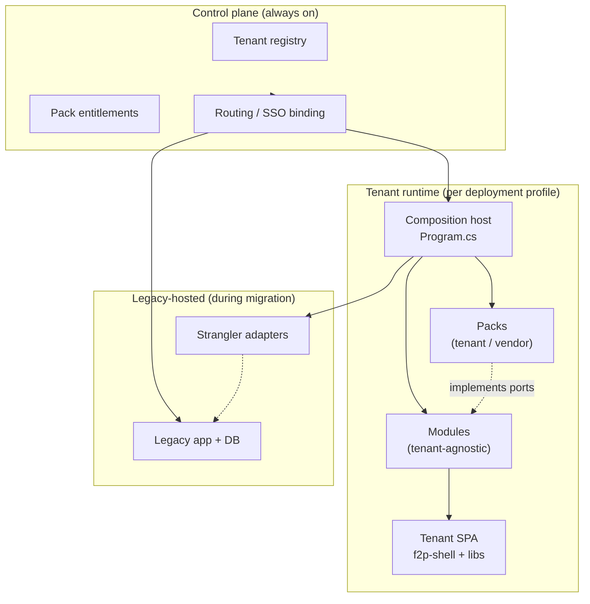
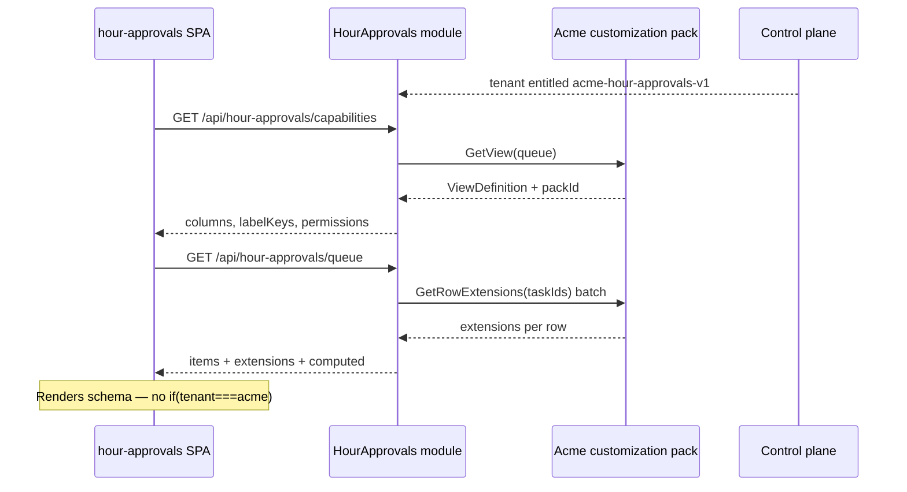

# Platform 2.0 architecture overview

**Purpose:** Single entry point for **stakeholder presentations**, onboarding, and engineering orientation. Explains how the V2 platform is structured, how **modules** and **packs** relate, and where to find deep standards.

**Audience:** Tech leads, product, engineers, AI agents.

**Runnable reference:** `F2pPlatform/` in SandBox.

**Deep standards (detail):** linked in [Further reading](#further-reading).

---

## Presentation outline (slide deck skeleton)

Copy section headings into slides; diagrams below are presentation-ready.

| # | Slide title | Key message |
|---|-------------|-------------|
| 1 | **Why V2** | One product core; client variance via packs — not git submodules or service inheritance |
| 2 | **Platform layers** | Control plane → host → modules + packs → SPA |
| 3 | **What is a module?** | Tenant-agnostic bounded context (API, domain, default UI) |
| 4 | **What is a pack?** | Versioned tenant/vendor plugin (columns, rules, connectors) |
| 5 | **Modules vs packs** | Modules are required; packs are optional; packs never replace modules |
| 6 | **Hour Approvals example** | One module, one shared UI, Acme pack adds SAP column |
| 7 | **Legacy vs native** | Control plane routes; strangler until cutover |
| 8 | **Orchestration** | Akka actor pipelines compose pack stages at the host |
| 9 | **Roadmap** | Foundation → pilots → scale (`foundation-and-pilot-plan.md`) |

**Speaker notes (slide 1):** Legacy Floor2Plan often ships client variance as optional `Text*` columns, `AcmeService : BaseService`, and connector submodules in a customized mega-repo. V2 keeps **one canonical module per capability** and plugs in **versioned packs** per tenant.

---

## Platform at a glance



| Layer | Responsibility | Examples |
|-------|----------------|----------|
| **Control plane** | Who the tenant is, which packs they own, legacy vs native routing | `ControlPlane` module, Admin backoffice |
| **Host** | Composition root — wires modules and entitled packs | `F2pPlatform.Host` |
| **Module** | Product capability — domain, API, persistence, default behavior | `HourApprovals`, `Import`, `Planning` |
| **Pack** | Variance — UI layout, tenant rules, vendor protocols | `acme-hour-approvals-v1`, `sap-projects-v1` |
| **SPA** | Schema-driven UI paired 1:1 with modules | `web/libs/hour-approvals/` |
| **Actors** | Long-running workflow orchestration; pack stages attach here | Import pipeline, integration routers |

---

## Module vs pack

### One-line definitions

| Term | Definition |
|------|------------|
| **Module** | A **bounded context** delivered as Domain → Application → Infrastructure → Api (+ paired frontend libs). **Same for every tenant.** |
| **Pack** | A **small, versioned plugin** that implements a port defined by a module (or integration abstractions). **Different per tenant or vendor.** |

### What each owns

| Owns | Module | Pack |
|------|--------|------|
| Ubiquitous language & invariants | ✓ | ✗ |
| HTTP API & read DTOs | ✓ | ✗ |
| Persistence (`DbContext`) | ✓ | ✗ *(optional pack-local store for extensions only)* |
| Default screen behavior | ✓ (default pack in Infrastructure) | ✗ |
| Tenant column layout / `extensions` | port only | ✓ |
| Tenant workflow gates | port / actor hook | ✓ (rules pack) |
| Vendor fetch & map | port only | ✓ (integration pack) |
| i18n for core columns | ✓ (module bundles) | pack keys only (`packs.<pack-id>.*`) |
| Angular feature components | ✓ (shared per context) | ✗ |

### Dependency direction

```text
Pack  ──implements──►  Module Application port
Module  ──never references──►  Pack implementation
Host  ──registers both──►  AddHourApprovalsModule() + AddAcmeHourApprovalsPack()
```

**Rule:** Compile-time arrows point **from pack to module abstractions**, never into module Domain.

### Module application boundaries (Ports vs Persistence)

Not every interface in Application is a **pack** port. Split abstractions by role:

```text
<Context>.Application/
  Ports/                    ← inbound API + tenant extension points
  Persistence/              ← outbound storage (Infrastructure implements)
```

| Interface | Folder | Implemented by | Per-tenant? |
|-----------|--------|----------------|-------------|
| `IHourApprovalsService` | `Ports/` | Application | No |
| `IHourApprovalsCustomizationPack` | `Ports/` | Pack or default | Yes |
| `IHourApprovalsRepository` | `Persistence/` | `EfHourApprovalsRepository` | No |

**Who calls the repository?** Only `HourApprovalsService` — not HTTP endpoints or packs.

```text
HTTP  →  IHourApprovalsService  →  IHourApprovalsRepository  →  EF
              ↑
              └── IHourApprovalsCustomizationPack (view schema only)
```

Reference: `F2pPlatform/src/Modules/HourApprovals/`.

### Cardinality

```text
1 bounded context  →  1 module  (required for that capability)
1 module           →  0..n packs  (optional)
1 tenant × context →  typically 1 active customization pack (or default)
```

### Can you have packs without modules?

**No.** Packs are plugins; modules are the application surface.

| Scenario | Valid? |
|----------|--------|
| Host with modules, no packs | ✓ — default packs suffice (`Reference`, `Identity`) |
| Host with packs, no modules | ✗ — nothing to plug into |
| Ship only an integration pack NuGet | ✓ as a **deliverable**, but runtime still needs `Import` / `WBS` modules to consume canonical data |
| Legacy tenant with pack ids in control plane only | ✓ metadata until native cutover — code still in legacy build profile |

### Legacy → V2 mapping

| Legacy pattern | V2 replacement |
|----------------|----------------|
| `Text3` / `Bool2` on core tables | Module read DTO + pack `extensions` / rules |
| `AcmePlanningService : PlanningService` | `Planning` module + `acme-planning-rules-v1` pack |
| Connector git submodule | `sap-projects-v1` integration pack |
| Per-client Razor/Vue fork | Shared Angular feature + pack view schema |
| `if (tenant == "acme")` in C# | Forbidden in modules; pack port or actor stage |

---

## End-to-end example: Hour Approvals



| Artifact | Location |
|----------|----------|
| Module | `F2pPlatform/src/Modules/HourApprovals/` |
| Acme pack | `F2pPlatform/src/Packs/HourApprovals.Packs.Acme/` |
| Frontend | `F2pPlatform/web/libs/hour-approvals/` |
| Pack manifest | `HourApprovals.Packs.Acme/PACK.md` |

---

## Module rules (engineering)

1. **Tenant-agnostic** — no tenant slug branches in Domain/Application.
2. **Define extension ports** — e.g. `IHourApprovalsCustomizationPack`; ship `DefaultHourApprovalsPack` in Infrastructure.
3. **Explicit DI** — `Add<Context>Module()` / `Map<Context>Endpoints()`; no ABP in new code.
4. **Paired frontend** — `web/libs/<context>/` per `MODULE.md`.
5. **Characterization tests** — P0 behavior locked before strangler moves.

Detail: `module-composition-di.md`.

---

## Pack rules (engineering)

1. **One primary role per pack** — UI customization, rules, or integration (do not mix SAP SDK with view schema).
2. **Versioned id** — `acme-hour-approvals-v1`; bump suffix on breaking changes.
3. **Entitled per tenant** — `packEntitlements.customizationPacks` / `integrationPacks` in control plane.
4. **Host registration only** — `AddAcmeHourApprovalsPack()` in `Program.cs`.
5. **No domain invariants** — promote to module when all tenants need the rule.

Detail: `platform-pack-blueprint.md`.

---

## Pack types (quick reference)

| Type | packId example | Solves |
|------|----------------|--------|
| **Customization (UI)** | `acme-hour-approvals-v1` | Columns, visibility, extension fields, labels |
| **Customization (rules)** | `acme-planning-rules-v1` | Approval gates, validation stages |
| **Integration** | `sap-projects-v1` | Vendor protocol → canonical exchange format |
| **Strangler adapter** *(not a pack)* | — | Delegate to legacy API/DB during migration |

---

## Deployment profiles

```text
                    Control plane
                          │
           ┌──────────────┴──────────────┐
           ▼                             ▼
   legacy_hosted                    native
   · full legacy app                · v2 host + modules
   · submodule build profile        · entitled packs loaded
   · pack ids = metadata            · canonical DB per tenant
           │                             │
           └──────── cutover ────────────┘
```

| Mode | Modules | Packs |
|------|---------|-------|
| **legacy_hosted** | Legacy code owns behavior | Pack ids documented; enforced after cutover |
| **native** | V2 modules in host | Packs registered and enforced |

Detail: `ApiImportActorPoc/docs/deployment-profile-sketch.md` (pattern applies platform-wide).

---

## Actor orchestration (workflows)

For imports, integrations, and multi-step tenant workflows:

```text
HTTP / queue / scheduler
  → Facade (AskCorrelated)
    → IntegrationRouterActor
        → [VendorFetchActor]      ← integration pack
        → [MapToCanonicalActor]   ← integration pack
        → [TenantRulesActor]      ← customization rules pack
        → OrchestratorActor
            → PersistActor        ← sole DbContext boundary
```

**Principle:** Modules own domain rules; actors **compose** pack stages at the host. Detail: `platform-actor-standard.md`.

---

## Physical layout (SandBox)

```text
F2pPlatform/
  host/F2pPlatform.Host/           composition root
  src/
    Modules/<Context>/               bounded contexts
    Packs/<Context>.Packs.<Client>/  customization packs
    Shared/                          Platform.Shared.View, etc.
  web/
    apps/f2p-shell/                  tenant SPA host
    libs/<context>/                  paired frontend modules
```

Scaffold:

```bash
./scripts/scaffold-module.sh Planning
./scripts/scaffold-frontend-module.sh Planning
./scripts/scaffold-customization-pack.sh Planning Acme acme-planning-v1
```

---

## Glossary

| Term | Meaning |
|------|---------|
| **Bounded context** | Business area (Planning, Hours, Import) — usually one module |
| **Module** | Code delivery of a context: layers + API + UI lib |
| **Pack** | Versioned tenant or vendor variance plugin |
| **Port** | Application interface a pack implements |
| **Default pack** | Baseline implementation inside module Infrastructure |
| **Entitlement** | Control-plane list of enabled pack ids for a tenant |
| **Composition root** | Host `Program.cs` — only place that wires modules + packs |
| **Persistence port** | `I<Context>Repository` in `Application/Persistence/` — EF adapter in Infrastructure |
| **Promotion** | Move field from pack `extensions` into module when universal |
| **Strangler** | Adapter that delegates to legacy until native parity |

---

## FAQ

**Does every module need a pack?**  
No. Many modules run on the default pack only.

**Does every tenant need the same packs?**  
No. Entitlements differ per tenant.

**Where does client-specific English/Dutch labels for SAP columns go?**  
Pack i18n keys (`packs.<pack-id>.columns.*`), not in C#.

**Can a pack open EF Core on the main domain DbContext?**  
Integration packs: no. UI packs: only via a dedicated batch loader in pack Infrastructure — never in Application Domain.

**Is Control Plane a module?**  
Yes — platform capability, not a tenant product feature. It typically has no customization packs.

---

## Further reading

| Topic | Document |
|-------|----------|
| Modularization roadmap & pilots | `foundation-and-pilot-plan.md` |
| Module DI (no ABP) | `module-composition-di.md` |
| Pack artifact catalog & scaffold | `platform-pack-blueprint.md` |
| UI view schemas & extensions | `platform-ui-customization-standard.md` |
| Actor pipelines | `platform-actor-standard.md` |
| Integration pack dependencies | `../floor2plan-v2-connector-architecture.md` |
| Legacy Text*/Bool* migration | `tenant-workflow-fields-deepdive-instructions.md` |
| Frontend (@floorganise/css) | `platform-frontend-standard.md` |
| Auth & SSO | `platform-authentication-standard.md` |
| Legacy connector anti-pattern | `../floor2plan-legacy-connector-submodule-antipattern.md` |
| Runnable POC index | `F2pPlatform/README.md` |

---

## Versioning

| Version | Date | Notes |
|---------|------|-------|
| 1.0 | 2026-06-27 | Initial overview; module vs pack; presentation outline |
