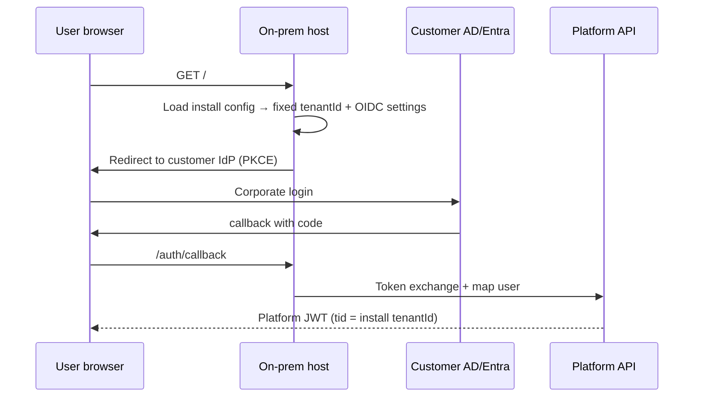

# Platform 2.0 authentication — design standard

**Status:** Design / not implemented. V2 does not exist yet; this document describes the **intended** authentication architecture for cloud multi-tenant SaaS and on-prem single-tenant deployments.

**Audience:** Architects, platform engineers, and AI agents scaffolding the Identity bounded context.

**Related:**

| Document | Role |
|----------|------|
| `ApiImportActorPoc/docs/deployment-profile-sketch.md` | Control plane, tenant registry, edge routing |
| `ApiImportActorPoc/docs/platform-rebuild-proposal-summary.md` | Cloud vs on-prem deployment profiles |
| `docs/Modularization/00-inventory.md` §5 | Legacy F2P auth (reference only) |
| `docs/monolith-modularization/platform-correlation-standard.md` | Correlation headers after auth |
| `docs/floor2plan-v2-read-model-playbook.md` | `@f2p/identity` frontend module |

---

## 1. Goals

| Goal | Detail |
|------|--------|
| **One product binary** | Same API + SPA artefact for cloud SaaS and on-prem; behaviour differs by **deployment profile + installation config**, not separate auth code paths. |
| **OIDC-first** | Browser users authenticate via OpenID Connect (Authorization Code + PKCE). Machine clients use client credentials or API keys where appropriate. |
| **Tenant-scoped identity** | Every authenticated session is bound to exactly one tenant. Cross-tenant access is impossible at the API and data layers. |
| **Per-tenant database** | Every tenant has its own SQL Server **database**. Cloud may host many tenant DBs on one shared SQL Server **instance**; enterprise tier may use a dedicated instance — never a shared database with row-level `TenantId` isolation. |
| **IdP flexibility** | Cloud: Floorganise-hosted or customer-owned IdP per tenant. On-prem: customer AD / Entra / LDAP / SAML configured at install. |
| **Strangler-safe** | `legacy_hosted` tenants may keep legacy sessions during migration; control plane still owns SSO binding metadata. |
| **No ABP in new modules** | Identity module registers via `IServiceCollection` extensions — see `module-composition-di.md`. |

---

## 2. Architecture overview

```text
┌─────────────────────────────────────────────────────────────────────────┐
│  Browser (f2p-shell SPA)                                                │
│  · OIDC login (PKCE)                                                    │
│  · stores access token (memory / secure storage)                        │
│  · api-core interceptor adds Authorization + correlation headers        │
└───────────────────────────────┬─────────────────────────────────────────┘
                                │ HTTPS
                                ▼
┌─────────────────────────────────────────────────────────────────────────┐
│  Edge / API gateway                                                     │
│  · resolve tenant (slug / host / install config)                        │
│  · JWT validation (signature, issuer, audience, expiry)                  │
│  · enforce tenant claim matches resolved tenant                         │
│  · route legacy_hosted → legacy runtime (optional token bridge)         │
└───────────────────────────────┬─────────────────────────────────────────┘
                                │
         ┌──────────────────────┼──────────────────────┐
         ▼                      ▼                      ▼
┌─────────────────┐   ┌─────────────────┐   ┌─────────────────┐
│ Control plane   │   │ Identity module │   │ Domain APIs     │
│ (cloud SaaS)    │   │ users · roles   │   │ tenant DB conn  │
│ tenant registry │   │ permissions     │   │ on every query  │
│ SSO bindings    │   │ token exchange  │   │                 │
└─────────────────┘   └─────────────────┘   └─────────────────┘
```

### Bounded context: Identity

```text
F2P.Identity/
├── Identity.Domain/           Permissions, roles (ubiquitous language)
├── Identity.Application/      Login orchestration, user provisioning ports
├── Identity.Infrastructure/   User store, IdP adapters, JWT signing keys
└── Identity.Api/              /auth/* endpoints, MapIdentityEndpoints
```

The **host** (`Program.cs`) is the only composition root: `AddIdentityModule`, `MapIdentityEndpoints`, JWT bearer middleware.

---

## 3. Core concepts

### 3.1 Deployment topologies

| Topology | Tenant resolution | Control plane | Typical IdP |
|----------|-------------------|---------------|-------------|
| **Cloud multi-tenant** | `{slug}.app.example` → tenant registry lookup | Required (registry, SSO bindings, provisioning) | Per-tenant Entra / Okta / SAML, or shared Entra multi-tenant app |
| **On-prem single-tenant** | Fixed host + `TenantId` in install config | Optional (telemetry/licensing only) or absent | Customer AD / Entra / LDAP / SAML from install wizard |
| **Legacy-hosted** (either topology) | Same as above at edge | SSO binding in control plane | Shared SSO → legacy session **or** federated token bridge |

### 3.2 Authentication vs authorization

| Layer | Responsibility | V2 module |
|-------|----------------|-----------|
| **Authentication** | Who is the user? Which tenant? | Identity + IdP (OIDC) |
| **Authorization** | What can they do? | Identity (roles/permissions) + per-endpoint policies |

Legacy F2P used multiple cookie schemes (client Azure AD, Floorganise Azure AD, local password) plus JWT for API (`docs/Modularization/00-inventory.md` §5). V2 collapses browser and API auth onto **one OIDC login** and **one platform JWT** (or validated IdP token where claims are sufficient — see §6.3).

### 3.3 Platform token claims (minimum)

| Claim | Purpose |
|-------|---------|
| `sub` | Platform user ID (stable surrogate, not email) |
| `tid` | Tenant ID (GUID) |
| `tenant_slug` | Human routing key (cloud) |
| `email` | Display / audit |
| `name` | Display |
| `roles` | Coarse roles (`Planner`, `Admin`, …) |
| `permissions` | Fine-grained (optional in token; prefer server-side lookup for large sets) |
| `deployment_mode` | `native` \| `legacy_hosted` — edge routing hint |
| `iss`, `aud`, `exp`, `iat` | Standard JWT |

**Rule:** APIs and EF repositories **never** trust client-supplied `TenantId` headers alone. Tenant comes from validated token claims (or install-time fixed context on on-prem).

---

## 4. Cloud multi-tenant authentication flow

### 4.1 Prerequisites (control plane)

When a tenant is provisioned (`POST /admin/tenants`), the control plane stores an **auth binding** alongside the deployment profile:

```json
{
  "tenantId": "3f2e9b1a-8c4d-4e5f-9a0b-1c2d3e4f5a6b",
  "slug": "acme-shipyard",
  "auth": {
    "protocol": "oidc",
    "idpType": "entra_id",
    "authority": "https://login.microsoftonline.com/{customer-tenant-id}/v2.0",
    "clientId": "platform-registered-app-id",
    "clientSecretRef": "vault:tenants/acme-shipyard/oidc-client-secret",
    "redirectUri": "https://acme-shipyard.app.example/auth/callback",
    "scopes": ["openid", "profile", "email"],
    "groupRoleMappings": [
      { "idpGroupId": "…", "platformRole": "Planner" }
    ]
  }
}
```

For SAML tenants, `protocol: "saml"` with `metadataUrl` or inline metadata ref instead of OIDC fields.

### 4.2 User login sequence (native runtime)

```mermaid
sequenceDiagram
    participant U as User browser
    participant E as Edge / shell
    participant CP as Control plane
    participant IdP as Customer IdP
    participant API as Platform API

    U->>E: GET https://acme-shipyard.app.example/
    E->>CP: Resolve slug → tenant + auth binding
    CP-->>E: tenantId, OIDC authority, clientId
    E->>U: Redirect to IdP (PKCE code_challenge)
    U->>IdP: Login (MFA, conditional access, …)
    IdP->>U: Redirect to /auth/callback?code=…
    U->>E: GET /auth/callback?code=…
    E->>API: POST /auth/token (code + code_verifier + tenant context)
    API->>IdP: Token exchange
    IdP-->>API: id_token + access_token
    API->>API: Map IdP subject → platform user (provision if JIT allowed)
    API->>API: Issue platform JWT (tid, sub, roles, …)
    API-->>E: platform access_token (+ refresh_token)
    E->>U: SPA loaded; token in memory
    U->>API: GET /api/v1/planning/... Authorization Bearer
    API->>API: Validate JWT; enforce tid; scope EF queries
```

### 4.3 Tenant isolation enforcement

1. **Edge:** slug → `tenantId` before any auth redirect (prevents wrong IdP).
2. **Token exchange:** callback handler verifies `state` encodes expected `tenantId`.
3. **API middleware:** `tid` claim must match resolved tenant for the request host.
4. **Data layer:** resolve this tenant's **dedicated database** from deployment profile (`databaseConnectionRef`); open DbContext against that connection only. JWT `tid` must match the tenant that owns the connection. Optional `TenantId` columns in schema are for portability/export — not the primary isolation mechanism.

### 4.4 Per-tenant database (SQL Server tier)

**Every tenant gets its own database.** V2 does not offer a shared-database multi-tenant model (one DB, many tenants, row-level `TenantId`).

| `dataTier` | Meaning |
|------------|---------|
| `shared_sql_server` | Tenant DB on a **shared SQL Server instance** (typical cloud SaaS) |
| `dedicated_sql_server` | Tenant DB on a **dedicated SQL Server instance** (enterprise / isolation) |

Auth is identical across tiers. `dataTier` only affects **which server hosts the tenant's database** and provisioning/cost — not login flow. JWT always carries `tid`; the API uses it to select the correct `databaseConnectionRef`.

### 4.5 Legacy-hosted tenant (cloud)

Edge resolves `mode: legacy_hosted` and proxies product traffic to `deploymentProfile.legacy.runtimeUrl` (see deployment-profile-sketch).

| Option | When | Flow |
|--------|------|------|
| **A — Shared SSO, separate sessions** | Early migration | User logs in via control-plane IdP binding; edge sets legacy session cookie on proxy (requires legacy auth bridge adapter). |
| **B — Legacy owns auth** | Minimal v2 investment | User hits legacy login directly; v2 control plane only for admin/provisioning. |
| **C — Token bridge** | Preferred long-term | Platform JWT accepted by legacy via strangler adapter validating same issuer. |

Document the chosen option per tenant in `auth.legacyBridgeMode`.

---

## 5. On-prem single-tenant authentication flow

On-prem ships the **same binary** with an **installation profile** that fixes tenant context. There is no slug registry at runtime (unless connecting to a remote control plane for license/telemetry).

### 5.1 Installation configuration

Supplied at install (wizard, `appsettings.Production.json`, environment variables, or sealed secrets file):

```json
{
  "Platform": {
    "Deployment": {
      "topology": "on_prem_single_tenant",
      "tenantId": "fixed-guid-from-install-or-generated",
      "tenantDisplayName": "Acme Shipyard",
      "dataTier": "dedicated_sql_server",
      "databaseConnectionRef": "secrets/db-connection"
    },
    "Authentication": {
      "protocol": "oidc",
      "authority": "https://login.microsoftonline.com/{customer-tenant}/v2.0",
      "clientId": "…",
      "clientSecretRef": "secrets/oidc-client-secret",
      "redirectUri": "https://f2p.acme.internal/auth/callback",
      "allowLocalLogin": false,
      "jitProvisioning": true,
      "groupRoleMappings": [ … ]
    }
  }
}
```

| Setting | Purpose |
|---------|---------|
| `topology` | `on_prem_single_tenant` — disables multi-tenant slug resolution |
| `tenantId` | Baked into every issued token; no registry lookup |
| `authority` / SAML metadata | Customer IdP — configured once at install |
| `allowLocalLogin` | `true` only for air-gapped sites without IdP (Argon2 local accounts — legacy parity) |
| `jitProvisioning` | Create platform user on first successful IdP login |

### 5.2 User login sequence (on-prem)

Same OIDC + PKCE sequence as cloud (§4.2), except:

- Host is fixed (`https://f2p.acme.internal`) — no slug lookup.
- `tenantId` comes from install config, not control plane.
- Token issuer/audience may use customer-specific URLs (`https://f2p.acme.internal` as `iss`/`aud`).
- Signing keys: customer-managed (HSM, cert in secrets store) or platform-generated at install and rotated via customer process.



### 5.3 On-prem variants

| Variant | Identity source | Notes |
|---------|-----------------|-------|
| **Entra ID / OIDC** | Cloud IdP reachable from site | Same as cloud; no Floorganise-hosted IdP required |
| **AD FS / SAML** | On-prem federation | SAML SP configuration in install profile |
| **LDAP bind** (fallback) | Directory | Username/password → LDAP validate → issue platform JWT; use only when OIDC/SAML unavailable |
| **Local accounts** | Platform user store | `allowLocalLogin: true`; for isolated networks |

### 5.4 Optional control plane link

Large enterprise on-prem may still **phone home** to Floorganise control plane for license, updates, and support — but **authentication stays local**. The install config may include `controlPlaneUrl` + `registrationToken` without routing user login through SaaS.

---

## 6. Token strategy

### 6.1 Recommended: platform-issued JWT

After OIDC login, the Identity module **issues its own JWT** signed with platform keys:

- **Pros:** Uniform claims (`tid`, `permissions`, `deployment_mode`); same validation for cloud and on-prem; legacy bridge can trust one issuer.
- **Cons:** Requires token exchange endpoint and refresh-token store.

### 6.2 Alternative: validate IdP token directly

API validates incoming Entra/Okta JWT. Platform user mapping uses `oid` / `sub` from IdP.

- **Pros:** Fewer moving parts.
- **Cons:** Harder to add platform-specific claims; short IdP token lifetime; on-prem key rotation tied to IdP.

**Recommendation:** platform-issued JWT for product API; IdP token used only at login boundary.

### 6.3 Machine / integration clients

| Client type | Auth mechanism |
|-------------|----------------|
| CI / health agents | API key + `CiBuildAgent`-style policy (legacy parity) |
| Shop floor / clocking terminals | Device credential + scoped policy |
| Server-to-server integrations | OAuth2 client credentials per tenant, or mTLS |
| Import workers | Service principal; no user cookie |

---

## 7. Authorization model

### 7.1 Permission storage

Migrate conceptually from legacy `PermissionGrant` + ABP (`00-inventory.md` §5) to:

```text
Identity DB (per deployment)
├── Users           (platform surrogate id, external idp subject, tenant id)
├── Roles
├── RolePermissions
└── UserRoles
```

Fine-grained permissions remain **server-side**; JWT carries roles and optionally a compressed permission set for hot paths.

### 7.2 Enforcement

```csharp
// Endpoint
app.MapGet("/api/v1/planning/projects/{id}/activities", …)
   .RequireAuthorization("Planning.Read");

// Handler
public sealed class ListActivitiesHandler(ICurrentUser user, …)
{
    // user.TenantId from JWT — never from route/body alone
}
```

Custom attribute equivalent of legacy `[PermissionAuthorise]` lives in `Identity.Application` — not in domain modules.

### 7.3 Admin / backoffice

Provisioning APIs (`POST /admin/tenants`, pack enablement, user bootstrap) require a **separate operator identity** (Floorganise staff) with `Platform.Admin` — not tenant user JWT.

---

## 8. Frontend (f2p-shell)

From `platform-frontend-standard.md` and read-model playbook:

| Piece | Responsibility |
|-------|----------------|
| `apps/f2p-shell` | Login redirect, callback route, silent refresh |
| `libs/shared/api-core` | Attach `Authorization: Bearer`, `X-Correlation-Id`, `X-Use-Case` |
| `@f2p/identity` | User admin screens (tenant operators) |

**Rules:**

- PKCE for all browser logins; no implicit flow.
- Access token in memory; refresh via `httpOnly` cookie or secure BFF endpoint.
- On 401: attempt refresh once, then redirect to login preserving return URL.
- Never store tokens in `localStorage` if XSS risk unacceptable (prefer BFF cookie pattern).

---

## 9. Technical requirements checklist

### 9.1 Platform components to build

| # | Component | Cloud | On-prem |
|---|-----------|-------|---------|
| 1 | Identity module (Domain, Application, Infrastructure, Api) | ✓ | ✓ |
| 2 | OIDC login + callback + token exchange | ✓ | ✓ |
| 3 | SAML SP support (or bridge to external proxy) | Per tenant | Common |
| 4 | Platform JWT signing + rotation | Central KMS | Install-time cert |
| 5 | Refresh token store | Control-plane DB | Local SQL |
| 6 | User / role / permission store | Per control plane region | Local SQL |
| 7 | JIT provisioning + group → role mapping | ✓ | ✓ |
| 8 | Tenant resolution middleware | Slug-based | Config-based |
| 9 | Tenant → database connection resolution | ✓ | ✓ |
| 10 | Auth binding in tenant registry | ✓ | N/A (install config) |
| 11 | Legacy auth bridge adapter | If `legacy_hosted` | If `legacy_hosted` |
| 12 | Install wizard / config schema validation | N/A | ✓ |

### 9.2 Security requirements

- TLS everywhere; HSTS on cloud edge.
- Secrets by reference (`clientSecretRef`, `databaseConnectionRef`) — never in tenant JSON.
- PKCE, `state`, and `nonce` validation on OIDC callbacks.
- Rate limiting on `/auth/*` and login endpoints.
- Audit log: login success/failure, role changes, permission grants (correlate with `CorrelationId`).
- MFA enforced by customer IdP — platform does not implement MFA for OIDC tenants.
- CORS: allow only tenant-specific origins in cloud; fixed origin on-prem.

### 9.3 Operational requirements

| Concern | Cloud | On-prem |
|---------|-------|---------|
| Key rotation | Automated via KMS / cert manager | Customer-run playbook in install docs |
| IdP cert rollover | Monitor metadata URL | Same |
| Session revocation | Refresh token revoke + short access TTL | Same |
| User offboarding | Disable in platform + IdP group removal | Customer IdP + local disable |

---

## 10. Configuration comparison

| Aspect | Cloud multi-tenant | On-prem single-tenant |
|--------|-------------------|------------------------|
| Tenant ID source | Control plane registry | Install config |
| Host routing | `{slug}.app.example` | Customer DNS |
| IdP config | Per-tenant `auth` block in registry | Install `Authentication` section |
| JWT issuer | `https://auth.platform.example` | `https://f2p.customer.internal` or customer choice |
| Signing keys | Platform KMS | Customer cert / local key store |
| User store | Regional Identity DB | Customer SQL Server |
| Provisioning | Backoffice API | Install wizard + optional import |
| Local login | Rare; tenant flag | `allowLocalLogin` for air-gap |

---

## 11. Migration from legacy F2P

| Legacy mechanism | V2 target |
|------------------|-----------|
| Cookie + Azure AD (`ClientAuthScheme`, `FloorganiseAuthScheme`) | OIDC → platform JWT |
| Local username/password | `allowLocalLogin` + Argon2 (on-prem or explicit tenant flag) |
| `POST /api/Auth/LoginAsync` JWT | `POST /auth/token` or standard OIDC |
| `F2PAuthenticationPolicy.Api` claim `Api` | Scope-based or role-based policies |
| `[PermissionAuthorise]` | `RequireAuthorization` + permission handler |
| `PermissionGrant` table | `RolePermissions` in Identity DB |
| AD via `System.DirectoryServices` | LDAP bind adapter or OIDC to Entra |

**Strangler:** legacy-hosted tenants may keep legacy login until cutover; control plane records `auth.legacyBridgeMode` so edge behaviour is explicit.

---

## 12. Suggested build order

Aligned with deployment-profile-sketch sprint ordering:

1. **Install config schema** + validation (on-prem path exercises single-tenant early).
2. **OIDC login + platform JWT** for one fixed tenant (on-prem or staging).
3. **Tenant resolution middleware** + per-tenant database connection routing.
4. **Control plane auth binding** + slug-based login (cloud).
5. **Group → role mapping** + JIT provisioning.
6. **Refresh tokens** + revocation.
7. **SAML** (if enterprise tenants require before cloud GA).
8. **Legacy auth bridge** for `legacy_hosted` pilots.
9. **@f2p/identity** admin UI (user/role management).

---

## 13. Open decisions [NEEDS REVIEW]

| Topic | Options |
|-------|---------|
| BFF vs pure SPA token handling | BFF (`httpOnly` cookie) improves XSS resistance; pure SPA simpler for on-prem |
| Central IdP for small cloud tenants | Floorganise-operated Keycloak/Entra B2B vs customer brings own IdP only |
| Permission claims in JWT vs introspection | Size limits vs latency |
| On-prem license without network | Signed license file bound to `tenantId` + machine fingerprint |

---

## 14. Explicit non-goals (v0)

- Per-screen auth mode inside one tenant.
- Platform-managed MFA (delegate to IdP).
- Cross-tenant admin impersonation without audited break-glass flow.
- Inline secrets in tenant or install JSON files.
- Shared-database multi-tenancy (one database, many tenants, row-level `TenantId` isolation).
