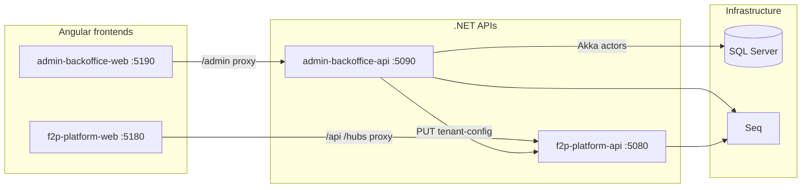

# Platform Docker stack

Run the **admin backoffice**, **F2pPlatform v2 runtime**, and both **Angular frontends** from a single Docker Compose file.

## Quick start

```bash
# From repository root
docker compose -f docker-compose.platform.yml up --build
```

| Service | URL | Purpose |
|---------|-----|---------|
| Admin UI | http://localhost:5190 | Tenant list + create form |
| F2P tenant UI | http://localhost:5180 | v2 platform shell (login, modules) |
| Admin API | http://localhost:5090/swagger | Control-plane REST API |
| F2P API | http://localhost:5080/swagger | v2 platform host API |
| Seq | http://localhost:8080 | Structured logs (all .NET hosts) |

### First tenant

1. Open http://localhost:5190
2. Click **New tenant**
3. Submit the form (defaults target the in-stack F2P API)
4. Tenant is persisted in SQL Server and pushed to F2pPlatform via Akka actor pipeline
5. Open http://localhost:5180 and sign in with the dummy identity module

## Architecture



### Admin backoffice — Akka actor pipeline

Tenant provisioning follows the same pattern as `ApiImportActorPoc`:

```
HTTP POST /admin/tenants
  └── IControlPlaneActorFacade.AskCorrelated
        └── RootActor
              └── TenantProvisioningManagerActor
                    ├── TenantPersistActor   (sole EF writer)
                    └── PlatformSyncActor    (HTTP push to F2pPlatform)
```

Read paths (`GET /admin/tenants`) still use the EF repository directly. Write paths (`POST /admin/tenants`, `POST .../sync`) go through actors.

### Frontend containers

Both Angular apps are built with `node:22-alpine` and served by `nginx:alpine`:

- **Admin UI** — `AdminBackoffice/web/Dockerfile`; nginx proxies `/admin/*` to `admin-backoffice-api`
- **F2P shell** — `F2pPlatform/web/Dockerfile`; nginx proxies `/api/*` and `/hubs/*` to `f2p-platform-api`

This keeps browser calls same-origin (no CORS configuration required in Docker).

## Configuration

Environment variables (optional `.env` at repo root):

| Variable | Default | Used by |
|----------|---------|---------|
| `PLATFORM_MSSQL_SA_PASSWORD` | `Your_strong_password123` | SQL Server, admin API connection string |
| `PLATFORM_CONFIG_API_KEY` | `dev-platform-config-key` | Admin → F2P tenant-config push |

## Local development (without full stack)

### Admin backoffice only

```bash
cd AdminBackoffice
docker compose up -d          # SQL :1403, Seq :5343 (UI :8083)
dotnet run --project host/AdminBackoffice.Host
cd web && npm install && npm start   # :5190, proxies /admin → :5090
```

### F2pPlatform only

```bash
cd F2pPlatform
docker compose up -d          # SQL :1402, Seq :8083
dotnet run --project host/F2pPlatform.Host
cd web && npm install && npm start   # :5180
```

Start F2pPlatform before provisioning tenants from the admin UI.

## Project layout

```text
AdminBackoffice/
  host/AdminBackoffice.Host/     API host + Dockerfile
  src/ControlPlane.Core/         Akka actors
  src/ControlPlane.Contracts/    Actor messages + facade interface
  web/                           Angular admin UI + Dockerfile

F2pPlatform/
  host/F2pPlatform.Host/         v2 API host + Dockerfile
  web/                           Angular tenant shell + Dockerfile

docker-compose.platform.yml      Unified stack (this document)
Platform.ControlPlane.Contracts/ Shared tenant DTOs
```

## Troubleshooting

| Symptom | Check |
|---------|-------|
| Admin UI cannot load tenants | `docker compose logs admin-backoffice-api`; SQL healthy? |
| Tenant stuck in Provisioning | F2P API running? `Platform__BaseUrl` reachable from admin container? |
| Platform sync 502 | API keys match (`PLATFORM_CONFIG_API_KEY`) on both hosts |
| Angular build fails in Docker | `FloorganiseCss/` must exist (local `file:` dependency) |

## Related docs

- `AdminBackoffice/README.md` — control-plane API details
- `F2pPlatform/web/README.md` — frontend module scaffold
- `docs/monolith-modularization/platform-actor-standard.md` — actor conventions
- `ApiImportActorPoc/` — reference actor + Docker POC
