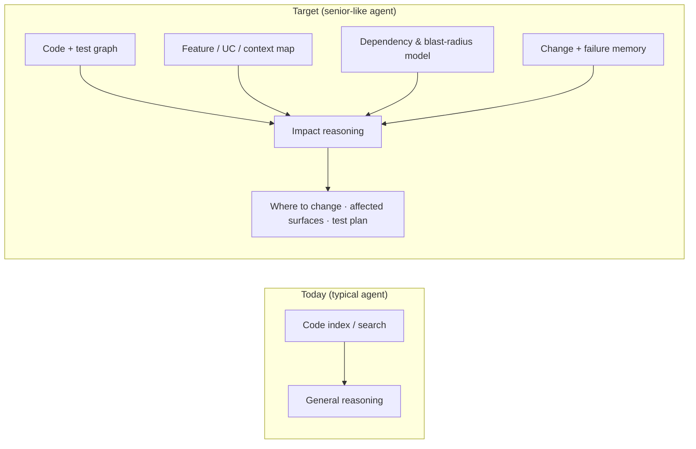

# Vision note: intelligence from associations

**Recorded:** 2026-07-27  
**Status:** Active — AI-assisted development evolution  
**Trigger:** Reading on how intelligence emerges less from isolated facts and more from **relationships between** pieces of knowledge (association, context, *when*).

---

## Insight (from the article)

Traditional views treat “knowing” as holding discrete facts. The article’s angle: **intelligence emerges from how knowledge connects** — associations between things, temporal or situational links (*when* something applies), and the structure of those links rather than any single node in isolation.

| Isolated knowledge | Relational knowledge |
|--------------------|----------------------|
| “What is X?” | “What is X **in relation to** Y?” |
| Static fact | **When** / **under what conditions** |
| Single node | **Graph of associations** |

This matches how humans reason (cue → context → action), how memory works (spreading activation), and how many modern systems (retrieval, agents, knowledge graphs) outperform pure lookup.

---

## Next vision: senior-engineer impact reasoning for AI agents

When building a new feature, a **senior engineer with deep product experience** does not only search the repo. They combine:

- **Where things live** (code, modules, tests)
- **What the feature *means*** in the product (use cases, boundaries, tenant/pack variance)
- **How pieces depend on each other** (call paths, events, shared data, integration contracts)
- **What usually breaks** when you touch an area (flaky tests, legacy quirks, cross-context rules)

They produce **impact-aware guidance**: where the change should land, what will be affected downstream, and which tests are likely to need updates—before or alongside implementation.

**Vision:** AI-assisted development evolves from *fast drafting inside a codebase index* to **meaningful impact evaluation and change guidance** by combining:

1. **Codebase index** — symbols, references, diffs, CI history (what agents have today, unevenly).
2. **In-depth knowledge of system features** — bounded contexts, use cases, integration stories, pack boundaries, “this UI maps to that API and those events” (what seniors carry in their heads and in scattered docs).

Intelligence here is **associative**: impact is not “files that mention `Foo`” but “this user story touches **approval → planning read model → SAP pack stage**; last time we changed similar rules, **these characterization tests** moved.”

---

## What a senior engineer does (behaviour to replicate)

| Behaviour | Not sufficient alone | Needs association across |
|-----------|----------------------|---------------------------|
| “Put this in Application, not Domain” | Lint rules / layer docs | **This feature’s** aggregates and ports |
| “You’ll break the strangler adapter” | Grep for adapter name | **Which legacy path** still serves this UC |
| “Update characterization tests first” | List of test projects | **Tests that lock behaviour** for this story |
| “Acme pack might need a column” | Pack folder list | **Entitlement + UI schema** for this module |
| “Don’t cross DbContext boundaries” | Architecture doc | **Tables touched** by this change |

The agent should output an **impact brief** (draft, human-validated) analogous to a tech lead’s pre-implementation chat:

- **Recommended change locus** (module, layer, pack vs core)
- **Affected surfaces** (API, actors, SPA lib, integration, config)
- **Risk flags** (shared kernel, legacy parity, tenant variance)
- **Test delta hypothesis** (which suites/methods *likely* change; gaps where no test exists)

This aligns with existing delivery discipline: draft → validate → test → implement (`docs/monolith-modularization/ai-assisted-delivery-quality-framework.md`). The evolution is making the **draft** stage structurally aware of impact, not only syntax-aware.

---

## What more would an agent need? (capability stack)

Rough layers from “smart search” to “senior-like guidance.” Not all must be ML; much is **curated structure + graphs + gates**.

### 1. Feature graph (product ↔ code)

- Stable IDs: `UC-###`, `US-###`, `INT-###`, module names, `slice_id` strangler slices.
- **Explicit edges:** UC owns aggregates; UC implemented by endpoints/handlers; UC covered by `TestClass.TestMethod`; UC may be extended by pack `PACK.md`.
- Maintained in repo (YAML/markdown), same as analysis gates—not inferred-only.

*Without this, the index knows files; it does not know **features**.*

### 2. Structural dependency graph (code ↔ code)

- Project references, public API surfaces, HTTP/event contracts, actor message flows.
- Optional: static analysis (call graph) on bounded slices—not whole-monolith fantasy graphs.

*Enables blast radius beyond text search.*

### 3. Test–behaviour map

- Tag tests as characterization, integration, pack-specific, `known_quirk`.
- Link tests to UCs or observable outcomes (already a quality-framework expectation for analysis).

*Enables “what tests might change” with evidence, not guesswork.*

### 4. Context and variance model

- Bounded contexts, allowed dependencies, pack entitlement rules, legacy vs native routing.
- “When tenant has pack X, this path applies”—the **when** from the original insight.

*Stops one-size-fits-all change suggestions.*

### 5. Change memory (organizational, lightweight)

- PR/issue labels tied to UCs; optional “last touched” summaries per module (can start as changelog discipline).
- CI failure patterns per area (flaky suite list).

*Approximates experience: “we always break Y when we touch Z.”*

### 6. Reasoning workflow (agent process, not one shot)

- **Mandatory impact pass** before code: query feature graph + deps + tests; produce cited brief.
- Human gate: tech lead confirms or corrects brief (extends G4-style slice planning).
- Implementation constrained to approved locus and linked IDs.

*Process turns associations into trustworthy output.*

### 7. Verification loop

- After edit: run targeted tests from the hypothesis list; widen if red.
- Diff-based “surprise” detector: files changed outside predicted blast radius → flag for review.

*Closes the loop like a senior re-running the right tests.*

---

## Maturity sketch

| Level | Agent behaviour |
|-------|-----------------|
| **L0** | Code search + generic codegen |
| **L1** | Skills/standards in context (this repo’s `.cursor/skills/`, `AGENTS.md`) |
| **L2** | Cited inventory; refuses uncited claims (quality framework analysis mode) |
| **L3** | UC-linked PRs; characterization-before-move |
| **L4** | **Impact brief** with predicted surfaces + test list (human-validated) |
| **L5** | Graph-maintained associations; automated blast-radius check vs brief |

SandBox is between **L1–L3** depending on task; the vision targets **L4–L5** without replacing human gates.

---

## Challenges (honest)

- **Graph drift** — Feature and test links rot unless updating them is part of Done (same problem as docs).
- **Monolith scale** — Full graphs are expensive; scope per **bounded context slice** and strangler path.
- **Implicit knowledge** — Seniors know political/ops constraints; agent needs explicit `[NEEDS REVIEW]` for those.
- **Confident wrong impact** — Worse than no brief; citations and “hypothesis” labelling are required.
- **Pack/tenant combinatorics** — Impact may be conditional; output must state **assumptions** (tenant profile, packs enabled).

---

## Smallest proof (POC ideas)

1. **One pilot module** (e.g. Hour Approvals): maintain `feature-graph.yaml` linking 3–5 UCs → endpoints → tests → pack hooks; agent prompt must emit impact brief from that file + grep/build graph.
2. **PR template field:** “Predicted test impact” vs “Actual test changes” — measure gap over time.
3. **Blast-radius script:** given entrypoint (handler/endpoint), list downstream project refs + integration events (static, limited depth).

---

## Open questions

- What was the article title / author / URL? *(Add when available.)*
- Which pilot bounded context first for a maintained feature graph?
- Build graph in-repo vs external tooling (e.g. Nx project graph + custom YAML)?

---

## Related repo pointers

- AI delivery gates and citations: `docs/monolith-modularization/ai-assisted-delivery-quality-framework.md`
- Bounded contexts: `docs/Modularization/02-bounded-context-map.md`
- Platform composition and packs: `docs/monolith-modularization/platform-architecture-overview.md`
- Use-case tracing: `docs/monolith-modularization/platform-correlation-standard.md`
- Agent skills entry: `AGENTS.md`, `.cursor/skills/sandbox-starter-kit/SKILL.md`

---

## Revision log

| Date | Change |
|------|--------|
| 2026-07-27 | Initial capture from founder reflection on association-based intelligence |
| 2026-07-27 | Expanded: AI-assisted dev evolution, senior impact reasoning, capability stack, maturity L0–L5 |
